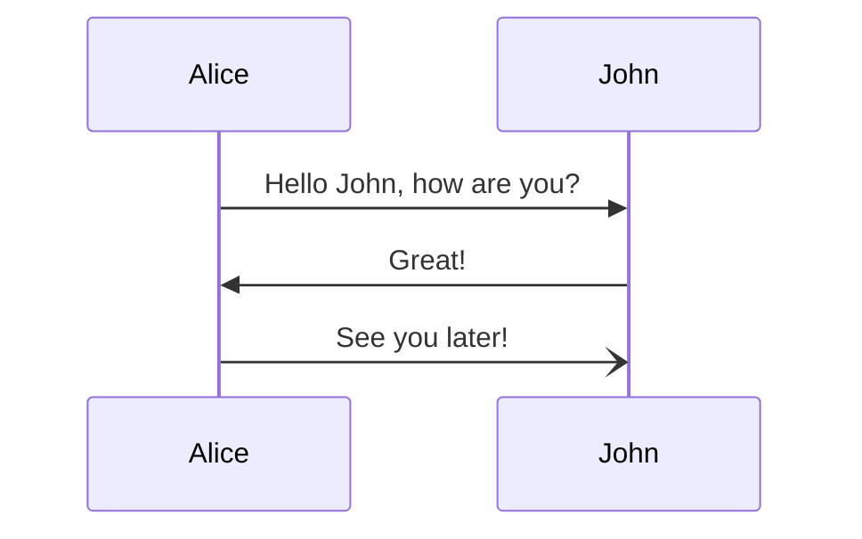

# Documentation in Erlang/OTP

This HOWTO describes how documentation of the Erlang/OTP project works. If you
want to know how to document a project built using Erlang/OTP see
[Documentation].

For details on how to build the Erlang/OTP documentation see
[How to Build the Documentation](INSTALL.md#how-to-build-the-documentation) and
[Writing and building documentation](DEVELOPMENT.md#writing-and-building-documentation).

The documentation for Erlang/OTP can be divided into three major sections:

1. Erlang module reference documentation.
2. User's Guides and other reference manuals (config files, command line tools, etc).
3. Release notes and other project metadata (deprecations, removals etc)
4. Internal documentation.

The first three are user facing documentation that describe how to use Erlang/OTP.
The last is documentation describing how various part of Erlang/OTP works, for
example the document you are reading now is internal documentation.

All user facing documentation, and some internal documentation, is rendered by
[ex_doc] and follows the style described in [Documentation]. To get a _full
understanding_ on how to write documentation for Erlang/OTP you needs to read
both the [Documentation] docs, [ex_doc]'s docs, [GFM] docs, and [earmark_parser] docs.
For most use cases though you don't need a full understanding and it is enough
to just read [Documentation].

Internal documentation is mostly written using [GFM] or just plain text.

All user facing documentation should follow the [Documentation style rules] described
later in this document.

## User facing documentation

All user facing documentation is written using [Markdown], specifically
the [Markdown flavor] used by [earmark_parser].
The flavor is described in detail in the [earmark_parser README],
but it is basically [GFM] with some extra extensions, such as [IAL] and
[Mathematical Expressions].

The documentation is built using [ex_doc] and [$ERL_TOP/make/ex_doc.exs], which is
a top level [ex_doc configuration file] describing how to build the docs for
Erlang/OTP. Each application then has a local `docs.exs` (for example
[stdlib](../lib/stdlib/doc/docs.exs)) describing details specific for that application.

[ex_doc] divides documentation into two separate areas, "modules" and "extra pages".
Modules is documentation about Erlang modules, and "extra pages" is [Markdown] files
describing anything else.

In `moduledoc` and extra pages it is also allowed to use [mermaid diagrams] to
complement the documentation text. For example

````markdown



````

will be rendered as:


Any images or other static assets needed by the documentation should be placed
in the `assets` folder.

### Modules

All modules in applications except `edoc` are documented using inline markdown as
described in [Documentation].

`edoc` modules are still documented using `edoc` in order to test that it works.
However, [ex_doc] is still used to generate HTML docs for the `edoc` application.

#### Grouping

It is possible to create groups of types and/or functions within a module using
documentation metadata. To do that you need to add the key `group` to each type
and/or function you want to be listed within that group.

Example:

```erlang
-module(test).
-moduledoc "A test module".

-export([old_function/0]).

-doc "An old type".
-doc(#{group => <<"Obsolete API">> }).
-type old_type() :: term().

-doc "An old function".
-doc(#{group => <<"Obsolete API">> }).
old_function() -> very_old.
```

For an example in practice see the [string module](../lib/stdlib/src/string.erl).

If you don't want to manually annotate each function, you can also create groupings
programmatically. See [Groups](https://hexdocs.pm/ex_doc/Mix.Tasks.Docs.html#module-groups)
in the [ex_doc] documentation for details on how to do that.
See the [erts application docs.exs](../erts/doc/docs.exs) for an example.

### Extra pages

Erlang/OTP by default divides "extra pages" into four groups, "User's Guides",
"References", "Command line tools" and "Internal Documentation". Which group a
guide is placed within depends on which sub-folder in `doc` that the file is
placed in.

* `guides` -> "User's Guides"
* `references/*_cmd.md` -> "Command line tools"
* `references` -> "References"
* `internal_docs` -> "Internal documentation"

For an examples, see the [kernel application](../lib/kernel/doc/) and [erts application](../erts/doc/).

It is also possible to customize the groups for an application by adding a `groups_for_extras` in
`docs.exs`. See the [system application's docs.exs](../system/doc/docs.exs) for an example on how
to do that.

## Documentation style rules

When writing documentation for the Erlang/OTP project, the following
rules should be followed. The documentation has been written by a lot
of different people, with their own writing style, that may or may not
be following this style guide. When in doubt, follow the style that is
used in the document you are currently editing in order to keep the
same style throughout that document.

### Grammar rules and guidelines

American English is to be used in all documents.

#### Word list

* behavior - Should be spelled this way because it is American
  English. However, the module attribute is named "-behaviour.".

* back-end - Not "backend"

* boot script - ".script file", a script specifying which code to load
  and which applications to start. The binary version is called a boot
  file, see below.

* boot file - ".boot file", an argument for the command line flag -boot.

* code path - Not "search path"

* command line arguments - Everything after `erl` on the command line.

* command line flags - Flags after `erl` on the command line, for
  example, `-boot`. Subset of "command line arguments"

* (application) configuration parameter - Values that can be set in a
  `.config` file, or from Erlang shell or command line. Not
  "(application) variable".

* Erlang, Erlang/OTP, OTP - "Erlang" is the language. "Erlang/OTP" is
  the product and should normally be referred to as such. "OTP" is the
  project. "OTP" can also in some cases be used to refer to the parts
  of the product that are completely decoupled from the Erlang
  part. Example: 'OTP Design Principles', a part of Erlang/OTP, but you can
  write Erlang programs without ever caring about them.
  
  Release versions is written as, for example, "Erlang/OTP R10B.", or only
  "OTP 26.0".

* Erlang runtime system - What is started by the command `erl`.

* Erlang system - A system written in Erlang. Not the same thing as a
  runtime system.

* function, function call - A function can be "local" (in the same
  module) or "external" (in another module). A function call can be
  "implicitly qualified" (without module name) or "fully qualified"
  (with module name).

* node - Normally an Erlang runtime system that is part of a
  distributed Erlang system, but can also be used as an overarching
  concept (thus meaning a runtime system, distributed or not). A node
  can be "alive" or possibly "distributed", otherwise it is
  "non-distributed". "This" node is "the local node" other nodes are
  "remote".

* port - A port can be "open" or "closed". It can also possibly be
  "existing" or "non-existing" (that is, be closed or never having
  existed).

* process - A process can be "alive" or "dead". It can also possibly
  be "existing" or "non-existing" (that is, be dead or never having
  existed). A process is "local" (on "this" node) or "remote" (on
  another node). "This" process is "the calling process", not
  "current", "executing", "currently executing", or similar.

* system configuration file - ".config file" an argument for the
  command line flag `-config`.

Refer to the [Errors and Error Handling,
"Terminology"](../system/doc/reference_manual/errors.md) for
terminology related to errors and error handling. Note that it is no
longer appropriate to write that a process "exits", as this now (since
`try`..`catch` and the concept of "exception class" were introduced)
implies that the process either calls `exit/1` or terminates normally.

#### Contractions and abbreviations

Avoid contractions such as "can't", "it's" in written text. Write
"cannot", "it is", and so on.

Do not write "can not", but almost always "cannot", except when "not"
belongs with the words to the right (binds to the right).

Avoid "e.g.", "i.e.", and "etc.". Instead write "for example", "that is", and
"and so on", respectively.

#### Oxford comma

Use the [Oxford comma](https://en.wikipedia.org/wiki/Serial_comma).
That is, in a series of three or more terms, place a comma immediately
after the penultimate term.

*Example*:

"Common data types are lists, tuples, and maps."

#### "However"

Use punctuation properly around the word "however".

*Examples*:

* "However, do not try this at home".

* "They, however, did not agree."

* "The new feature worked; however, it was far too slow."

However, when "however" is used in the sense of "no matter how" or "in
whatever way", it should not be followed by a comma.

*Example*:

* "I am going fix this bug however long it takes."

#### Examples

Introduce the code example in the preceding text and end with a colon,
not a period. Example: “The compiler gives a warning for the following
code fragment:”

For code examples with several steps and for long examples:
- Ensure that it is obvious for the reader what belongs to the example.
- Use a subheading `## Examples`.

All examples should be tested if possible using [`shell_docs:test/2`](../lib/stdlib/src/shell_docs.erl).
See [lists_SUITE:doctests/1](../lib/stdlib/test/lists_SUITE.erl) for an example
on how to do that.

##### Examples

````markdown
The compiler gives a warning for some code fragments:

```erlang
1> erlc test.erl
test.erl:3:6: Warning: variable 'Data' is unused
%    3| main(Data) ->
%     |      ^
```

````

````markdown
Searches the list of tuples `TupleList` for a tuple whose `N`th element compares
equal to `Key`.

Returns `Tuple` if such a tuple is found; otherwise, returns `false`.

## Examples

```erlang
1> lists:keyfind(b, 1, [{a,10}, {b,20}, {c,30}]).
{b,20}
2> lists:keyfind(unknown, 1, [{a,10}, {b,20}, {c,30}]).
false
```
""".
````

#### Headings

Use capital letters at the beginning of each word, except for small
words like "and" and "of," following American English language
tradition.

Example: Principles of Writing Titles and Captions

#### Application names

Name for applications in text should be considered proper names and
should be written beginning with capital letter.

Except for when they are acronyms or some other tradition exists. Example:

```
asn1
Common Test
Compiler
Crypto
Debugger
Dialyzer
Diameter
EDoc
Eldap
Erl_interface
Event Tracer
EUnit
FTP
Inets
Jinterface
Kernel
Megaco
Mnesia
Observer
ODBC
OS_Mon
Parsetools
Public_Key
Reltool
Runtime_Tools
SASL
SNMP
SSH
SSL
STDLIB
Syntax_Tools
TFTP
Tools
Wx
Xmerl
```

### Definition lists

When documenting a set of options or items you would normally use a
[definition list].  However, Markdown does not support them so a
convention using un-ordered lists should be used:

```markdown
- **tag**{: #tag-anchor } - Description
```

It is recommended, but not required, to place an anchor on each definition list
item. Placing an anchor on an item will make it possible for search to
find that specific item.

For example the [erl_cmd.md](../erts/doc/references/erl_cmd.md) has this item:

```markdown
- **`+c true | false`**{: #+c } - Enables or disables
  [time correction](time_correction.md#time-correction):

  - **`true`** - Enables time correction. This is the default if time correction
    is supported on the specific platform.

  - **`false`** - Disables time correction.

  For backward compatibility, the boolean value can be omitted. This is
  interpreted as `+c false`.
```

The above example has nested [definition list]s using an anchor for the top item.

### Equivalent functions

When a function call is the same as another, you should strive to use
the argument form of the [`equiv` doc
metadata](../system/doc/reference_manual/documentation.md#doc-metadata).

Example:

```erlang
-doc #{equiv => atom_to_binary(Atom, utf8)}).
-spec atom_to_binary(Atom) -> binary() when
      Atom :: atom().
```

If it is not possible to use `equiv`, then you should use:

```erlang
-doc """
Equivalent to [atom_to_binary(Atom, utf8)](`atom_to_binary/2`).
""".
```

### Referring to multiple arities

Sometimes it is useful to be able to concisely refer to multiple
arities of the same function. This should be done like this:

```markdown
See [`disk_log:blog/1,2`](`disk_log:blog/2`).
See [`disk_log:blog/*`](`disk_log:blog/2`).
```

The link should point the to arity with the most relevant documentation,
which usually is the largest arity function.

### Diagrams and images

Diagrams and images are powerful tools to describe complicated
concepts. They should not be used in function/type/callback
documentation as that documentation is used by editors to display help
and typically cannot render any images.

For simple diagrams it is recommended to use
[dia](http://dia-installer.de/) and then commit both the `.dia` source
and the `.png` generated. See the [emulator internal docs
Makefile](../erts/emulator/internal_doc/assets/Makefile) for an
example on how it is done.

### Since annotations

When writing `since` annotations for functions/types/callbacks the
convention is that the `-doc` attribute shows when a specific `MFA`
was added, and then in text describe when specific options or
behaviors are added.

Example:

```erlang
-doc #{since => ~"OTP 26.2"}.
-spec info([key1, key2]) -> list(term()).
-doc """
Get information about a thing.

- **`key1`** - Fetch `key1` data.
- **`key2`** - Fetch `key2` data.

  Since: OTP 26.3
""".
```

As the actual version is generally not yet certain at the time when a
change gets merged, an internal ticket number (for example
`OTP-12345`) is used as a placeholder in the respective `since` tags,
such as `-doc #{since => ~"OTP @OTP-12345@"}.`.  When your new
functions are released with an Erlang/OTP release, this placeholder
will get replaced with the actual OTP version, leading to something
like "OTP 26.0".

[Markdown]: https://en.wikipedia.org/wiki/Markdown
[mermaid diagrams]: https://mermaid.js.org/
[Markdown flavor]: https://en.wikipedia.org/wiki/Markdown#Rise_and_divergence
[Documentation]: ../system/doc/reference_manual/documentation.md
[GFM]: https://github.github.com/gfm/
[$ERL_TOP/make/ex_doc.exs]: ../make/ex_doc.exs
[ex_doc]: https://hexdocs.pm/ex_doc/
[ex_doc configuration file]: https://hexdocs.pm/ex_doc/Mix.Tasks.Docs.html#module-configuration
[earmark_parser]: https://github.com/RobertDober/earmark_parser/
[earmark_parser README]: https://github.com/RobertDober/earmark_parser/blob/master/README.md
[IAL]: https://github.com/RobertDober/earmark_parser/blob/master/README.md#adding-attributes-with-the-ial-extension
[Mathematical Expressions]: https://github.com/RobertDober/earmark_parser/blob/master/README.md#mathematical-expressions
[Documentation style rules]: #documentation-style-rules
[definition list]: https://developer.mozilla.org/en-US/docs/Web/HTML/Element/dl
