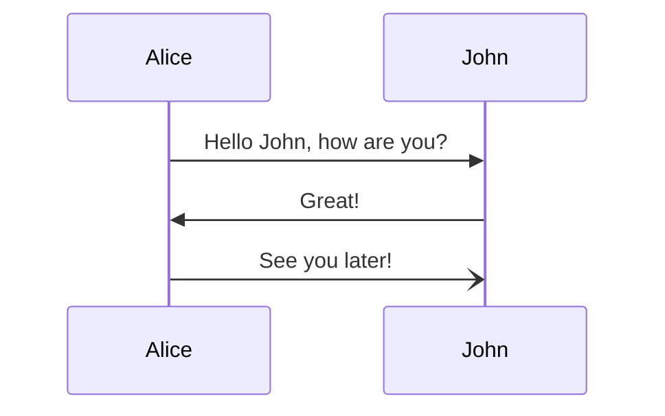

# Documentation in Erlang/OTP

This HOWTO describes how documentation of the Erlang/OTP project works. If you
want to know how to document a project built using Erlang/OTP see
[Documentation].

For details on how to build the Erlang/OTP documentation see
[How to Build the Documentation](INSTALL.md#how-to-build-the-documentation) and
[Writing and building documentation](DEVELOPMENT.md#writing-and-building-documentation).

The documentation for Erlang/OTP can be divided into three major sections:

1. Erlang module reference documentation.
2. User's Guides and other reference manuals (config files, command line tools, etc).
3. Release notes and other project metadata (deprecations, removals etc)
4. Internal documentation.

The first three are user facing documentation that describe how to use Erlang/OTP.
The last is documentation describing how various part of Erlang/OTP works, for
example the document you are reading now is internal documentation.

All user facing documentation, and some internal documentation, is rendered by
[ex_doc] and follows the style described in [Documentation]. To get a _full
understanding_ on how to write documentation for Erlang/OTP you needs to read
both the [Documentation] docs, [ex_doc]'s docs, [GFM] docs, and [earmark_parser] docs.
For most use cases though you don't need a full understanding and it is enought
to just read [Documentation].

Internal documentation is mostly written using [GFM] or just plain text.

## User facing documentation

All user facing documentation is written using [Markdown], specifically
the [Markdown flavor] used by [earmark_parser].
The flavor is described in detail in the [earmark_parser README],
but it is basically [GFM] with some extra extensions, such as [IAL] and
[Mathematical Expressions].

The documentation is built using [ex_doc] and [$ERL_TOP/make/ex_doc.exs], which is
a top level [ex_doc configuration file] describing how to build the docs for
Erlang/OTP. Each application then has a local `docs.exs` (for example
[stdlib](../lib/stdlib/doc/docs.exs)) describing details specific for that application.

[ex_doc] divides documentation into two separate areas, "modules" and "extra pages".
Modules is documentation about Erlang modules, and "extra pages" is [Markdown] files
describing anything else.

<!--

In `moduledoc` and extra pages it is also allowed to use [mermaid diagrams] to
complement the documentation text. For example

````markdown



````

will be rendered as:


-->

Any images or other static assets needed by the documentation should be placed
in the `assets` folder.

### Modules

All modules in applications except `edoc` are documented using inline markdown as
described in [Documentation].

`edoc` modules are still documented using `edoc` in order to test that it works.
However, [ex_doc] is still used to generate HTML docs for the `edoc` application.

#### Grouping

It is possible to create groups of types and/or functions within a module using
documentation metadata. To do that you need to do two things:

1. Add the key `titles` to the `moduledoc` metadata with a list containing which
  groups you want.
2. Add the key `title` to each type and/or function you want to be listed within
  that group.

Example:

```erlang
-module(test).
-moduledoc "A test module".
-moduledoc(#{ titles => [{function, <<"Obsolete API">>}, {type, <<"Obsolete API">>}] }).

-export([old_function/0]).

-doc "An old type".
-doc(#{ title => <<"Obsolete API">> }).
-type old_type() :: term().

-doc "An old function".
-doc(#{ title => <<"Obsolete API">> }).
old_function() -> very_old.
```

For an example in practice see the [string module](../lib/stdlib/src/string.erl).

If you don't want to manually annotate each function, you can also create groupings
programmatically. See [Groups](https://hexdocs.pm/ex_doc/Mix.Tasks.Docs.html#module-groups)
in the [ex_doc] documentation for details on how to do that.
See the [erts application docs.exs](../erts/doc/docs.exs) for an example.

### Extra pages

Erlang/OTP by default divides "extra pages" into four groups, "User's Guides",
"References", "Command line tools" and "Internal Documentation". Which group a
guide is placed within depends on which sub-folder in `doc` that the file is
placed in.

* `guides` -> "User's Guides"
* `references/*_cmd.md` -> "Command line tools"
* `references` -> "References"
* `internal_docs` -> "Internal documentation"

For an examples, see the [kernel application](../lib/kernel/doc/) and [erts application](../erts/doc/).

It is also possible to customize the groups for an application by adding a `groups_for_extras` in
`docs.exs`. See the [system application's docs.exs](../system/doc/docs.exs) for an example on how
to do that.

[Markdown]: https://en.wikipedia.org/wiki/Markdown
[Markdown flavor]: https://en.wikipedia.org/wiki/Markdown#Rise_and_divergence
[Documentation]: ../system/doc/reference_manual/documentation.md
[GFM]: https://github.github.com/gfm/
[$ERL_TOP/make/ex_doc.exs]: ../make/ex_doc.exs
[ex_doc]: https://hexdocs.pm/ex_doc/
[ex_doc configuration file]: https://hexdocs.pm/ex_doc/Mix.Tasks.Docs.html#module-configuration
[earmark_parser]: https://github.com/RobertDober/earmark_parser/
[earmark_parser README]: https://github.com/RobertDober/earmark_parser/blob/master/README.md
[IAL]: https://github.com/RobertDober/earmark_parser/blob/master/README.md#adding-attributes-with-the-ial-extension
[Mathematical Expressions]: https://github.com/RobertDober/earmark_parser/blob/master/README.md#mathematical-expressions
