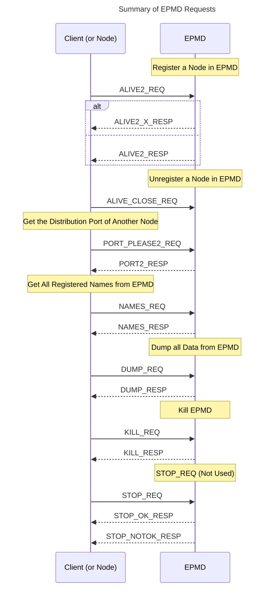
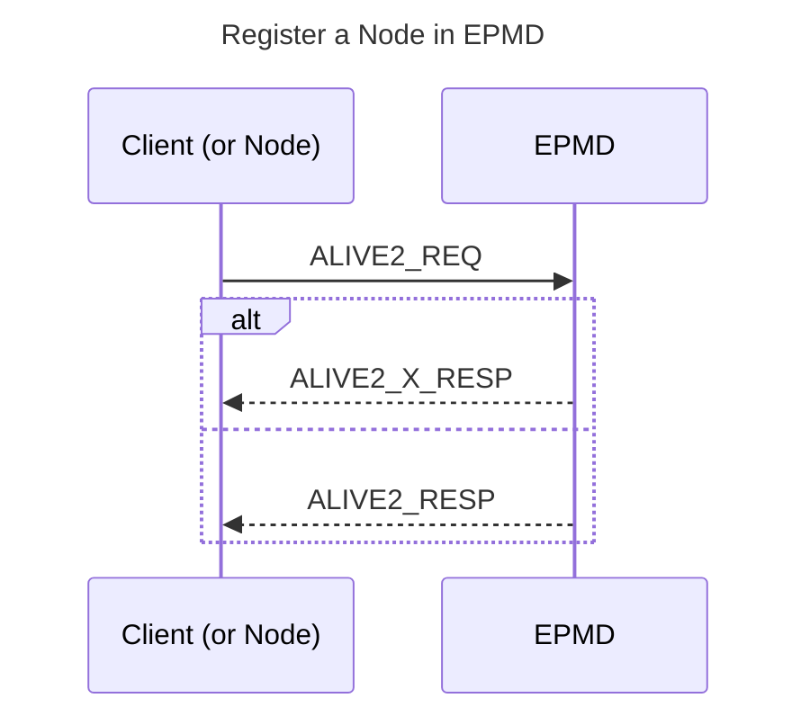
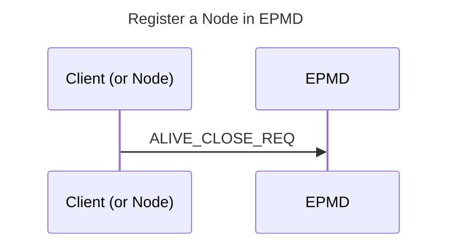
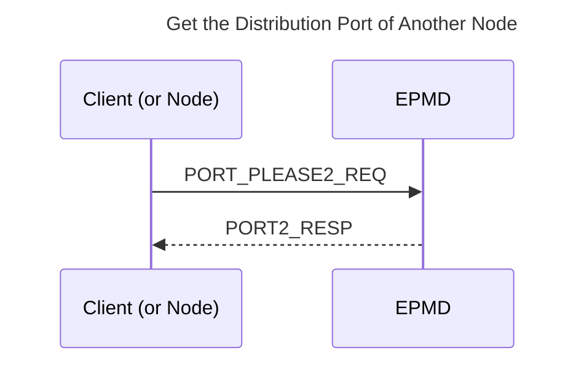
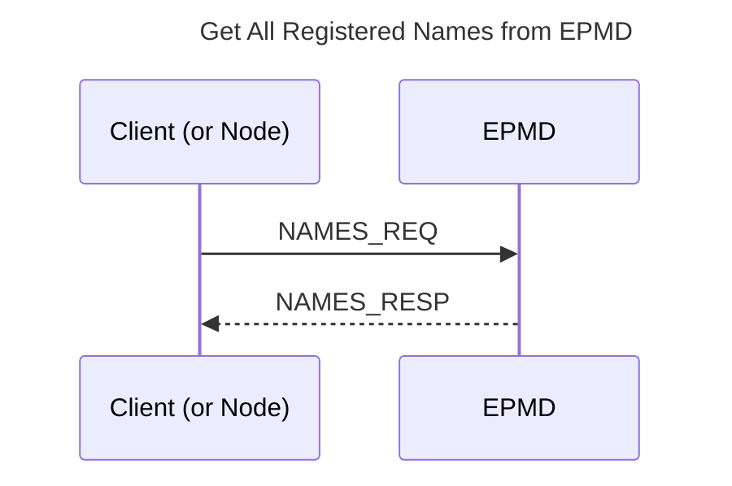
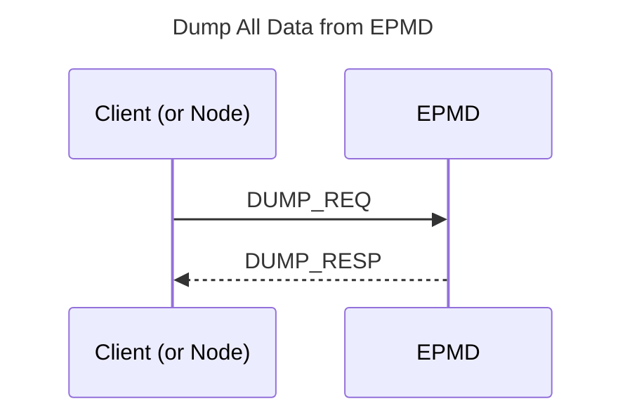
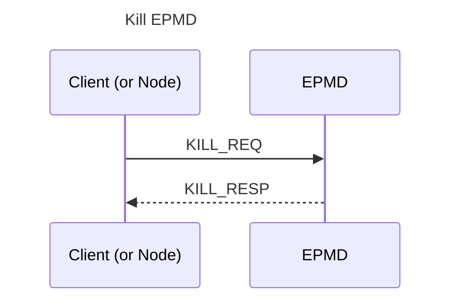
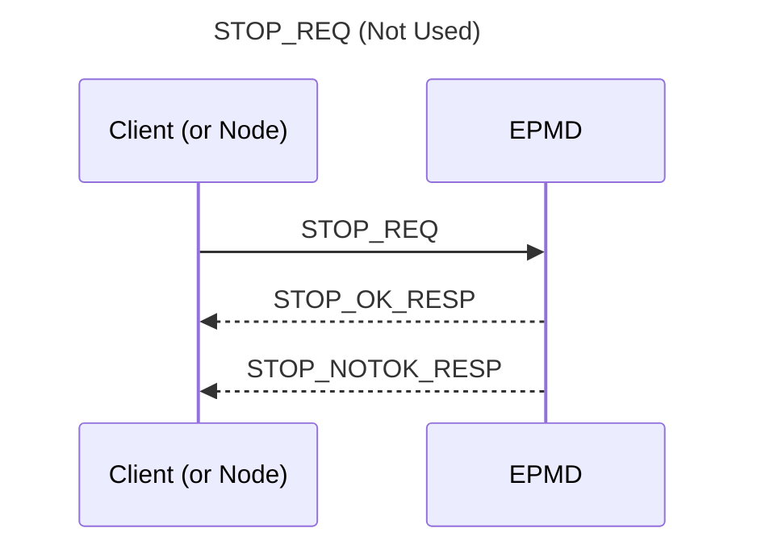

<!--
%CopyrightBegin%

Copyright Ericsson AB 2023-2024. All Rights Reserved.

Licensed under the Apache License, Version 2.0 (the "License");
you may not use this file except in compliance with the License.
You may obtain a copy of the License at

    http://www.apache.org/licenses/LICENSE-2.0

Unless required by applicable law or agreed to in writing, software
distributed under the License is distributed on an "AS IS" BASIS,
WITHOUT WARRANTIES OR CONDITIONS OF ANY KIND, either express or implied.
See the License for the specific language governing permissions and
limitations under the License.

%CopyrightEnd%
-->
# Distribution Protocol

This description is far from complete. It will be updated if the protocol is
updated. However, the protocols, both from Erlang nodes to the Erlang Port
Mapper Daemon (EPMD) and between Erlang nodes are stable since many years.

The distribution protocol can be divided into four parts:

- Low-level socket connection (1)
- Handshake, interchange node name, and authenticate (2)
- Authentication (done by `m:net_kernel`) (3)
- Connected (4)

A node fetches the port number of another node through the EPMD (at the other
host) to initiate a connection request.

For each host, where a distributed Erlang node is running, also an EPMD is to be
running. The EPMD can be started explicitly or automatically as a result of the
Erlang node startup.

By default the EPMD listens on port 4369.

(3) and (4) above are performed at the same level but the `net_kernel`
disconnects the other node if it communicates using an invalid cookie (after 1
second).

The integers in all multibyte fields are in big-endian order.

> #### Warning {: .warning }
>
> The Erlang Distribution protocol is not by itself secure and does not aim to
> be so. In order to get secure distribution the distributed nodes should be
> configured to use distribution over tls. See the
> [Using SSL for Erlang Distribution](`e:ssl:ssl_distribution.md`) User's Guide
> for details on how to setup a secure distributed node.

## EPMD Protocol

The EPMD Protocol supports various tasks:

- Registering a Node
- Unregistering a Node
- Getting the Distributing Port of Another Node
- Getting all Registered Names
- Dumping all Data from EPMD
- Killing EPMD
- `STOP_REQ` (Not Used)

The requests served by the EPMD for these tasks are summarized in the following figure.



Each request `*_REQ` is preceded by a 2 byte length field. Thus, the overall
request format is as follows:

| 2        | n         |
| -------- | --------- |
| `Length` | `Request` |

_Table: Request Format_

### Register a Node in EPMD

When a distributed node is started it registers itself in the EPMD. The message
`ALIVE2_REQ` described below is sent from the node to the EPMD. The response
from the EPMD is `ALIVE2_X_RESP` (or `ALIVE2_RESP`):



| 1     | 2        | 1          | 1          | 2                | 2               | 2      | Nlen       | 2      | Elen    |
| ----- | -------- | ---------- | ---------- | ---------------- | --------------- | ------ | ---------- | ------ | ------- |
| `120` | `PortNo` | `NodeType` | `Protocol` | `HighestVersion` | `LowestVersion` | `Nlen` | `NodeName` | `Elen` | `Extra` |

_Table: ALIVE2_REQ (120)_

- **`PortNo`** - The port number on which the node accept connection requests.

- **`NodeType`** - 77 = normal Erlang node, 72 = hidden node (C-node), ...

- **`Protocol`** - 0 = TCP/IPv4, ...

- **`HighestVersion`** - The highest distribution protocol version this node can
  handle. The value in OTP 23 and later is 6. Older nodes only support
  version 5.

- **`LowestVersion`** - The lowest distribution version that this node can
  handle. The value in OTP 25 and later is 6 as support for connections to nodes
  older than OTP 23 has been dropped.

- **`Nlen`** - The length (in bytes) of field `NodeName`.

- **`NodeName`** - The node name as an UTF-8 encoded string of `Nlen` bytes.

- **`Elen`** - The length of field `Extra`.

- **`Extra`** - Extra field of `Elen` bytes.

The connection created to the EPMD must be kept as long as the node is a
distributed node. When the connection is closed, the node is automatically
unregistered from the EPMD.

The response message is either `ALIVE2_X_RESP` or `ALIVE2_RESP` depending on
distribution version. If both the node and EPMD support distribution version 6
then the response is `ALIVE2_X_RESP` otherwise it is the older `ALIVE2_RESP`:

| 1     | 1        | 4          |
| ----- | -------- | ---------- |
| `118` | `Result` | `Creation` |

_Table: ALIVE2_X_RESP (118) with 32 bit creation_

| 1     | 1        | 2          |
| ----- | -------- | ---------- |
| `121` | `Result` | `Creation` |

_Table: ALIVE2_RESP (121) with 16-bit creation_

Result = 0 -> ok, result > 0 -> error.

### Unregister a Node from EPMD

A node unregisters itself from the EPMD by closing the TCP connection to EPMD
established when the node was registered:




### Get the Distribution Port of Another Node

When one node wants to connect to another node it starts with a
`PORT_PLEASE2_REQ` request to the EPMD on the host where the node resides to get
the distribution port that the node listens to:




| 1     | N          |
| ----- | ---------- |
| `122` | `NodeName` |

_Table: PORT_PLEASE2_REQ (122)_

where N = `Length` \- 1.

| 1     | 1        |
| ----- | -------- |
| `119` | `Result` |

_Table: PORT2_RESP (119) Response Indicating Error, Result > 0_

or

| 1     | 1        | 2        | 1          | 1          | 2                | 2               | 2      | Nlen       | 2      | Elen     |
| ----- | -------- | -------- | ---------- | ---------- | ---------------- | --------------- | ------ | ---------- | ------ | -------- |
| `119` | `Result` | `PortNo` | `NodeType` | `Protocol` | `HighestVersion` | `LowestVersion` | `Nlen` | `NodeName` | `Elen` | >`Extra` |

_Table: PORT2_RESP, Result = 0_

If `Result` > 0, the packet only consists of `[119, Result]`.

The EPMD closes the socket when it has sent the information.

### Get All Registered Names from EPMD

This request is used through the Erlang function
[`net_adm:names/1,2`](`net_adm:names/1`). A TCP connection is opened to the EPMD
and this request is sent:



| 1     |
| ----- |
| `110` |

_Table: NAMES_REQ (110)_

The response for a `NAMES_REQ` is as follows:

| 4            |             |
| ------------ | ----------- |
| `EPMDPortNo` | `NodeInfo*` |

_Table: NAMES_RESP_

`NodeInfo` is a string written for each active node. When all `NodeInfo` has
been written the connection is closed by the EPMD.

`NodeInfo` is, as expressed in Erlang:

```erlang
io:format("name ~ts at port ~p~n", [NodeName, Port]).
```

### Dump All Data from EPMD

This request is not really used, it is to be regarded as a debug feature.




| 1     |
| ----- |
| `100` |

_Table: DUMP_REQ_

The response for a `DUMP_REQ` is as follows:

| 4            |             |
| ------------ | ----------- |
| `EPMDPortNo` | `NodeInfo*` |

_Table: DUMP_RESP_

`NodeInfo` is a string written for each node kept in the EPMD. When all
`NodeInfo` has been written the connection is closed by the EPMD.

`NodeInfo` is, as expressed in Erlang:

```erlang
io:format("active name     ~ts at port ~p, fd = ~p~n",
          [NodeName, Port, Fd]).
```

or

```erlang
io:format("old/unused name ~ts at port ~p, fd = ~p ~n",
          [NodeName, Port, Fd]).
```

### Kill EPMD

This request kills the running EPMD. It is almost never used.



| 1     |
| ----- |
| `107` |

_Table: KILL_REQ_

The response for a `KILL_REQ` is as follows:

| 2          |
| ---------- |
| `OKString` |

_Table: KILL_RESP_

where `OKString` is "OK".

### STOP_REQ (Not Used)



| 1     | n          |
| ----- | ---------- |
| `115` | `NodeName` |

_Table: STOP_REQ_

where n = `Length` \- 1.

The response for a `STOP_REQ` is as follows:

| 7          |
| ---------- |
| `OKString` |

_Table: STOP_RESP_

where `OKString` is "STOPPED".

A negative response can look as follows:

| 7           |
| ----------- |
| `NOKString` |

_Table: STOP_NOTOK_RESP_

where `NOKString` is "NOEXIST".

[](){: #distribution_handshake }

## Distribution Handshake

This section describes the distribution handshake protocol used between nodes to
establishing a connection. The protocol was introduced in Erlang/OTP R6 and
amended in OTP 23. From OTP 25 support for the older protocol was dropped.
Therefore an OTP 25 node can not connect to nodes older than OTP 23. This
documentation only decribes the part of the protocol used by OTP 25.

> #### Note {: .info }
>
> A bug introduced in OTP 25.0 may cause OTP 25 nodes to reject connection
> attempts from OTP 23 and 24 nodes that are not using `epmd` to gain version
> information about the remote node. This is fixed in OTP 25.3.

### General

The TCP/IP distribution uses a handshake that expects a connection-based
protocol, that is, the protocol does not include any authentication after the
handshake procedure.

This is not entirely safe, as it is vulnerable against takeover attacks, but it
is a tradeoff between fair safety and performance.

The cookies are never sent in cleartext and the handshake procedure expects the
client (called `A`) to be the first one to prove that it can generate a
sufficient digest. The digest is generated with the MD5 message digest algorithm
and the challenges are expected to be random numbers.

### Definitions

A challenge is a 32-bit integer in big-endian order. Below the function
`gen_challenge()` returns a random 32-bit integer used as a challenge.

A digest is a (16 bytes) MD5 hash of the cookie (as text) concatenated with the
challenge (as text). Below, the function `gen_digest(Challenge, Cookie)`
generates a digest as described above.

An `out_cookie` is the cookie used in outgoing communication to a certain node,
so that `A`'s `out_cookie` for `B` is to correspond with `B`'s `in_cookie` for
`A` and conversely. `A`'s `out_cookie` for `B` and `A`'s `in_cookie` for `B`
need _not_ be the same. Below the function `out_cookie(Node)` returns the
current node's `out_cookie` for `Node`.

An `in_cookie` is the cookie expected to be used by another node when
communicating with us, so that `A`'s `in_cookie` for `B` corresponds with `B`'s
`out_cookie` for `A`. Below the function `in_cookie(Node)` returns the current
node's `in_cookie` for `Node`.

The cookies are text strings that can be viewed as passwords.

Every message in the handshake starts with a 16-bit big-endian integer, which
contains the message length (not counting the two initial bytes). In Erlang this
corresponds to option `{packet, 2}` in `m:gen_tcp`. Notice that after the
handshake, the distribution switches to 4 byte packet headers.

### The Handshake in Detail

Imagine two nodes, `A` that initiates the handshake and `B` that accepts the
connection.

- **1) connect/accept** - `A` connects to `B` through TCP/IP and `B` accepts the
  connection.

- **2) `send_name`/`receive_name`** - `A` sends an initial identification to
  `B`, which receives the message. The message can have two different formats
  which looks as follows (the packet headers are removed):

  | 1     | 2           | 4       | Nlen   |
  | ----- | ----------- | ------- | ------ |
  | `'n'` | `Version=5` | `Flags` | `Name` |

  _Table: Old send_name ('n') for protocol version 5_

  | 1     | 8       | 4          | 2      | Nlen   |
  | ----- | ------- | ---------- | ------ | ------ |
  | `'N'` | `Flags` | `Creation` | `Nlen` | `Name` |

  _Table: New send_name ('N') for protocol version 6_

  The old `send_name` format is only sent from OTP 23 and 24 nodes that are not
  using `epmd` and therefore do not know if the remote node only supports
  protocol version 5. The `Version` is a 16-bit big endian integer and _must_
  always have the value 5 (even though node `A` supports version 6). `Flags` are
  the [capability flags](erl_dist_protocol.md#dflags) of node `A` in 32-bit big
  endian. The flag bit
  [`DFLAG_HANDSHAKE_23`](erl_dist_protocol.md#DFLAG_HANDSHAKE_23) must be set
  (as node `A` must supports version 6). `Name` is the full node name of `A`, as
  a string of bytes (the packet length denotes how long it is).

  The new `send_name` is sent to nodes known to support version 6. `Flags` are
  the [capability flags](erl_dist_protocol.md#dflags) of node `A` in 64-bit big
  endian. The flag bit
  [`DFLAG_HANDSHAKE_23`](erl_dist_protocol.md#DFLAG_HANDSHAKE_23) must always be
  set. `Creation` is the node incarnation identifier used by node `A` to create
  its pids, ports and references. `Name` is the full node name of `A`, as a
  string of bytes. `Nlen` is the byte length of the node name in 16-bit big
  endian. Any extra data after the node `Name` must be accepted and ignored.

  The `Name` must be just the host name (without @) when
  [`DFLAG_NAME_ME`](erl_dist_protocol.md#DFLAG_NAME_ME) is set.

- **3) `recv_status`/`send_status`** - `B` sends a status message to `A`, which
  indicates if the connection is allowed.

  | 1     | Slen     |
  | ----- | -------- |
  | `'s'` | `Status` |

  _Table: The format of the status message_

  's' is the message tag. `Status` is the status code as a string (not null
  terminated). The following status codes are defined:

  - **`ok`** - The handshake will continue.

  - **`ok_simultaneous`** - The handshake will continue, but `A` is informed
    that `B` has another ongoing connection attempt that will be shut down
    (simultaneous connect where `A`'s name is greater than `B`'s name, compared
    literally).

  - **`nok`** - The handshake will not continue, as `B` already has an ongoing
    handshake, which it itself has initiated (simultaneous connect where `B`'s
    name is greater than `A`'s).

  - **`not_allowed`** - The connection is disallowed for some (unspecified)
    security reason.

  - **`alive`** - A connection to the node is already active, which either means
    that node `A` is confused or that the TCP connection breakdown of a previous
    node with this name has not yet reached node `B`. See step 3B below.

  - **`named:`** - The handshake will continue, but `A` requested a dynamic node
    name by setting flag [`DFLAG_NAME_ME`](erl_dist_protocol.md#DFLAG_NAME_ME).
    The dynamic node name of `A` is supplied at the end of the status message
    from `B`. The host name of `A` which was sent as `Name` in `send_name` will
    be used by node `B` to generate the full dynamic node name.

    | 1     | Slen=6            | 2      | Nlen   | 4          |
    | ----- | ----------------- | ------ | ------ | ---------- |
    | `'s'` | `Status='named:'` | `Nlen` | `Name` | `Creation` |

    *Table: The format of the 'named:' status message*

    `Name` is the full dynamic node name of `A`, as a string of bytes. `Nlen` is
    the byte length of the node name in 16-bit big endian. `Creation` is the
    incarnation identifier of node `A` generated by node `B`. Any extra data after
    the node `Creation` must be accepted and ignored.

- **3B) `send_status`/`recv_status`** - If status was `alive`, node `A` answers
  with another status message containing either `true`, which means that the
  connection is to continue (the old connection from this node is broken), or
  `false`, which means that the connection is to be closed (the connection
  attempt was a mistake.

- **4) `recv_challenge`/`send_challenge`** - If the status was `ok` or
  `ok_simultaneous`, the handshake continues with `B` sending `A` another
  message, the challenge. The challenge contains the same type of information as
  the "name" message initially sent from `A` to `B`, plus a 32-bit challenge:

  | 1     | 8       | 4           | 4          | 2      | Nlen   |
  | ----- | ------- | ----------- | ---------- | ------ | ------ |
  | `'N'` | `Flags` | `Challenge` | `Creation` | `Nlen` | `Name` |

  _Table: The new challenge message format (version 6)_

  `Challenge` is a 32-bit big-endian integer. The other fields are node `B`'s
  flags, creation and full node name, similar to the `send_name` message. Any
  extra data after the node `Name` must be accepted and ignored.

- **4B) `send_complement`/`recv_complement`** - The complement message, from `A`
  to `B`, is only sent if node `A` initially sent an old name message. It
  contains complementary information missing in the initial old name message
  from node `A`.

  | 1     | 4           | 4          |
  | ----- | ----------- | ---------- |
  | `'c'` | `FlagsHigh` | `Creation` |

  _Table: The complement message_

  `FlagsHigh` are the high capability flags (bit 33-64) of node `A` as a 32-bit
  big endian integer. `Creation` is the incarnation identifier of node `A`.

- **5) `send_challenge_reply`/`recv_challenge_reply`** - Now `A` has generated a
  digest and its own challenge. Those are sent together in a package to `B`:

  | 1     | 4           | 16       |
  | ----- | ----------- | -------- |
  | `'r'` | `Challenge` | `Digest` |

  _Table: The challenge_reply message_

  `Challenge` is `A`'s challenge for `B` to handle. `Digest` is the MD5 digest
  that `A` constructed from the challenge `B` sent in the previous step.

- **6) `recv_challenge_ack`/`send_challenge_ack`** - `B` checks that the digest
  received from `A` is correct and generates a digest from the challenge
  received from `A`. The digest is then sent to `A`. The message is as follows:

  | 1     | 16       |
  | ----- | -------- |
  | `'a'` | `Digest` |

  _Table: The challenge_ack message_

  `Digest` is the digest calculated by `B` for `A`'s challenge.

- **7) check** - `A` checks the digest from `B` and the connection is up.

### Semigraphic View

```erlang
A (initiator)                                      B (acceptor)

TCP connect ------------------------------------>
                                                   TCP accept

send_name -------------------------------------->
                                                   recv_name

  <---------------------------------------------- send_status
recv_status
(if status was 'alive'
 send_status - - - - - - - - - - - - - - - - - ->
                                                   recv_status)

                          (ChB)                      ChB = gen_challenge()
  <---------------------------------------------- send_challenge
recv_challenge

(if old send_name
 send_complement - - - - - - - - - - - - - - - ->
                                                   recv_complement)

ChA = gen_challenge(),
OCA = out_cookie(B),
DiA = gen_digest(ChB, OCA)
                          (ChA, DiA)
send_challenge_reply --------------------------->
                                                   recv_challenge_reply
                                                   ICB = in_cookie(A),
                                                   check:
                                                   DiA == gen_digest (ChB, ICB)?
                                                   - if OK:
                                                    OCB = out_cookie(A),
                                                    DiB = gen_digest (ChA, OCB)
                          (DiB)
  <----------------------------------------------- send_challenge_ack
recv_challenge_ack                                  DONE
ICA = in_cookie(B),                                - else:
check:                                              CLOSE
DiB == gen_digest(ChA, ICA)?
- if OK:
 DONE
- else:
 CLOSE
```

[](){: #dflags }

### Distribution Flags

Early in the distribution handshake the two participating nodes exchange
capability flags. This is done in order to determine how the communication
between the two nodes should be performed. The intersection of the capabilities
presented by the two nodes defines the capabilities that will be used. The
following capability flags are defined:

- **`-define(DFLAG_PUBLISHED,16#1).`** - The node is to be published and part of
  the global namespace.

- **`-define(DFLAG_ATOM_CACHE,16#2).`** - The node implements an atom cache
  (obsolete).

- **`-define(DFLAG_EXTENDED_REFERENCES,16#4).`** - The node implements extended
  (3 × 32 bits) references. This flag is mandatory. If not present, the
  connection is refused.

- **`-define(DFLAG_DIST_MONITOR,16#8).`** - The node implements distributed
  process monitoring.

- **`-define(DFLAG_FUN_TAGS,16#10).`** - The node uses separate tags for funs
  (lambdas) in the distribution protocol. This flag is mandatory. If not
  present, the connection is refused.

- **`-define(DFLAG_DIST_MONITOR_NAME,16#20).`** - The node implements
  distributed named process monitoring.

- **`-define(DFLAG_HIDDEN_ATOM_CACHE,16#40).`** - The (hidden) node implements
  atom cache (obsolete).

- **`-define(DFLAG_NEW_FUN_TAGS,16#80).`** - The node understands the
  [`NEW_FUN_EXT`](erl_ext_dist.md#new_fun_ext) tag. This flag is mandatory. If
  not present, the connection is refused.

- **`-define(DFLAG_EXTENDED_PIDS_PORTS,16#100).`** - The node can handle
  extended pids and ports. This flag is mandatory. If not present, the
  connection is refused.

- **`-define(DFLAG_EXPORT_PTR_TAG,16#200).`** - The node understands the
  [`EXPORT_EXT`](erl_ext_dist.md#export_ext) tag. This flag is mandatory. If not
  present, the connection is refused.

- **`-define(DFLAG_BIT_BINARIES,16#400).`** - The node understands the
  [`BIT_BINARY_EXT`](erl_ext_dist.md#bit_binary_ext) tag. This flag is
  mandatory. If not present, the connection is refused.

- **`-define(DFLAG_NEW_FLOATS,16#800).`** - The node understands the
  [`NEW_FLOAT_EXT`](erl_ext_dist.md#new_float_ext) tag. This flag is mandatory.
  If not present, the connection is refused.

- **`-define(DFLAG_UNICODE_IO,16#1000).`**

- **`-define(DFLAG_DIST_HDR_ATOM_CACHE,16#2000).`** - The node implements atom
  cache in distribution header.

- **`-define(DFLAG_SMALL_ATOM_TAGS, 16#4000).`{: #DFLAG_SMALL_ATOM_TAGS }** -
  The node understands the [`SMALL_ATOM_EXT`](erl_ext_dist.md#small_atom_ext)
  tag.

- **`-define(DFLAG_UTF8_ATOMS, 16#10000).`{: #DFLAG_UTF8_ATOMS }** - The node
  understands UTF-8 atoms encoded with
  [`ATOM_UTF8_EXT`](erl_ext_dist.md#atom_utf8_ext) and
  [`SMALL ATOM_UTF8_EXT`](erl_ext_dist.md#small_atom_utf8_ext). This flag is
  mandatory. If not present, the connection is refused.

- **`-define(DFLAG_MAP_TAG, 16#20000).`** - The node understands the map tag
  [`MAP_EXT`](erl_ext_dist.md#map_ext). This flag is mandatory. If not present,
  the connection is refused.

- **`-define(DFLAG_BIG_CREATION, 16#40000).`{: #DFLAG_BIG_CREATION }** - The
  node understands big node creation tags
  [`NEW_PID_EXT`](erl_ext_dist.md#new_pid_ext),
  [`NEW_PORT_EXT`](erl_ext_dist.md#new_port_ext) and
  [`NEWER_REFERENCE_EXT`](erl_ext_dist.md#newer_reference_ext). This flag is
  mandatory. If not present, the connection is refused.

- **`-define(DFLAG_SEND_SENDER, 16#80000).`** - Use the `SEND_SENDER`
  [control message](erl_dist_protocol.md#control_message) instead of the `SEND`
  control message and use the `SEND_SENDER_TT` control message instead of the
  `SEND_TT` control message.

- **`-define(DFLAG_BIG_SEQTRACE_LABELS, 16#100000).`** - The node understands
  any term as the seqtrace label.

- **`-define(DFLAG_EXIT_PAYLOAD, 16#400000).`** - Use the `PAYLOAD_EXIT`,
  `PAYLOAD_EXIT_TT`, `PAYLOAD_EXIT2`, `PAYLOAD_EXIT2_TT` and
  `PAYLOAD_MONITOR_P_EXIT`
  [control message](erl_dist_protocol.md#control_message)s instead of the
  non-PAYLOAD variants.

- **`-define(DFLAG_FRAGMENTS, 16#800000).`{: #DFLAG_FRAGMENTS }** - Use
  [fragmented](erl_ext_dist.md#fragments) distribution messages to send large
  messages.

- **`-define(DFLAG_HANDSHAKE_23, 16#1000000).`{: #DFLAG_HANDSHAKE_23 }** - The
  node supports the new connection setup handshake (version 6) introduced in
  OTP 23. This flag is mandatory (from OTP 25). If not present, the connection
  is refused.

- **`-define(DFLAG_UNLINK_ID, 16#2000000).`{: #DFLAG_UNLINK_ID }** - Use the
  [new link protocol](erl_dist_protocol.md#link_protocol).

  > #### Note {: .info }
  >
  > This flag is mandatory as of OTP 26.

- **`-define(DFLAG_MANDATORY_25_DIGEST, (1 bsl 36)).`** - The node supports all
  capabilities that are mandatory in OTP 25. Introduced in OTP 25.

  > #### Note {: .info }
  >
  > This flag will become mandatory in OTP 27.

- **`-define(DFLAG_SPAWN, (1 bsl 32)).`{: #DFLAG_SPAWN }** - Set if the
  [`SPAWN_REQUEST`](erl_dist_protocol.md#SPAWN_REQUEST),
  [`SPAWN_REQUEST_TT`](erl_dist_protocol.md#SPAWN_REQUEST_TT),
  [`SPAWN_REPLY`](erl_dist_protocol.md#SPAWN_REPLY),
  [`SPAWN_REPLY_TT`](erl_dist_protocol.md#SPAWN_REPLY_TT) control messages are
  supported.

- **`-define(DFLAG_NAME_ME, (1 bsl 33)).`{: #DFLAG_NAME_ME }** - Dynamic node
  name. This is not a capability but rather used as a request from the
  connecting node to receive its node name from the accepting node as part of
  the handshake.

- **`-define(DFLAG_V4_NC, (1 bsl 34)).`{: #DFLAG_V4_NC }** - The node accepts a
  larger amount of data in pids, ports and references (node container types
  version 4). In the pid case full 32-bit `ID` and `Serial` fields in
  [`NEW_PID_EXT`](erl_ext_dist.md#new_pid_ext), in the port case a 64-bit
  integer in [`V4_PORT_EXT`](erl_ext_dist.md#v4_port_ext), and in the reference
  case up to 5 32-bit ID words are now accepted in
  [`NEWER_REFERENCE_EXT`](erl_ext_dist.md#newer_reference_ext). This flag was
  introduced in OTP 24 and became mandatory in OTP 26.

- **`-define(DFLAG_ALIAS, (1 bsl 35)).`{: #DFLAG_ALIAS }** - The node supports
  process alias and can by this handle the
  [`ALIAS_SEND`](erl_dist_protocol.md#ALIAS_SEND) and
  [`ALIAS_SEND_TT`](erl_dist_protocol.md#ALIAS_SEND_TT) control messages.
  Introduced in OTP 24.

There is also function `dist_util:strict_order_flags/0` returning all flags
(bitwise or:ed together) corresponding to features that require strict ordering
of data over distribution channels.

[](){: #connected_nodes }

## Protocol between Connected Nodes

Since ERTS 5.7.2 (OTP R13B) the runtime system passes a distribution flag in the
handshake stage that enables the use of a
[distribution header ](erl_ext_dist.md#distribution-header)on all messages
passed. Messages passed between nodes have in this case the following format:

| 4        | d                    | n                | m         |
| -------- | -------------------- | ---------------- | --------- |
| `Length` | `DistributionHeader` | `ControlMessage` | `Message` |

_Table: Format of Messages Passed between Nodes (as from ERTS 5.7.2 (OTP R13B))_

- **`Length`** - Equal to d + n + m.

- **`DistributionHeader`** -
  [Distribution header describing the atom cache and fragmented distribution messages.](erl_ext_dist.md#distribution-header)

- **`ControlMessage`** - A tuple passed using the external format of Erlang.

- **`Message`** - The message sent to another node using the '\!' or the reason
  for a EXIT, EXIT2 or DOWN signal using the external term format.

Notice that
[the version number is omitted from the terms that follow a distribution header ](erl_ext_dist.md#overall_format).

Nodes with an ERTS version earlier than 5.7.2 (OTP R13B) does not pass the
distribution flag that enables the distribution header. Messages passed between
nodes have in this case the following format:

| 4        | 1      | n                | m         |
| -------- | ------ | ---------------- | --------- |
| `Length` | `Type` | `ControlMessage` | `Message` |

_Table: Format of Messages Passed between Nodes (before ERTS 5.7.2 (OTP R13B))_

- **`Length`** - Equal to 1 + n + m.

- **`Type`** - Equal to `112` (pass through).

- **`ControlMessage`** - A tuple passed using the external format of Erlang.

- **`Message`** - The message sent to another node using the '\!' (in external
  format). Notice that `Message` is only passed in combination with a
  `ControlMessage` encoding a send ('\!').

[](){: #control_message }

The `ControlMessage` is a tuple, where the first element indicates which
distributed operation it encodes:

- **`LINK`{: #LINK }** - `{1, FromPid, ToPid}`

  This signal is sent by `FromPid` in order to create a link between `FromPid`
  and `ToPid`.

- **`SEND`** - `{2, Unused, ToPid}`

  Followed by `Message`.

  `Unused` is kept for backward compatibility.

- **`EXIT`** - `{3, FromPid, ToPid, Reason}`

  This signal is sent when a link has been broken

- **`UNLINK`{: #UNLINK } (obsolete)** - `{4, FromPid, ToPid}`

  > #### Warning {: .warning }
  >
  > This signal is obsolete and not supported as of OTP 26. For more information
  > see the documentation of the
  > [link protocol](erl_dist_protocol.md#link_protocol).

- **`NODE_LINK`** - `{5}`

- **`REG_SEND`** - `{6, FromPid, Unused, ToName}`

  Followed by `Message`.

  `Unused` is kept for backward compatibility.

- **`GROUP_LEADER`** - `{7, FromPid, ToPid}`

- **`EXIT2`** - `{8, FromPid, ToPid, Reason}`

  This signal is sent by a call to the erlang:exit/2 bif

- **`SEND_TT`** - `{12, Unused, ToPid, TraceToken}`

  Followed by `Message`.

  `Unused` is kept for backward compatibility.

- **`EXIT_TT`** - `{13, FromPid, ToPid, TraceToken, Reason}`

- **`REG_SEND_TT`** - `{16, FromPid, Unused, ToName, TraceToken}`

  Followed by `Message`.

  `Unused` is kept for backward compatibility.

- **`EXIT2_TT`** - `{18, FromPid, ToPid, TraceToken, Reason}`

- **`MONITOR_P`** - `{19, FromPid, ToProc, Ref}`, where `FromPid` = monitoring
  process and `ToProc` = monitored process pid or name (atom)

- **`DEMONITOR_P`** - `{20, FromPid, ToProc, Ref}`, where `FromPid` = monitoring
  process and `ToProc` = monitored process pid or name (atom)

  We include `FromPid` just in case we want to trace this.

- **`MONITOR_P_EXIT`** - `{21, FromProc, ToPid, Ref, Reason}`, where `FromProc`
  = monitored process pid or name (atom), `ToPid` = monitoring process, and
  `Reason` = exit reason for the monitored process

### New Ctrlmessages for Erlang/OTP 21

- **`SEND_SENDER`** - `{22, FromPid, ToPid}`

  Followed by `Message`.

  This control message replaces the `SEND` control message and will be sent when
  the distribution flag [`DFLAG_SEND_SENDER`](erl_dist_protocol.md#dflags) has
  been negotiated in the connection setup handshake.

  > #### Note {: .info }
  >
  > Messages encoded before the connection has been set up may still use the
  > `SEND` control message. However, once a `SEND_SENDER` or `SEND_SENDER_TT`
  > control message has been sent, no more `SEND` control messages will be sent
  > in the same direction on the connection.

- **`SEND_SENDER_TT`** - `{23, FromPid, ToPid, TraceToken}`

  Followed by `Message`.

  This control message replaces the `SEND_TT` control message and will be sent
  when the distribution flag [`DFLAG_SEND_SENDER`](erl_dist_protocol.md#dflags)
  has been negotiated in the connection setup handshake.

  > #### Note {: .info }
  >
  > Messages encoded before the connection has been set up may still use the
  > `SEND_TT` control message. However, once a `SEND_SENDER` or `SEND_SENDER_TT`
  > control message has been sent, no more `SEND_TT` control messages will be
  > sent in the same direction on the connection.

### New Ctrlmessages for Erlang/OTP 22

> #### Note {: .info }
>
> Messages encoded before the connection has been set up may still use the
> non-PAYLOAD variant. However, once a PAYLOAD control message has been sent, no
> more non-PAYLOAD control messages will be sent in the same direction on the
> connection.

- **`PAYLOAD_EXIT`** - `{24, FromPid, ToPid}`

  Followed by `Reason`.

  This control message replaces the `EXIT` control message and will be sent when
  the distribution flag [`DFLAG_EXIT_PAYLOAD`](erl_dist_protocol.md#dflags) has
  been negotiated in the connection setup handshake.

- **`PAYLOAD_EXIT_TT`** - `{25, FromPid, ToPid, TraceToken}`

  Followed by `Reason`.

  This control message replaces the `EXIT_TT` control message and will be sent
  when the distribution flag [`DFLAG_EXIT_PAYLOAD`](erl_dist_protocol.md#dflags)
  has been negotiated in the connection setup handshake.

- **`PAYLOAD_EXIT2`** - `{26, FromPid, ToPid}`

  Followed by `Reason`.

  This control message replaces the `EXIT2` control message and will be sent
  when the distribution flag [`DFLAG_EXIT_PAYLOAD`](erl_dist_protocol.md#dflags)
  has been negotiated in the connection setup handshake.

- **`PAYLOAD_EXIT2_TT`** - `{27, FromPid, ToPid, TraceToken}`

  Followed by `Reason`.

  This control message replaces the `EXIT2_TT` control message and will be sent
  when the distribution flag [`DFLAG_EXIT_PAYLOAD`](erl_dist_protocol.md#dflags)
  has been negotiated in the connection setup handshake.

- **`PAYLOAD_MONITOR_P_EXIT`** - `{28, FromProc, ToPid, Ref}`

  Followed by `Reason`.

  This control message replaces the `MONITOR_P_EXIT` control message and will be
  sent when the distribution flag
  [`DFLAG_EXIT_PAYLOAD`](erl_dist_protocol.md#dflags) has been negotiated in the
  connection setup handshake.

### New Ctrlmessages for Erlang/OTP 23

- **`SPAWN_REQUEST`{: #SPAWN_REQUEST }** -
  `{29, ReqId, From, GroupLeader, {Module, Function, Arity}, OptList}`

  Followed by `ArgList`.

  This signal is sent by the [`spawn_request()`](`erlang:spawn_request/5`) BIF.

  - **`ReqId :: reference()`** - Request identifier. Also used as monitor
    reference in case the `monitor` option has been passed.

  - **`From :: pid()`** - Process identifier of the process making the request.
    That is, the parent process to be.

  - **`GroupLeader :: pid()`** - Process identifier of the group leader of the
    newly created process.

  - **`{Module :: atom(), Function :: atom(), Arity :: integer() >= 0}`** -
    Entry point for the new process.

  - **`OptList :: [term()]`** - A proper list of spawn options to use when
    spawning.

  - **`ArgList :: [term()]`** - A proper list of arguments to use in the call to
    the entry point.

  Only supported when the [`DFLAG_SPAWN`](erl_dist_protocol.md#DFLAG_SPAWN)
  [distribution flag](erl_dist_protocol.md#dflags) has been passed.

- **`SPAWN_REQUEST_TT`{: #SPAWN_REQUEST_TT }** -
  `{30, ReqId, From, GroupLeader, {Module, Function, Arity}, OptList, Token}`

  Followed by `ArgList`.

  Same as [`SPAWN_REQUEST`](erl_dist_protocol.md#SPAWN_REQUEST), but also with a
  sequential trace `Token`.

  Only supported when the [`DFLAG_SPAWN`](erl_dist_protocol.md#DFLAG_SPAWN)
  [distribution flag](erl_dist_protocol.md#dflags) has been passed.

- **`SPAWN_REPLY`{: #SPAWN_REPLY }** - `{31, ReqId, To, Flags, Result}`

  This signal is sent as a reply to a process previously sending a
  [`SPAWN_REQUEST`](erl_dist_protocol.md#SPAWN_REQUEST) signal.

  - **`ReqId :: reference()`** - Request identifier. Also used as monitor
    reference in case the `monitor` option has been passed.

  - **`To :: pid()`** - Process identifier of the process making the spawn
    request.

  - **`Flags :: integer() >= 0`** - A bit flag field of bit flags bitwise or:ed
    together. Currently the following flags are defined:

    - **`1`** - A link between `To` and `Result` was set up on the node where
      `Result` resides.

    - **`2`** - A monitor from `To` to `Result` was set up on the node where
      `Result` resides.

  - **`Result :: pid() | atom()`** - Result of the operation. If `Result` is a
    process identifier, the operation succeeded and the process identifier is
    the identifier of the newly created process. If `Result` is an atom, the
    operation failed and the atom identifies failure reason.

  Only supported when the [`DFLAG_SPAWN`](erl_dist_protocol.md#DFLAG_SPAWN)
  [distribution flag](erl_dist_protocol.md#dflags) has been passed.

- **`SPAWN_REPLY_TT`{: #SPAWN_REPLY_TT }** -
  `{32, ReqId, To, Flags, Result, Token}`

  Same as [`SPAWN_REPLY`](erl_dist_protocol.md#SPAWN_REPLY), but also with a
  sequential trace `Token`.

  Only supported when the [`DFLAG_SPAWN`](erl_dist_protocol.md#DFLAG_SPAWN)
  [distribution flag](erl_dist_protocol.md#dflags) has been passed.

- **`UNLINK_ID`{: #UNLINK_ID }** - `{35, Id, FromPid, ToPid}`

  This signal is sent by `FromPid` in order to remove a link between `FromPid`
  and `ToPid`. This unlink signal replaces the
  [`UNLINK`](erl_dist_protocol.md#UNLINK) signal. Besides process identifiers of
  the sender and receiver the `UNLINK_ID` signal also contains an integer
  identifier `Id`. Valid range of `Id` is `[1, (1 bsl 64) - 1]`. `Id` is to be
  passed back to the sender by the receiver in an
  [`UNLINK_ID_ACK`](erl_dist_protocol.md#UNLINK_ID_ACK) signal. `Id` must
  uniquely identify the `UNLINK_ID` signal among all not yet acknowledged
  `UNLINK_ID` signals from `FromPid` to `ToPid`.

  This signal is part of the
  [new link protocol](erl_dist_protocol.md#link_protocol) which became mandatory
  as of OTP 26.

- **`UNLINK_ID_ACK`{: #UNLINK_ID_ACK }** - `{36, Id, FromPid, ToPid}`

  An unlink acknowledgement signal. This signal is sent as an acknowledgement of
  the reception of an [`UNLINK_ID`](erl_dist_protocol.md#UNLINK_ID) signal. The
  `Id` element should be the same `Id` as present in the `UNLINK_ID` signal.
  `FromPid` identifies the sender of the `UNLINK_ID_ACK` signal and `ToPid`
  identifies the sender of the `UNLINK_ID` signal.

  This signal is part of the
  [new link protocol](erl_dist_protocol.md#link_protocol) which became mandatory
  as of OTP 26.

### New Ctrlmessages for Erlang/OTP 24

- **`ALIAS_SEND`{: #ALIAS_SEND }** - `{33, FromPid, Alias}`

  Followed by `Message`.

  This control message is used when sending the message `Message` to the process
  identified by the process alias `Alias`. Nodes that can handle this control
  message sets the distribution flag
  [`DFLAG_ALIAS`](erl_dist_protocol.md#dflags) in the connection setup
  handshake.

- **`ALIAS_SEND_TT`{: #ALIAS_SEND_TT }** - `{34, FromPid, Alias, Token}`

  Followed by `Message`.

  Same as [`ALIAS_SEND`](erl_dist_protocol.md#ALIAS_SEND), but also with a
  sequential trace `Token`.

[](){: #link_protocol } [](){: #new_link_protocol } [](){: #old_link_protocol }

### Link Protocol

The new link protocol introduced in OTP 23.3 became mandatory as of OTP 26. As
of OTP 26, OTP nodes will therefor refuse to connect to nodes that do not
indicate that they support the new link protocol using the
[`DFLAG_UNLINK_ID`](erl_dist_protocol.md#DFLAG_UNLINK_ID)
[distribution flag](erl_dist_protocol.md#dflags).

The new link protocol introduced two new signals,
[`UNLINK_ID`](erl_dist_protocol.md#UNLINK_ID) and
[`UNLINK_ID_ACK`](erl_dist_protocol.md#UNLINK_ID), which replaced the old
[`UNLINK`](erl_dist_protocol.md#UNLINK) signal. The old
[`LINK`](erl_dist_protocol.md#LINK) signal is still sent in order to set up a
link, but handled differently upon reception.

In order to set up a link, a `LINK` signal is sent, from the process initiating
the operation, to the process that it wants to link to. In order to remove a
link, an `UNLINK_ID` signal is sent, from the process initiating the operation,
to the linked process. The receiver of an `UNLINK_ID` signal responds with an
`UNLINK_ID_ACK` signal. Upon reception of an `UNLINK_ID` signal, the
corresponding `UNLINK_ID_ACK` signal _must_ be sent before any other signals are
sent to the sender of the `UNLINK_ID` signal. Together with
[the signal ordering guarantee](`e:system:ref_man_processes.md#signal-delivery`)
of Erlang this makes it possible for the sender of the `UNLINK_ID` signal to
know the order of other signals which is essential for the protocol. The
`UNLINK_ID_ACK` signal should contain the same `Id` as the `Id` contained in the
`UNLINK_ID` signal being acknowledged.

Processes also need to maintain process local information about links. The state
of this process local information is changed when the signals above are sent and
received. This process local information also determines if a signal should be
sent when a process calls [`link/1`](`erlang:link/1`) or
[`unlink/1`](`erlang:unlink/1`). A `LINK` signal is only sent if there does not
currently exist an active link between the processes according to the process
local information and an `UNLINK_ID` signal is only sent if there currently
exists an active link between the processes according to the process local
information.

The process local information about a link contains:

- **Pid** - Process identifier of the linked process.

- **Active Flag** - If set, the link is active and the process will react on
  [incoming exit signals](`e:system:ref_man_processes.md#receiving_exit_signals`)
  issued due to the link. If not set, the link is inactive and incoming exit
  signals, issued due to the link, will be ignored. That is, the processes are
  considered as _not_ linked.

- **Unlink Id** - Identifier of an outstanding unlink operation. That is, an
  unlink operation that has not yet been acknowledged. This information is only
  used when the active flag is not set.

A process is only considered linked to another process if it has process local
information about the link containing the process identifier of the other
process and with the active flag set.

The process local information about a link is updated as follows:

- **A `LINK` signal is sent** - Link information is created if not already
  existing. The active flag is set, and unlink id is cleared. That is, if we had
  an outstanding unlink operation we will ignore the result of that operation
  and enable the link.

- **A `LINK` signal is received** - If no link information already exists, it is
  created, the active flag is set and unlink id is cleared. If the link
  information already exists, the signal is silently ignored, regardless of
  whether the active flag is set or not. That is, if we have an outstanding
  unlink operation we will _not_ activate the link. In this scenario, the sender
  of the `LINK` signal has not yet sent an `UNLINK_ID_ACK` signal corresponding
  to our `UNLINK_ID` signal which means that it will receive our `UNLINK_ID`
  signal after it sent its `LINK` signal. This in turn means that both processes
  in the end will agree that there is no link between them.

- **An `UNLINK_ID` signal is sent** - Link information already exists and the
  active flag is set (otherwise the signal would not be sent). The active flag
  is unset, and the unlink id of the signal is saved in the link information.

- **An `UNLINK_ID` signal is received** - If the active flag is set, information
  about the link is removed. If the active flag is not set (that is, we have an
  outstanding unlink operation), the information about the link is left
  unchanged.

- **An `UNLINK_ID_ACK` signal is sent** - This is done when an `UNLINK_ID`
  signal is received and causes no further changes of the link information.

- **An `UNLINK_ID_ACK` signal is received** - If information about the link
  exists, the active flag is not set, and the unlink id in the link information
  equals the `Id` in the signal, the link information is removed; otherwise, the
  signal is ignored.

When a process receives an exit signal due to a link, the process will first
react to the exit signal if the link is active and then remove the process local
information about the link.

In case the connection is lost between two nodes, exit signals with exit reason
`noconnection` are sent to all processes with links over the connection. This
will cause all process local information about links over the connection to be
removed.

Exactly the same link protocol is also used internally on an Erlang node. The
signals however have different formats since they do not have to be sent over
the wire.
