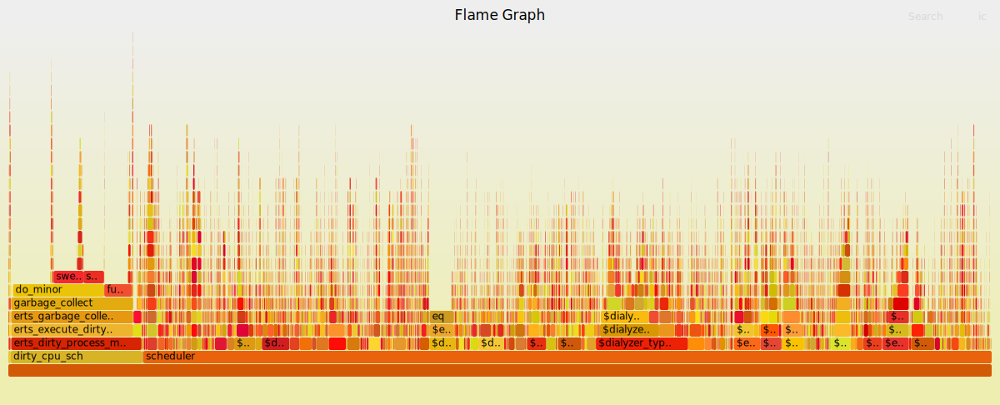

# BeamAsm, the Erlang JIT

BeamAsm provides load-time conversion of Erlang BEAM instructions into
native code on x86-64. This allows the loader to eliminate any instruction
dispatching overhead and also specialize each instruction on their argument types.

BeamAsm does not do any cross instruction optimizations and the x and y
register arrays work the same as when interpreting BEAM instructions.
This allows the Erlang run-time system to be largely unchanged except for
places that need to work with loaded BEAM instructions like code loading,
tracing, and a few others.

BeamAsm uses [asmjit](https://github.com/asmjit/asmjit) to generate native code
in run-time. Only small parts of the
[Assembler API](https://asmjit.com/doc/group__asmjit__assembler.html) of
[asmjit](https://github.com/asmjit/asmjit) is used. At the moment
[asmjit](https://github.com/asmjit/asmjit) only supports x86 32/64 bit assembler.

## Loading Code

The code is loaded very similarly to how it is loaded for the interpreter. Each beam
file is parsed and then optimized through the transformations described in
[beam_makeops](beam_makeops#defining-transformation-rules). The transformations
used in BeamAsm are much simpler than the interpreter's, as most of the
transformations for the interpreter are done only to eliminate the instruction
dispatch overhead.

Then each instruction is encoded using the C++ functions in the asm/instr_*.cpp files.
Example:

    void BeamModuleAssembler::emit_is_nonempty_list(const ArgVal &Fail, const ArgVal &Src) {
      a.test(getArgRef(Src), imm(_TAG_PRIMARY_MASK - TAG_PRIMARY_LIST));
      a.jne(labels[Fail.getValue()]);
    }

[asmjit](https://github.com/asmjit/asmjit) provides a fairly straightforward
mapping from a C++ function call to the x86 assembly instruction. The above
instruction tests if the value in the `Src` register is a non-empty list and if
it is not then it jumps to the fail label.

For comparison, the interpreter has 8 combinations and specializations of
this implementation to minimize the instruction dispatch overhead for
common patterns.

The original register allocation done by the Erlang compiler is used to manage the
liveness of values and the physical registers are statically allocated to keep
the necessary process state. At the moment this is the static register allocation:

    rbx: ErtsSchedulerRegisters struct (contains x and float registers and some metadata)
    r12: Erlang stack pointer
    r13: current running process
    r14: remaining reductions
    r15: Erlang heap pointer

Note that all of these are callee save registers under the System V and Windows
ABIs which means that BeamAsm never has to spill any of these when making C
function calls.

The caller save registers are used as scratch registers within instructions but
never to carry information between them.

### Reducing code size and load time

One of the strengths of the interpreter is that it uses relatively little memory
for loaded code. This is because the implementation of each loaded instruction is
shared and only the arguments to the instructions vary. Using as little memory as
possible has many advantages; less memory is used, loading time decreases,
higher cache hit-rate.

In BeamAsm we need to achieve something similar since the load-time of a module
scales almost linearly with the amount of memory it uses. Early BeamAsm prototypes
used about double the amount of memory for code as the interpreter, while current
versions use somewhere between 10-20% more. How was this achieved?

In BeamAsm we heavily use shared code fragments to try to emit as much code as
possible as global shared fragments instead of duplicating the code unnecessarily.
For instance, the return instruction looks something like this:

    Label yield = a.newLabel();

    a.mov(ARG3, getCPRef()); /* Get address to return to */
    a.mov(getCPRef(), imm(NIL));

    a.dec(FCALLS); /* Decrement reduction counter */
    a.jl(yield);   /* Check if we should yield */
    a.jmp(ARG3);   /* Jump to the return address */

    a.bind(yield);
    abs_jmp(ga->get_return_shared());

The code above is not exactly what is emitted, but close enough. The thing to note
is that the code for doing the context switch is never emitted. Instead, we jump
to a global fragment that all return instructions share. This greatly reduces
the amount of code that has to be emitted for each module.

## Running Code

Running BeamAsm code is very similar to running the interpreter, only that native
code is executed instead of interpreted code. It does not use the native-stack to
keep track of Erlang process stack frames, nor does it use the native registers.

Instead, everything is kept the same as the interpreter to not have to do
any context switches when calling BIFs or any other C functions.

This means that the BEAM instruction for `call` does not do an x86 `call`.
Instead it does a push of the return address to the Erlang process stack and then
a jump to the called function.

## Tracing and NIF Loading

To make tracing and NIF loading work there needs to be a way to intercept
any function call. In the interpreter, this is done by rewriting the loaded BEAM code,
but this is more complicated in BeamAsm as we want to have a fast and compact way to
do this. This is solved by emitting the code below at the start of each function:

    0x0: jmp 6
    0x2: ERTS_ASM_BP_FLAG_NONE
    0x3: relative near call
    0x4: &genericBPTramp
    0x8: actual code for the function

When code starts to execute it will simply see the `jmp 6` instruction
which skips the prologue and starts to execute the code directly.

When we want to enable a certain breakpoint we set the `jmp` target to
be 1 (which means it will land on the call instruction) and will call
genericBPTramp. genericBPTramp is a label at the top of each module
that contains [trampolines][1] for all flag combinations.

[1]: https://en.wikipedia.org/wiki/Trampoline_(computing)

    genericBPTramp:

    0x0: ret
    0x10: jmp call_nif_early
    0x20: call generic_bp_local
    0x30: call generic_bp_local
    0x35: jmp call_nif_early

Note that each target is 16 byte aligned. This is because the call target
in the function prologue is updated to target the correct place when a flag
is updated. So if CALL\_NIF\_EARLY is set, then it is updated to be
genericBPTramp + 0x10. If BP is set, it is updated to genericBPTramp + 0x20
and the combination makes it to be genericBPTramp + 0x30.

## GDB support

When using the `cerl` command to debug BeamAsm a gdb plug-in called jit-reader
is automatically loaded so that symbols on the native stack are resolved to the
correct symbols. Example:

    #0  db_free_term (tb=0x7fffb51801c8, basep=0x7fffb5184cd0, offset=16)
        at beam/erl_db_util.c:3024
    #1  0x000055555572989c in free_term (p=<optimized out>, tb=0x7fffb51801c8)
        at beam/erl_db_hash.c:382
    #2  free_term_list (p=<optimized out>, tb=<optimized out>)
        at beam/erl_db_hash.c:382
    #3  db_erase_hash (tbl=0x7fffb51801c8, key=<optimized out>,
        ret=<optimized out>) at beam/erl_db_hash.c:1358
    #4  0x0000555555712065 in ets_delete_2 (A__p=0x7fffb4c44e40,
        A__p@entry=<error reading variable: value has been optimized out>,
        BIF__ARGS=0x7fffb5850440,
        BIF__ARGS@entry=<error reading variable: value has been optimized out>,
        A__I=<error reading variable: value has been optimized out>)
        at beam/erl_db.c:2786
    #5  0x0000555555601a64 in call_light_bif (c_p=0x7fffb4c44e40,
        reg=0x7fffb5850440, I=<optimized out>, exp=0x7fffb277b720,
        vbf=<optimized out>) at beam/asm/instr_bif.cpp:212
    #6  0x00007fffb275b451 in global::call_light_bif_shared ()
    #7  0x00007fffb2621920 in logger_config:delete/2 ()
    #8  0x00005555555ce447 in process_main (registers=<optimized out>)
        at beam/asm/beam_asm.cpp:165
    #9  0x00005555555abfd6 in sched_thread_func (vesdp=0x7fffb35d9580)
        at beam/erl_process.c:8509
    #10 0x0000555555840f3a in thr_wrapper (vtwd=0x7fffffffd110)
        at pthread/ethread.c:118
    #11 0x00007ffff75726db in start_thread (arg=0x7fffb22f9700)
        at pthread_create.c:463
    #12 0x00007ffff670988f in clone ()
        at ../sysdeps/unix/sysv/linux/x86_64/clone.S:95

The frames `logger_config:delete/2` and `global::call_light_bif_shared` are BeamAsm
generated frames. Note that this stack trace does not include the stack of the current
executing Erlang process. It only includes the current function of the currently executing
Erlang process.

## Description of each file

The BeamAsm implementation resides in the `$ERL_TOP/erts/emulator/beam/jit` folder.
The files are:

* `load.h`
    * BeamAsm specific header for loading code
* `asm_load.c`
    * BeamAsm specific functions for loading code
* `generators.tab`, `predicates.tab`, `ops.tab`
    * BeamAsm specific transformations for instructions. See [beam_makeops](beam_makeops) for
      more details.
* `beam_asm.h`
    * Header file describing the C -> C++ api
* `beam_asm.hpp`
    * Header file describing the structs and classes used by BeamAsm.
* `beam_asm.cpp`
    * Implementation of the main process loop
    * The BeamAsm initialization code
    * The C -> C++ interface functions.
* `beam_asm_module.cpp`
    * The code for the BeamAsm module code generator logic
* `beam_asm_global.cpp`
    * Global code fragments that are used by multiple instructions, e.g. error handling code.
* `instr_*.cpp`
    * Implementation of individual instructions grouped into files by area
* `beam_asm_perf.cpp`
    * The linux perf support for BeamAsm

## Linux perf support

perf can also be instrumented using BeamAsm symbols to provide more information. As with
gdb, only the currently executing function will show up in the stack trace, which means
that perf provides functionality similar to that of [eprof](https://erlang.org/doc/man/eprof.html).

You can run perf on BeamAsm like this:

    perf record -g erl +JPperf true

and then look at the results using `perf report` as you normally would with perf.
For example, you can run perf to analyze dialyzer building a PLT like this:

     ERL_FLAGS="+JPperf true +S 1" perf record -g \
     dialyzer --build_plt -Wunknown \
     --apps compiler crypto erts kernel stdlib syntax_tools \
     asn1 edoc et ftp inets mnesia observer public_key sasl \
     runtime_tools snmp ssl tftp wx xmerl tools

The above code is run using `+S 1` to make the perf output easier to understand.
If you then run `perf report -f --no-children` you may get something similar to this:

Any Erlang function in the report is prefixed with a `$` and all C functions have
their normal names. Any Erlang function that has the prefix `$global::` refers
to a global shared fragment.

So in the above, we can see that we spend the most time doing `eq`, i.e. comparing two terms.
By expanding it and looking at its parents we can see that it is the function
`erl_types:t_is_equal/2` that contributes the most to this value. Go and have a look
at it in the source code to see if you can figure out why so much time is spent there.

After `eq` we see the function `erl_types:t_has_var/1` where we spend almost
6% of the entire execution in. A while further down you can see `copy_struct` which
is the function used to copy terms. If we expand it to view the parents we find that
it is mostly `ets:lookup_element/3` that contributes to this time via the erlang
function `dialyzer_plt:ets_table_lookup/2`.

### Flame Graph

You can also create a Flame Graph from the perf output. Flame Graphs are basically
just another way to look at the same data as the `perf report` output, but can
be more easily shared with others and manipulated to give a graph tailor-made for
your needs. For instance, if we run dialyzer with all schedulers:

    ## Run dialyzer with multiple schedulers
    ERL_FLAGS="+JPperf true" perf record -g $ERL_TOP/bin/dialyzer \
      --build_plt -Wunknown --apps compiler crypto erts kernel stdlib \
      syntax_tools asn1 edoc et ftp inets mnesia observer public_key \
      sasl runtime_tools snmp ssl tftp wx xmerl tools --statistics

And then use the scripts found at Brendan Gregg's [CPU Flame Graphs](http://www.brendangregg.com/FlameGraphs/cpuflamegraphs)
webpage as follows:

    ## Collect the results
    perf script > out.perf
    ## run stackcollapse
    stackcollapse-perf.pl out.perf > out.folded
    ## Create the svg
    flamegraph.pl out.folded_sched > out.svg

We get a graph that would look something like this:

You can view a larger version [here](seefile/figures/perf-beamasm.svg). It contains
the same information, but it is easier to share with others as it does
not need the symbols in the executables.

Using the same data we can also produce a graph where the scheduler profile data
has been merged by using `sed`:

    ## Strip [0-9]+_ from all scheduler names
    sed -e 's/^[0-9]\+_//' out.folded > out.folded_sched
    ## Create the svg
    flamegraph.pl out.folded_sched > out_sched.svg

You can view a larger version [here](seefile/figures/perf-beamasm-merged.svg).
There are many different transformations that you can do to make the graph show
you what you want.

## FAQ

### How do I know that I'm running a JIT enabled Erlang?

You will see a banner containing `[jit]` shell when you start. You can also use
`erlang:system_info(emu_flavor)` to check the flavor and it should be `jit`.

There are three major reasons why when building Erlang/OTP you would not get the JIT.

* You are not building x86 64-bit
* You do not have a C++ compiler that supports C++-17
* You do not have an OS that supports executable *and* writable memory

If you run `./configure --enable-jit` configure will abort when it discovers that
your system cannot build the JIT.

### Is the interpreter still available?

Yes, you can still build the interpreter if you want to. In fact, it is what is used
on platforms where BeamAsm does not yet work. You can either completely disable
BeamAsm by passing `--disable-jit` to configure. Or you can build the
interpreter using `make FLAVOR=jit` and then run it using `erl -emu_flavor jit`.

It is possible to have both the JIT and interpreter available at the same time.

### How much of a speedup should I expect from BeamAsm compared to the interpreter?

It depends a lot on what your application does. Anything from no difference to up to
twice as fast is possible.

BeamAsm tries very hard to not be slower than the interpreter, but there can be cases
when that happens. One such could be very short-lived small scripts. If you come across
any scenarios when this happens, please open a bug report at [the Erlang/OTP bug tracker](http://bugs.erlang.org).

### Would it be possible to add support for BeamAsm on ARM?

Any new architecture needs support in the assembler as well. Since we use
[asmjit](https://github.com/asmjit/asmjit) for this, that means we need support
in [asmjit](https://github.com/asmjit/asmjit). BeamAsm uses relatively few
instructions (mostly, `mov`, `jmp`, `cmp`, `sub`, `add`), so it would not need to have
full support of all ARM instructions.

Another approach would be to not use [asmjit](https://github.com/asmjit/asmjit)
for ARM, but instead, use something different to assemble code during load-time.

### Would it be possible to add support for BeamAsm on another OS?

Adding a new OS that runs x86-64 should not need any large changes if
the OS supports mapping of memory as executable. If the ABI used by the
OS is not supported changes related to calling C-functions also have to
be made.

As a reference, it took us about 1-2 weeks to implement support for Windows.

### Would it be possible to add support in perf to crawl the Erlang stack?

Yes, though not easily. One approach would be to instruct perf to know
what Erlang is and how to crawl its stack. This would entail modifying
the Linux kernel and/or libunwind. A second, probably better approach,
would be to make Erlang processes run on the native C-stack instead of
on a parallel Erlang stack. This would radically change the way that
BeamAsm handles calls and returns but would allow perf to crawl the
Erlang stack.
