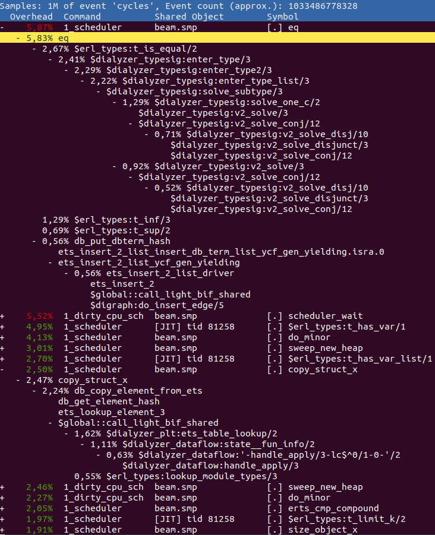
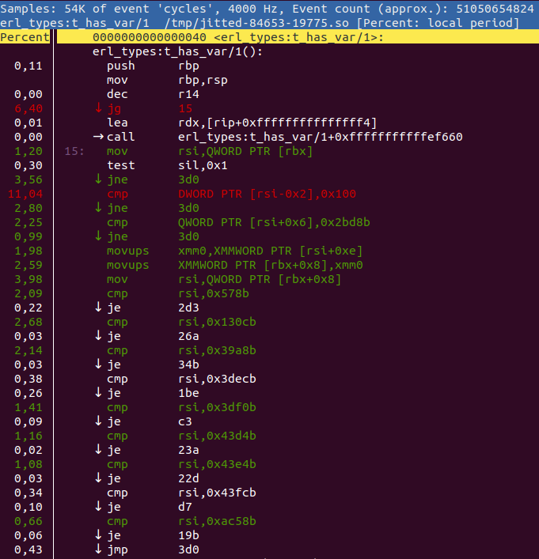

# BeamAsm, the Erlang JIT

BeamAsm provides load-time conversion of Erlang BEAM instructions into
native code on x86-64. This allows the loader to eliminate any instruction
dispatching overhead and also specialize each instruction on their argument types.

BeamAsm does hardly any cross instruction optimizations and the x and y
register arrays work the same as when interpreting BEAM instructions.
This allows the Erlang run-time system to be largely unchanged except for
places that need to work with loaded BEAM instructions like code loading,
tracing, and a few others.

BeamAsm uses [asmjit](https://github.com/asmjit/asmjit) to generate native code
in run-time. Only small parts of the
[Assembler API](https://asmjit.com/doc/group__asmjit__assembler.html) of
[asmjit](https://github.com/asmjit/asmjit) is used. At the moment
[asmjit](https://github.com/asmjit/asmjit) only supports x86 32/64 bit assembler.

## Loading Code

The code is loaded very similarly to how it is loaded for the interpreter. Each beam
file is parsed and then optimized through the transformations described in
[beam_makeops](beam_makeops#defining-transformation-rules). The transformations
used in BeamAsm are much simpler than the interpreter's, as most of the
transformations for the interpreter are done only to eliminate the instruction
dispatch overhead.

Then each instruction is encoded using the C++ functions in the jit/instr_*.cpp files.
Example:

    void BeamModuleAssembler::emit_is_nonempty_list(const ArgVal &Fail, const ArgVal &Src) {
      a.test(getArgRef(Src), imm(_TAG_PRIMARY_MASK - TAG_PRIMARY_LIST));
      a.jne(labels[Fail.getValue()]);
    }

[asmjit](https://github.com/asmjit/asmjit) provides a fairly straightforward
mapping from a C++ function call to the x86 assembly instruction. The above
instruction tests if the value in the `Src` register is a non-empty list and if
it is not then it jumps to the fail label.

For comparison, the interpreter has 8 combinations and specializations of
this implementation to minimize the instruction dispatch overhead for
common patterns.

The original register allocation done by the Erlang compiler is used to manage the
liveness of values and the physical registers are statically allocated to keep
the necessary process state. At the moment this is the static register allocation:

    rbx: ErtsSchedulerRegisters struct (contains x/float registers and some metadata)
    rbp: Current frame pointer when `perf` support is enabled, otherwise this
         is an optional save slot for the Erlang stack pointer when executing C
         code.
    r12: Active code index
    r13: Current running process
    r14: Remaining reductions
    r15: Erlang heap pointer

Note that all of these are callee save registers under the System V and Windows
ABIs which means that BeamAsm never has to spill any of these when making C
function calls.

The caller save registers are used as scratch registers within instructions but
usually do not carry information between them. For some frequent instruction
sequences such as tuple matching cross instruction optimization *are* done to avoid
fetching the base address of the tuple in every `get_tuple_element` instruction.

### Reducing code size and load time

One of the strengths of the interpreter is that it uses relatively little memory
for loaded code. This is because the implementation of each loaded instruction is
shared and only the arguments to the instructions vary. Using as little memory as
possible has many advantages; less memory is used, loading time decreases,
higher cache hit-rate.

In BeamAsm we need to achieve something similar since the load-time of a module
scales almost linearly with the amount of memory it uses. Early BeamAsm prototypes
used about double the amount of memory for code as the interpreter, while current
versions use about 10% more. How was this achieved?

In BeamAsm we heavily use shared code fragments to try to emit as much code as
possible as global shared fragments instead of duplicating the code unnecessarily.
For instance, the return instruction looks something like this:

    Label yield = a.newLabel();

    a.dec(FCALLS);           /* Decrement reduction counter */
    a.jl(dispatch_return);   /* Check if we should yield */
    a.ret();

    a.bind(yield);
    abs_jmp(ga->get_dispatch_return());

The code above is not exactly what is emitted, but close enough. The thing to note
is that the code for doing the context switch is never emitted. Instead, we jump
to a global fragment that all return instructions share. This greatly reduces
the amount of code that has to be emitted for each module.

## Running Erlang code

Running BeamAsm code is very similar to running the interpreter, except that
native code is executed instead of interpreted code.

We had to tweak the way the Erlang stack works in order to execute native
instructions on it. While the interpreter uses a stack slot for
the current frame's return address (setting it to `[]` when unused), the
native code merely reserves enough space for it as the x86 `call` and `ret`
instructions bump the stack pointer when executed.

This only affects the _current stack frame_, and is functionally identical
aside from two caveats:

1. Exceptions must not be thrown when the return address is reserved.

    It's hard to tell where the stack will end up after an exception; the return
    address won't be on the stack if we crash in the _current stack frame_, but
    will be if we crash in a function we call. Telling these apart turned out to
    rather complicated, so we decided to require the return address to be used
    when an exception is thrown.

    `emit_handle_error` handles this for you, and shared fragments that have been
    called (rather than jumped to) satisfy this requirement by default.

2. Garbage collection needs to take return addresses into account.

    If we're about to create a term we have to make sure that there's enough
    space for this term _and_ a potential return address, or else the next
    `call` will clobber said term. This is taken care of in `emit_gc_test` and
    you generally don't need to think about it.

In addition to the above, we ensure that there's always at least `S_REDZONE`
free words on the stack so we can make calls to shared fragments or trace
handlers even when we lack a stack frame. This is merely a reservation and has
no effect on how the stack works, and all values stored there must be valid
Erlang terms in case of a garbage collection.

## Frame pointers

To aid debuggers and sampling profilers, we support running Erlang code with
native frame pointers. At the time of writing, this is only enabled together
with `perf` support (`+JPperf true`) to save stack space, but we may add a flag
to explicitly enable it in the future.

When enabled, continuation pointers (CP) have both a return address _and_ a
frame pointer that points at the previous CP. CPs must form a valid chain at
all times, and it's illegal to have "half" a CP when the stack is inspected.

Frame pointers are pushed when entering an Erlang function and popped before
leaving it, including on tail calls as the callee will immediately push the
frame pointer on entry. This has a slight overhead but saves us the headache of
having multiple entry points for each function depending on whether it's tail-
or body-called, which would get very tricky once breakpoints enter the picture.

## Running C code

As Erlang stacks can be very small, we have to switch over to a different stack
when we need to execute C code (which may expect a much larger stack). This is
done through `emit_enter_runtime` and `emit_leave_runtime`, for example:

    mov_arg(ARG4, NumFree);

    /* Move to the C stack and swap out our current reductions, stack-, and
     * heap pointer to the process structure. */
    emit_enter_runtime<Update::eReductions | Update::eStack | Update::eHeap>();

    a.mov(ARG1, c_p);
    load_x_reg_array(ARG2);
    make_move_patch(ARG3, lambdas[Fun.getValue()].patches);

    /* Call `new_fun`, asserting that we're on the C stack. */
    runtime_call<4>(new_fun);

    /* Move back to the C stack, and read the updated values from the process
     * structure */
    emit_leave_runtime<Update::eReductions | Update::eStack | Update::eHeap>();

    a.mov(getXRef(0), RET);

All combinations of the `Update` constants are legal, but the ones given to
`emit_leave_runtime` _must_ be the same as those given to `emit_enter_runtime`.

## Tracing and NIF Loading

To make tracing and NIF loading work there needs to be a way to intercept
any function call. In the interpreter, this is done by rewriting the loaded BEAM code,
but this is more complicated in BeamAsm as we want to have a fast and compact way to
do this. This is solved by emitting the code below at the start of each function:

    0x0: jmp 6
    0x2: ERTS_ASM_BP_FLAG_NONE
    0x3: relative near call
    0x4: &genericBPTramp
    0x8: actual code for the function

When code starts to execute it will simply see the `jmp 6` instruction
which skips the prologue and starts to execute the code directly.

When we want to enable a certain break point we set the `jmp` target to
be 1 (which means it will land on the call instruction) and will call
genericBPTramp. genericBPTramp is a label at the top of each module
that contains [trampolines][1] for all flag combinations.

[1]: https://en.wikipedia.org/wiki/Trampoline_(computing)

    genericBPTramp:

    0x0: ret
    0x10: jmp call_nif_early
    0x20: call generic_bp_local
    0x30: call generic_bp_local
    0x35: jmp call_nif_early

Note that each target is 16 byte aligned. This is because the call target
in the function prologue is updated to target the correct place when a flag
is updated. So if CALL\_NIF\_EARLY is set, then it is updated to be
genericBPTramp + 0x10. If BP is set, it is updated to genericBPTramp + 0x20
and the combination makes it to be genericBPTramp + 0x30.

### Updating code

Because many environments enforce [W^X] it's not always possible to write
directly to the code pages. Because of this we map code twice: once with an
executable page and once with a writable page. Since they're backed by the
same memory, writes to the writable page appear magically in the executable
one.

The `erts_writable_code_ptr` function can be used to get writable pointers,
given a module instance:

    for (i = 0; i < n; ++i) {
        const ErtsCodeInfo* ci_exec;
        ErtsCodeInfo* ci_rw;
        void *w_ptr;

        ci_exec = code_hdr->functions[i];
        w_ptr = erts_writable_code_ptr(&modp->curr, ci_exec);
        ci_rw = (ErtsCodeInfo*)w_ptr;

        uninstall_breakpoint(ci_rw, ci_exec);
        consolidate_bp_data(modp, ci_rw, 1);
        ASSERT(ci_rw->u.gen_bp == NULL);
    }

Without the module instance there's no reliable way to figure out the writable
address of a code page, and we rely on _address space layout randomization_
(ASLR) to make it difficult to guess.

### Export tracing

Unlike the interpreter, we don't execute code inside export entries as that's
very annoying to do in the face of [W^X]. When tracing is enabled, we instead
point to a fragment that looks at the current export entry and decides what to
do.

This fragment is shared between all export entries, and the export entry to
operate on is assumed to be in a certain register (`RET` as of writing). This
means that all remote calls _must_ place the export entry in said register,
even when we don't know beforehand that the call is remote, such as when
calling a fun.

This is pretty easy to do in assembler and the `emit_setup_export_call` helper
handles it nicely for us, but we can't set registers when trapping out from C
code. When trapping to an export entry from C code one must set `c_p->current`
to the `ErtsCodeMFA` inside the export entry in question, and then set `c_p->i`
to `beam_bif_export_trap`.

The `BIF_TRAP` macros handle this for you, so you generally don't need to
think about it.

[W^X]: https://en.wikipedia.org/wiki/W%5EX

## Description of each file

The BeamAsm implementation resides in the `$ERL_TOP/erts/emulator/beam/jit` folder.
The files are:

* `load.h`
    * BeamAsm specific header for loading code
* `asm_load.c`
    * BeamAsm specific functions for loading code
* `generators.tab`, `predicates.tab`, `ops.tab`
    * BeamAsm specific transformations for instructions. See [beam_makeops](beam_makeops) for
      more details.
* `beam_asm.h`
    * Header file describing the C -> C++ api
* `beam_asm.hpp`
    * Header file describing the structs and classes used by BeamAsm.
* `beam_asm.cpp`
    * Implementation of the main process loop
    * The BeamAsm initialization code
    * The C -> C++ interface functions.
* `beam_asm_module.cpp`
    * The code for the BeamAsm module code generator logic
* `beam_asm_global.cpp`
    * Global code fragments that are used by multiple instructions, e.g. error handling code.
* `instr_*.cpp`
    * Implementation of individual instructions grouped into files by area
* `beam_asm_perf.cpp`
    * The linux perf support for BeamAsm

## Linux perf support

perf can also be instrumented using BeamAsm symbols to provide more information. As with
gdb, only the currently executing function will show up in the stack trace, which means
that perf provides functionality similar to that of [eprof](https://erlang.org/doc/man/eprof.html).

You can run perf on BeamAsm like this:

    perf record erl +JPperf true

and then look at the results using `perf report` as you normally would with
perf.

Frame pointers are enabled when the `+JPperf true` option is passed, so you can
use `perf record --call-graph=fp` to get more context. This will give you
accurate call graphs for pure Erlang code, but in rare cases it fails to track
transitions from Erlang to C code and back. [`perf record --call-graph=lbr`](https://lwn.net/Articles/680985/)
may work better in those cases, but it's worse at tracking in general.

For example, you can run perf to analyze dialyzer building a PLT like this:

     ERL_FLAGS="+JPperf true +S 1" perf record --call-graph=fp \
       dialyzer --build_plt -Wunknown --apps compiler crypto erts kernel stdlib \
       syntax_tools asn1 edoc et ftp inets mnesia observer public_key \
       sasl runtime_tools snmp ssl tftp wx xmerl tools

The above code is run using `+S 1` to make the perf output easier to understand.
If you then run `perf report -f --no-children` you may get something similar to this:

Any Erlang function in the report is prefixed with a `$` and all C functions have
their normal names. Any Erlang function that has the prefix `$global::` refers
to a global shared fragment.

So in the above, we can see that we spend the most time doing `eq`, i.e. comparing two terms.
By expanding it and looking at its parents we can see that it is the function
`erl_types:t_is_equal/2` that contributes the most to this value. Go and have a look
at it in the source code to see if you can figure out why so much time is spent there.

After `eq` we see the function `erl_types:t_has_var/1` where we spend almost
5% of the entire execution in. A while further down you can see `copy_struct_x`
which is the function used to copy terms. If we expand it to view the parents
we find that it is mostly `ets:lookup_element/3` that contributes to this time
via the Erlang function `dialyzer_plt:ets_table_lookup/2`.

### Flame Graph

You can also create a Flame Graph from the perf output. Flame Graphs are basically
just another way to look at the same data as the `perf report` output, but can
be more easily shared with others and manipulated to give a graph tailor-made for
your needs. For instance, if we run dialyzer with all schedulers:

    ## Run dialyzer with multiple schedulers
    ERL_FLAGS="+JPperf true" perf record --call-graph=fp \
      dialyzer --build_plt -Wunknown --apps compiler crypto erts kernel stdlib \
      syntax_tools asn1 edoc et ftp inets mnesia observer public_key \
      sasl runtime_tools snmp ssl tftp wx xmerl tools --statistics

And then use the scripts found at Brendan Gregg's [CPU Flame Graphs](http://www.brendangregg.com/FlameGraphs/cpuflamegraphs)
web page as follows:

    ## Collect the results
    perf script > out.perf
    ## run stackcollapse
    stackcollapse-perf.pl out.perf > out.folded
    ## Create the svg
    flamegraph.pl out.folded > out.svg

We get a graph that would look something like this:

You can view a larger version [here](seefile/figures/perf-beamasm.svg). It contains
the same information, but it is easier to share with others as it does
not need the symbols in the executable.

Using the same data we can also produce a graph where the scheduler profile data
has been merged by using `sed`:

    ## Strip [0-9]+_ from all scheduler names
    sed -e 's/^[0-9]\+_//' out.folded > out.folded_sched
    ## Create the svg
    flamegraph.pl out.folded_sched > out_sched.svg

You can view a larger version [here](seefile/figures/perf-beamasm-merged.svg).
There are many different transformations that you can do to make the graph show
you what you want.

### Annotate perf functions

If you want to be able to use the `perf annotate` functionality (and in extention
the annotate functionality in the `perf report` gui) you need to use a monotonic
clock when calling `perf record`, i.e. `perf record -k mono`. So for a dialyzer
run you would do this:

    ERL_FLAGS="+JPperf true +S 1" perf record -k mono --call-graph=fp \
      dialyzer --build_plt -Wunknown --apps compiler crypto erts kernel stdlib \
      syntax_tools asn1 edoc et ftp inets mnesia observer public_key \
      sasl runtime_tools snmp ssl tftp wx xmerl tools

In order to use the `perf.data` produced by this record you need to first call
`perf inject --jit` like this:

    perf inject --jit -i perf.data -o perf.jitted.data

and then you can view an annotated function like this:

    perf annotate -M intel -i perf.jitted.data erl_types:t_has_var/1

or by pressing `a` in the `perf report` ui. Then you get something like this:

> *WARNING*: Calling `perf inject --jit` will create a lot of files in `/tmp/`
> and in `~/.debug/tmp/`. So make sure to cleanup in those directories from time to
> time or you may run out of inodes.

### perf tips and tricks

You can do a lot of neat things with `perf`. Below is a list of some of the options
we have found useful:

* `perf report --no-children`
    Do not include the accumulation of all children in a call.
* `perf report  --call-graph callee`
    Show the callee rather than the caller when expanding a function call.
* `perf archive`
    Create an archive with all the artifacts needed to inspect the data
    on another host. In early version of perf this command does not work,
    instead you can use [this bash script](https://github.com/torvalds/linux/blob/master/tools/perf/perf-archive.sh).

## FAQ

### How do I know that I'm running a JIT enabled Erlang?

You will see a banner containing `[jit]` shell when you start. You can also use
`erlang:system_info(emu_flavor)` to check the flavor and it should be `jit`.

There are three major reasons why when building Erlang/OTP you would not get the JIT.

* You are not building x86 64-bit
* You do not have a C++ compiler that supports C++-17

If you run `./configure --enable-jit` configure will abort when it discovers that
your system cannot build the JIT.

### Is the interpreter still available?

Yes, you can still build the interpreter if you want to. In fact, it is what is used
on platforms where BeamAsm does not yet work. You can either completely disable
BeamAsm by passing `--disable-jit` to configure. Or you can build the
interpreter using `make FLAVOR=emu` and then run it using `erl -emu_flavor emu`.

It is possible to have both the JIT and interpreter available at the same time.

### How much of a speedup should I expect from BeamAsm compared to the interpreter?

It depends a lot on what your application does. Anything from no difference to up to
four times as fast is possible.

BeamAsm tries very hard to not be slower than the interpreter, but there can be cases
when that happens. One such could be very short-lived small scripts. If you come across
any scenarios when this happens, please open a bug report at
[the Erlang/OTP bug tracker](https://github.com/erlang/otp/issues).

### Would it be possible to add support for BeamAsm on ARM?

Any new architecture needs support in the assembler as well. Since we use
[asmjit](https://github.com/asmjit/asmjit) for this, that means we need support
in [asmjit](https://github.com/asmjit/asmjit). BeamAsm uses relatively few
instructions (mostly, `mov`, `jmp`, `cmp`, `sub`, `add`), so it would not need to have
full support of all ARM instructions.

Another approach would be to not use [asmjit](https://github.com/asmjit/asmjit)
for ARM, but instead, use something different to assemble code during load-time.

### Would it be possible to add support for BeamAsm on another OS?

Adding a new OS that runs x86-64 should not need any large changes if
the OS supports mapping of memory as executable. If the ABI used by the
OS is not supported changes related to calling C-functions also have to
be made.

As a reference, it took us about 2-3 weeks to implement support for Windows.

### Would it be possible to add support in perf to better crawl the Erlang stack?

Yes, though not easily.

Using `perf --call-graph lbr` works for Erlang, but it does not give a
perfect record as the buffer has a limited size.
