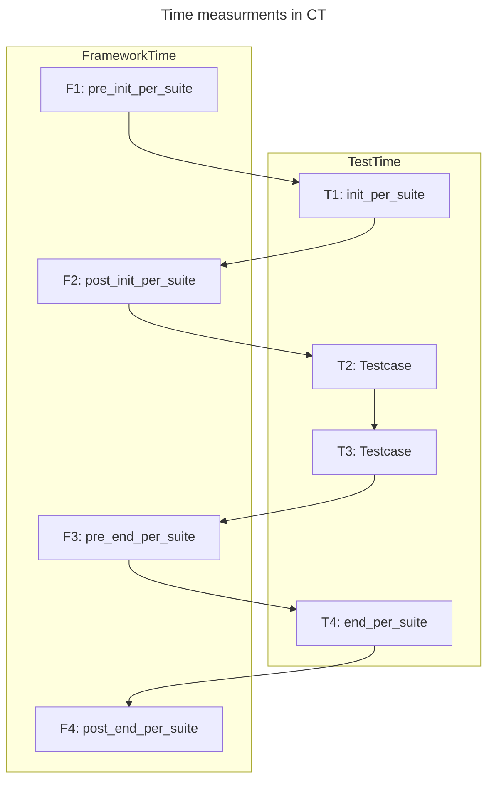
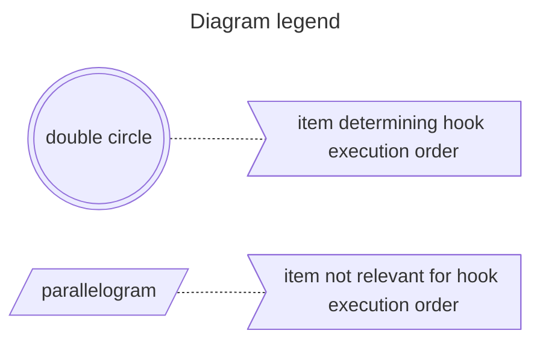
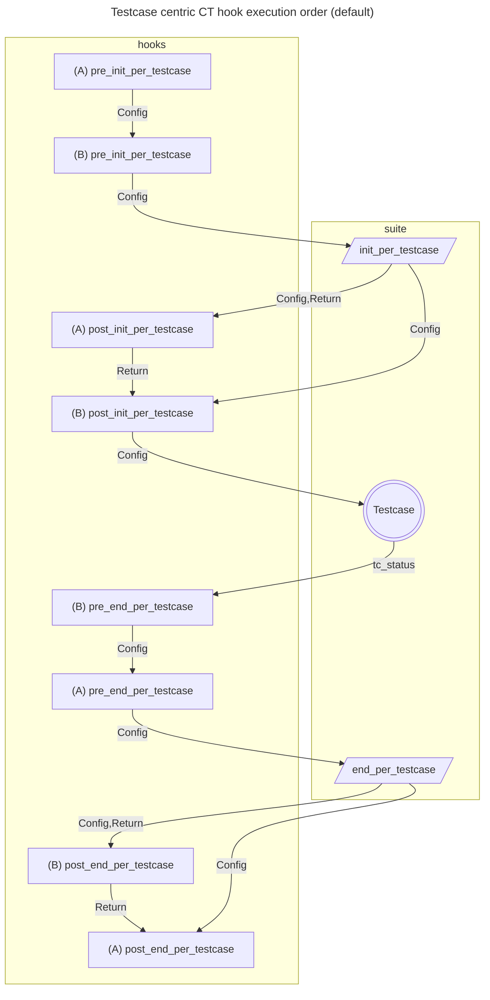
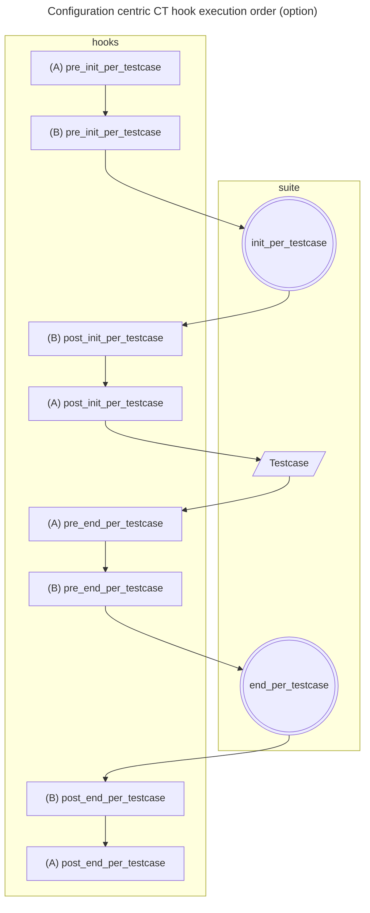
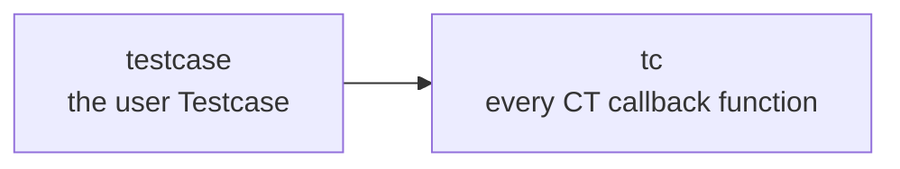
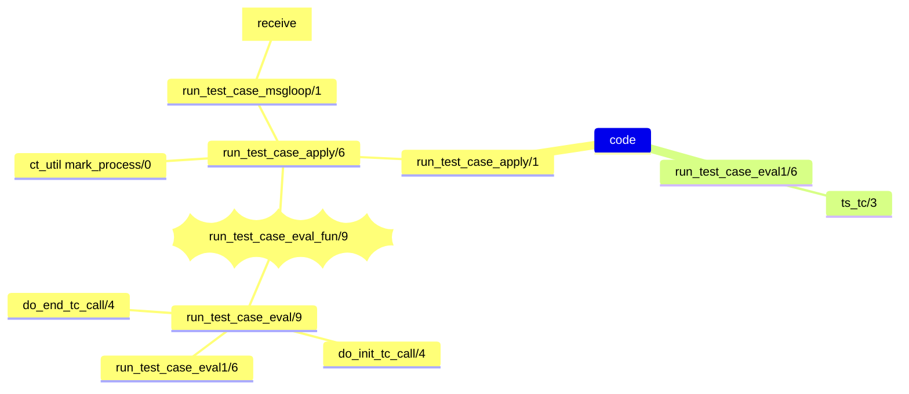
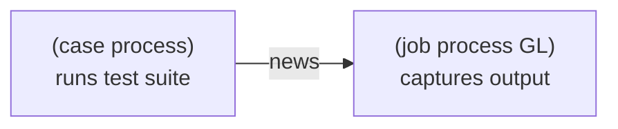
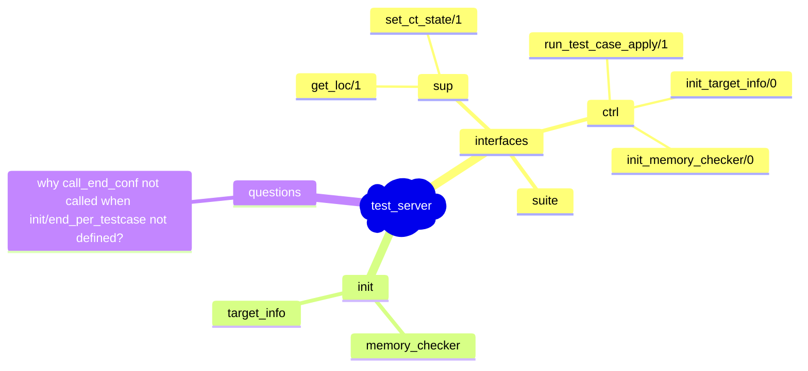

# CT notes
## Time categories and totals
1. TestTime - spent on executing configuration or test case functions
2. FrameworkTime - e.g. spent on executing hooks
3. ElapsedTime - start/stop timestamp difference for test execution

> [!NOTE]
> timetrap option operates on TestTime

### sequential execution
Without parallel execution ElapsedTime would be close to sum of test and framework execution times.

> [!NOTE]
> ElapsedTime ~= FrameworkTime + TestTime = (F1 + F2 + F3 + F4) + (T1 + _T2 + T3_ +T4)

### parallel execution
With parallel execution ElapsedTime is expected to be smaller than sum of test and framework execution times.

> [!NOTE]
> ElapsedTime ~= FrameworkTime + TestTime = (F1 + F2 + F3 + F4) + (T1 + _max(T2, T3)_ +T4)

## HTML pages - CT_LOGS folder content
1. index.html
   - **Test Run Started - timestamp**
2. suite.log.latest.html
3. all_runs.html
4. ct_run.../index.html
   - time fetched from suite.log.html files - **ElapsedTime** per row (test suite or test spec) (PR-8112)
5. ct_run.../ctlog.html
6. ct_run.../last_test.html
7. ct_run.../misc_io.log.html
8. ct_run.../...logs/run.../cover.html
9. ct_run.../...logs/run.../ct_framework.end_per_group.html - present only in global "make test" run
10. ct_run.../...logs/run.../ct_framework.init_per_group.html - same as above
11. ct_run.../...logs/run.../$SUITE.end_per_suite.html
12. ct_run.../...logs/run.../$SUITE.init_per_suite.html
13. ct_run.../...logs/run.../$SUITE.$TESTCASE.html
14. ct_run.../...logs/run.../$SUITE.src.html
15. ct_run.../...logs/run.../suite.log.html
    - **Time per row**(test or conf function) - does not include FrameworkTime (e.g. spent in hooks)
    - **TOTAL Time - being ElapsedTime** not a sum of rows above
16. ct_run.../...logs/run.../unexpected_io.log.html
## Problem (GH-7119, OTP-11894, OTP-14480)
I think the most confusing thing is that today OTP behavior and design seems to be a mix of Configuration and Testcase centric attributes:
1. (Configuration centric) CT hook callback looks as designed to wrap around CT Configuration functions (i.e. you have *pre* and *post* to wrapp around init_per_testcase or end_per_testcase)
   - Furthermore if you consider hook callback function names, there are no hooks wrapping around Testcase function at all!
2. (Testcase centric) AND at the same the hook execution order is determined by relation to CT Testcase callback

### CT hooks priorities (documentation sketch)
Let's assume:
1. cth_A and cth_B being CT hook modules to be installed
2. A, B are CT hook priorities where A is more important than B (higher priority)
3. hook priorities affect order in which hook callbacks of the same type are executed
4. Testcase functions - are CT callback functions defined in suite which will have test verdict assigned (e.g. ok, fail, skip)
5. Configuration functions - are CT callback functions defining initialization and cleanup routines for testcases (e.g. init_per_testcase, end_per_testcase)

#### Testcase centric (default)
1. execution order is related to position in relation to Testcase
2. all *init* hook callbacks(positioned before Testcase) are executed in some order 
3. all *end* hook callbacks(positioned after Testcase) are executed in reversed order
4. *pre* and *post* hook callback type is not affecting execution order

#### Configuration centric (option candidate)
- all *pre* hooks will be executed in some order
- all *post* hooks will be executed in reversed order
- relation to Testcase is not relevant for hook execution order
- Note: I think, it might be considered a bit inconsistent because there are no hook callbacks wrapping around Testcase (e.g. pre_testcase, post_testcase)
- Above could be ugly workarounded by using pre_init_per_testcase with post_end_per_testcase
- Adding pre_testcase, post_testcase might not be simple but maybe it is not needed

## processes

## test_server code

## processes

## concept

