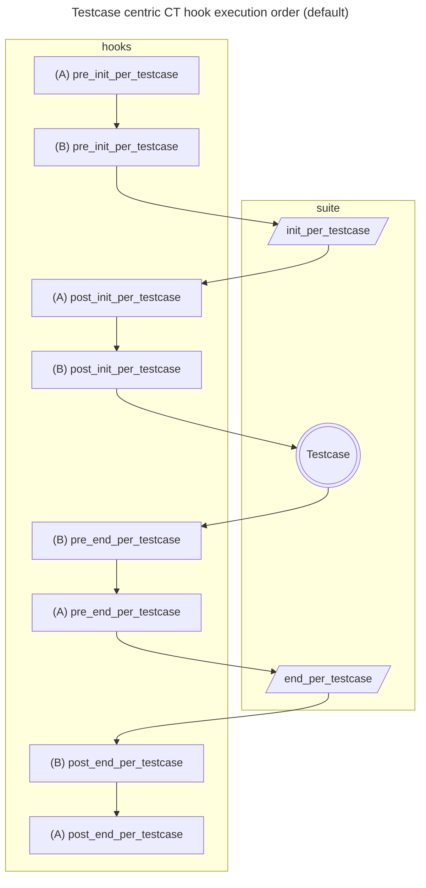

# CT test_server

## Problem (GH-7119, OTP-11894, OTP-14480)
I think the most confusing thing is that today OTP behavior and design seems to be a mix of Configuration and Testcase centric attributes:
1. (Configuration centric) CT hook callback looks as designed to wrap around CT Configuration functions (i.e. you have *pre* and *post* to wrapp around init_per_testcase or end_per_testcase)
   - Furthermore if you consider hook callback function names, there are no hooks wrapping around Testcase function at all!
2. (Testcase centric) AND at the same the hook execution order is determined by relation to CT Testcase callback
### Next step ideas
1. improve existing documentation for hooks (actually it was planned for many years but down prioritized)
2. add mermaid diagrams to docs when that is possible
3. introduce a CT option for Configuration centric hook execution order (maybe named ct_hooks_order := [testcase(default) | configuration])
### CT hooks priorities (documentation sketch)
Let's assume:
1. cth_A and cth_B being CT hook modules to be installed
2. A, B are CT hook priorities where A is more important than B (higher priority)
3. hook priorities affect order in which hook callbacks of the same type are executed
4. Testcase functions - are CT callback functions defined in suite which will have test verdict assigned (e.g. ok, fail, skip)
5. Configuration functions - are CT callback functions defining initialization and cleanup routines for testcases (e.g. init_per_testcase, end_per_testcase)

#### Testcase centric (default)
1. execution order is related to position in relation to Testcase
2. all *init* hook callbacks(positioned before Testcase) are executed in some order 
3. all *end* hook callbacks(positioned after Testcase) are executed in reversed order
4. *pre* and *post* hook callback type is not affecting execution order

#### Configuration centric (option candidate)
- all *pre* hooks will be executed in some order
- all *post* hooks will be executed in reversed order
- relation to Testcase is not relevant for hook execution order
- Note: I think, it might be considered a bit inconsistent because there are no hook callbacks wrapping around Testcase (e.g. pre_testcase, post_testcase)
- Above could be ugly workarounded by using pre_init_per_testcase with post_end_per_testcase
- Adding pre_testcase, post_testcase might not be simple but maybe it is not needed

## processes

## test_server code

## processes

## concept

