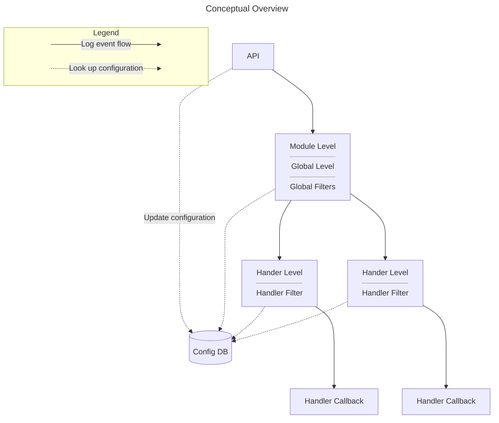

<!--
%CopyrightBegin%

Copyright Ericsson AB 2023-2025. All Rights Reserved.

Licensed under the Apache License, Version 2.0 (the "License");
you may not use this file except in compliance with the License.
You may obtain a copy of the License at

    http://www.apache.org/licenses/LICENSE-2.0

Unless required by applicable law or agreed to in writing, software
distributed under the License is distributed on an "AS IS" BASIS,
WITHOUT WARRANTIES OR CONDITIONS OF ANY KIND, either express or implied.
See the License for the specific language governing permissions and
limitations under the License.

%CopyrightEnd%
-->
# Logging

Erlang provides a standard API for logging through `Logger`, which is part of
the Kernel application. Logger consists of the API for issuing log events, and a
customizable backend where log handlers, filters and formatters can be plugged
in.

By default, the Kernel application installs one log handler at system start.
This handler is named `default`. It receives and processes standard log events
produced by the Erlang runtime system, standard behaviours and different
Erlang/OTP applications. The log events are by default written to the terminal.

You can also configure the system so that the default handler prints log events
to a single file, or to a set of wrap logs via `m:disk_log`.

By configuration, you can also modify or disable the default handler, replace it
by a custom handler, and install additional handlers.

## Overview

A _log event_ consists of a _log level_, the _message_ to be logged, and
_metadata_.

The Logger backend forwards log events from the API, first through a set of
_primary filters_, then through a set of secondary filters attached to each log
handler. The secondary filters are in the following named _handler filters_.

Each filter set consists of a _log level check_, followed by zero or more
_filter functions_.

The following figure shows a conceptual overview of Logger. The figure shows two
log handlers, but any number of handlers can be installed.



Log levels are expressed as atoms. Internally in Logger, the atoms are mapped to
integer values, and a log event passes the log level check if the integer value
of its log level is less than or equal to the currently configured log level.
That is, the check passes if the event is equally or more severe than the
configured level. See section [Log Level](#log-level) for a
listing and description of all log levels.

The primary log level can be overridden by a log level configured per module.
This is to, for instance, allow more verbose logging from a specific part of the
system.

Filter functions can be used for more sophisticated filtering than the log level
check provides. A filter function can stop or pass a log event, based on any of
the event's contents. It can also modify all parts of the log event. See section
[Filters](#filters) for more details.

If a log event passes through all primary filters and all handler filters for a
specific handler, Logger forwards the event to the _handler callback_. The
handler formats and prints the event to its destination. See section
[Handlers](#handlers) for more details.

Everything up to and including the call to the handler callbacks is executed on
the client process, that is, the process where the log event was issued. It is
up to the handler implementation if other processes are involved or not.

The handlers are called in sequence, and the order is not defined.

## Logger API

The API for logging consists of a set of [macros](`m:logger#module-macros`), and a set
of functions of the form `logger:Level/1,2,3`, which are all shortcuts for
[`logger:log(Level,Arg1[,Arg2[,Arg3]])`](`logger:log/2`).

The macros are defined in `logger.hrl`, which is included in a module with the
directive

```erlang
-include_lib("kernel/include/logger.hrl").
```

The difference between using the macros and the exported functions is that
macros add location (originator) information to the metadata, and performs lazy
evaluation by wrapping the logger call in a case statement, so it is only
evaluated if the log level of the event passes the primary log level check.

### Log Level

The log level indicates the severity of a event. In accordance with the Syslog
protocol, [RFC 5424](https://www.ietf.org/rfc/rfc5424.txt), eight log levels can
be specified. The following table lists all possible log levels by name (atom),
integer value, and description:

| **Level** | **Integer** | **Description**                   |
| --------- | ----------- | --------------------------------- |
| emergency | 0           | system is unusable                |
| alert     | 1           | action must be taken immediately  |
| critical  | 2           | critical conditions               |
| error     | 3           | error conditions                  |
| warning   | 4           | warning conditions                |
| notice    | 5           | normal but significant conditions |
| info      | 6           | informational messages            |
| debug     | 7           | debug-level messages              |

_Table: Log Levels_

Notice that the integer value is only used internally in Logger. In the API, you
must always use the atom. To compare the severity of two log levels, use
`logger:compare_levels/2`.

### Log Message

The log message contains the information to be logged. The message can consist
of a format string and arguments (given as two separate parameters in the Logger
API), a string or a report.

Example, format string and arguments:

```erlang
logger:error("The file does not exist: ~ts",[Filename])
```

Example, string:

```erlang
logger:notice("Something strange happened!")
```

A report, which is either a map or a key-value list, is the preferred way to log
using Logger as it makes it possible for different backends to filter and format
the log event as it needs to.

Example, report:

```erlang
?LOG_ERROR(#{ user => joe, filename => Filename, reason => enoent })
```

Reports can be accompanied by a _report callback_ specified in the log event's
[metadata](#metadata). The report callback is a convenience
function that the [formatter](#formatters) can use to convert
the report to a format string and arguments, or directly to a string. The
formatter can also use its own conversion function, if no callback is provided,
or if a customized formatting is desired.

The report callback must be a fun with one or two arguments. If it takes one
argument, this is the report itself, and the fun returns a format string and
arguments:

```erlang
fun((logger:report()) -> {io:format(),[term()]})
```

If it takes two arguments, the first is the report, and the second is a map
containing extra data that allows direct conversion to a string:

```erlang
fun((logger:report(),logger:report_cb_config()) -> unicode:chardata())
```

The fun must obey the `depth` and `chars_limit` parameters provided in the
second argument, as the formatter cannot do anything useful of these parameters
with the returned string. The extra data also contains a field named
`single_line`, indicating if the printed log message may contain line breaks or
not. This variant is used when the formatting of the report depends on the size
or single line parameters.

Example, report, and metadata with report callback:

```erlang
logger:debug(#{got => connection_request, id => Id, state => State},
             #{report_cb => fun(R) -> {"~p",[R]} end})
```

The log message can also be provided through a fun for lazy evaluation. The fun
is only evaluated if the primary log level check passes, and is therefore
recommended if it is expensive to generate the message. The lazy fun must return
a string, a report, or a tuple with format string and arguments.

### Metadata

Metadata contains additional data associated with a log message. Logger inserts
some metadata fields by default, and the client can add custom metadata in three
different ways:

- **Set primary metadata** - Primary metadata applies is the base metadata given
  to all log events. At startup it can be set using the kernel configuration
  parameter [logger_metadata](kernel_app.md#logger_metadata). At run-time it can
  be set and updated using `logger:set_primary_config/1` and
  `logger:update_primary_config/1` respectively.

- **Set process metadata** - Process metadata is set and updated with
  `logger:set_process_metadata/1` and `logger:update_process_metadata/1`,
  respectively. This metadata applies to the process on which these calls are
  made, and Logger adds the metadata to all log events issued on that process.

- **Add metadata to a specific log event** - Metadata associated with one
  specific log event is given as the last parameter to the log macro or Logger
  API function when the event is issued. For example:

  ```text
  ?LOG_ERROR("Connection closed",#{context => server})
  ```

See the description of the `t:logger:metadata/0` type for information about
which default keys Logger inserts, and how the different metadata maps are
merged.

## Filters

Filters can be primary, or attached to a specific handler. Logger calls the
primary filters first, and if they all pass, it calls the handler filters for
each handler. Logger calls the handler callback only if all filters attached to
the handler in question also pass.

A filter is defined as:

```text
{FilterFun, Extra}
```

where `FilterFun` is a function of arity 2, and `Extra` is any term. When
applying the filter, Logger calls the function with the log event as the first
argument, and the value of `Extra` as the second argument. See
`t:logger:filter/0` for type definitions.

The filter function can return `stop`, `ignore` or the (possibly modified) log
event.

If `stop` is returned, the log event is immediately discarded. If the filter is
primary, no handler filters or callbacks are called. If it is a handler filter,
the corresponding handler callback is not called, but the log event is forwarded
to filters attached to the next handler, if any.

If the log event is returned, the next filter function is called with the
returned value as the first argument. That is, if a filter function modifies the
log event, the next filter function receives the modified event. The value
returned from the last filter function is the value that the handler callback
receives.

If the filter function returns `ignore`, it means that it did not recognize the
log event, and thus leaves to other filters to decide the event's destiny.

The configuration option `filter_default` specifies the behaviour if all filter
functions return `ignore`, or if no filters exist. `filter_default` is by
default set to `log`, meaning that if all existing filters ignore a log event,
Logger forwards the event to the handler callback. If `filter_default` is set to
`stop`, Logger discards such events.

Primary filters are added with `logger:add_primary_filter/2` and removed with
`logger:remove_primary_filter/1`. They can also be added at system start via the
Kernel configuration parameter [`logger`](#logger_parameter).

Handler filters are added with `logger:add_handler_filter/3` and removed with
`logger:remove_handler_filter/2`. They can also be specified directly in the
configuration when adding a handler with `logger:add_handler/3` or via the
Kernel configuration parameter [`logger`](#logger_parameter).

To see which filters are currently installed in the system, use
`logger:get_config/0`, or `logger:get_primary_config/0` and
`logger:get_handler_config/1`. Filters are listed in the order they are applied,
that is, the first filter in the list is applied first, and so on.

For convenience, the following built-in filters exist:

- **`logger_filters:domain/2`** - Provides a way of filtering log events based
  on a `domain` field in `Metadata`.

- **`logger_filters:level/2`** - Provides a way of filtering log events based on
  the log level.

- **`logger_filters:progress/2`** - Stops or allows progress reports from
  `supervisor` and `application_controller`.

- **`logger_filters:remote_gl/2`** - Stops or allows log events originating from
  a process that has its group leader on a remote node.

## Handlers

A handler is defined as a module exporting at least the following callback
function:

```text
log(LogEvent, Config) -> term()
```

This function is called when a log event has passed through all primary filters,
and all handler filters attached to the handler in question. The function call
is executed on the client process, and it is up to the handler implementation if
other processes are involved or not.

Logger allows adding multiple instances of a handler callback. That is, if a
callback module implementation allows it, you can add multiple handler instances
using the same callback module. The different instances are identified by unique
handler identities.

In addition to the mandatory callback function `log/2`, a handler module can
export the optional callback functions `adding_handler/1`, `changing_config/3`,
`filter_config/1`, and `removing_handler/1`. See `m:logger_handler` for more
information about these function.

The following built-in handlers exist:

- **`logger_std_h`** - This is the default handler used by OTP. Multiple
  instances can be started, and each instance will write log events to a given
  destination, terminal or file.

- **`logger_disk_log_h`** - This handler behaves much like `logger_std_h`,
  except it uses `m:disk_log` as its destination.

- **`error_logger`{: #ErrorLoggerManager }** - This handler is provided for
  backwards compatibility only. It is not started by default, but will be
  automatically started the first time an `error_logger` event handler is added
  with
  [`error_logger:add_report_handler/1,2`](`error_logger:add_report_handler/1`).

  The old `error_logger` event handlers in STDLIB and SASL still exist, but they
  are not added by Erlang/OTP 21.0 or later.

## Formatters

A formatter can be used by the handler implementation to do the final formatting
of a log event, before printing to the handler's destination. The handler
callback receives the formatter information as part of the handler
configuration, which is passed as the second argument to
[`HModule:log/2`](`c:logger_handler:log/2`).

The formatter information consist of a formatter module, `FModule` and its
configuration, `FConfig`. `FModule` must export the following function, which
can be called by the handler:

```text
format(LogEvent,FConfig)
	-> FormattedLogEntry
```

The formatter information for a handler is set as a part of its configuration
when the handler is added. It can also be changed during runtime with
[`logger:set_handler_config(HandlerId,formatter,{Module,FConfig})` ](`logger:set_handler_config/3`),
which overwrites the current formatter information, or with
[`logger:update_formatter_config/2,3`](`logger:update_formatter_config/2`),
which only modifies the formatter configuration.

If the formatter module exports the optional callback function
[`check_config(FConfig)`](`c:logger_formatter:check_config/1`), Logger calls
this function when the formatter information is set or modified, to verify the
validity of the formatter configuration.

If no formatter information is specified for a handler, Logger uses
`logger_formatter` as default. See the `m:logger_formatter` manual page for more
information about this module.

## Configuration

At system start, Logger is configured through Kernel configuration parameters.
The parameters that apply to Logger are described in section
[Kernel Configuration Parameters](#kernel-configuration-parameters).
Examples are found in section
[Configuration Examples](#configuration-examples).

During runtime, Logger configuration is changed via API functions. See section
[Configuration API Functions](`m:logger#configuration-api-functions`) in the `m:logger`
manual page.

### Primary Logger Configuration

Logger API functions that apply to the primary Logger configuration are:

- [`get_primary_config/0`](`logger:get_primary_config/0`)
- [`set_primary_config/1,2`](`logger:set_primary_config/1`)
- [`update_primary_config/1`](`logger:update_primary_config/1`)
- [`add_primary_filter/2`](`logger:add_primary_filter/2`)
- [`remove_primary_filter/1`](`logger:remove_primary_filter/1`)

The primary Logger configuration is a map with the following keys:

- **`level = `{: #primary_level }`t:logger:level/0` ` | all | none`** - Specifies
  the primary log level, that is, log event that are equally or more severe than
  this level, are forwarded to the primary filters. Less severe log events are
  immediately discarded.

  See section [Log Level](#log-level) for a listing and
  description of possible log levels.

  The initial value of this option is set by the Kernel configuration parameter
  [`logger_level`](#logger_level). It is changed during runtime
  with
  [`logger:set_primary_config(level,Level)`](`logger:set_primary_config/2`).

  Defaults to `notice`.

- **`filters = [{FilterId,Filter}]`** - Specifies the primary filters.

  - `FilterId = ` `t:logger:filter_id/0`
  - `Filter = ` `t:logger:filter/0`

  The initial value of this option is set by the Kernel configuration parameter
  [`logger`](#logger_parameter). During runtime, primary
  filters are added and removed with `logger:add_primary_filter/2` and
  `logger:remove_primary_filter/1`, respectively.

  See section [Filters](#filters) for more detailed
  information.

  Defaults to `[]`.

- **`filter_default = log | stop`** - Specifies what happens to a log event if
  all filters return `ignore`, or if no filters exist.

  See section [Filters](#filters) for more information about
  how this option is used.

  Defaults to `log`.

- **`metadata = `[`metadata()`](`t:logger:metadata/0`)** - The primary metadata
  to be used for all log calls.

  See section [Metadata](#metadata) for more information about
  how this option is used.

  Defaults to `#{}`.

### Handler Configuration

Logger API functions that apply to handler configuration are:

- [`get_handler_config/0,1`](`logger:get_handler_config/0`)
- [`set_handler_config/2,3`](`logger:set_handler_config/2`)
- [`update_handler_config/2,3`](`logger:update_handler_config/2`)
- [`add_handler_filter/3`](`logger:add_handler_filter/3`)
- [`remove_handler_filter/2`](`logger:remove_handler_filter/2`)
- [`update_formatter_config/2,3`](`logger:update_formatter_config/2`)

The configuration for a handler is a map with the following keys:

- **`id =` `t:logger_handler:id/0`** - Automatically inserted by Logger. The
  value is the same as the `HandlerId` specified when adding the handler, and it
  cannot be changed.

- **`module = module()`** - Automatically inserted by Logger. The value is the
  same as the `Module` specified when adding the handler, and it cannot be
  changed.

- **`level =` `t:logger:level/0` ` | all | none`** - Specifies the log level for
  the handler, that is, log events that are equally or more severe than this
  level, are forwarded to the handler filters for this handler.

  See section [Log Level](#log-level) for a listing and
  description of possible log levels.

  The log level is specified when adding the handler, or changed during runtime
  with, for instance,
  [`logger:set_handler_config(HandlerId,level,Level)`](`logger:set_handler_config/3`).

  Defaults to `all`.

- **`filters = [{FilterId,Filter}]`** - Specifies the handler filters.

  - `FilterId = ` `t:logger:filter_id/0`
  - `Filter = ` `t:logger:filter/0`

  Handler filters are specified when adding the handler, or added or removed
  during runtime with `logger:add_handler_filter/3` and
  `logger:remove_handler_filter/2`, respectively.

  See [Filters](#filters) for more detailed information.

  Defaults to `[]`.

- **`filter_default = log | stop`** - Specifies what happens to a log event if
  all filters return `ignore`, or if no filters exist.

  See section [Filters](#filters) for more information about
  how this option is used.

  Defaults to `log`.

- **`formatter = {FormatterModule,FormatterConfig}`** - Specifies a formatter
  that the handler can use for converting the log event term to a printable
  string.

  - `FormatterModule = module()`
  - `FormatterConfig =` `t:logger:formatter_config/0`

  The formatter information is specified when adding the handler. The formatter
  configuration can be changed during runtime with
  [`logger:update_formatter_config/2,3`](`logger:update_formatter_config/2`), or
  the complete formatter information can be overwritten with, for instance,
  `logger:set_handler_config/3`.

  See section [Formatters](#formatters) for more detailed
  information.

  Defaults to `{logger_formatter,DefaultFormatterConfig}`. See the
  `m:logger_formatter` manual page for information about this formatter and its
  default configuration.

- **`config = term()`** - Handler specific configuration, that is, configuration
  data related to a specific handler implementation.

  The configuration for the built-in handlers is described in the
  `m:logger_std_h` and [`logger_disk_log_h` ](`m:logger_disk_log_h`)manual
  pages.

Notice that `level` and `filters` are obeyed by Logger itself before forwarding
the log events to each handler, while `formatter` and all handler specific
options are left to the handler implementation.

### Kernel Configuration Parameters

The following Kernel configuration parameters apply to Logger:

- **`logger = [Config]`{: #logger_parameter }** - Specifies the configuration
  for [Logger](`m:logger`), except the primary log level, which is specified
  with [`logger_level`](#logger_level), and the compatibility
  with [SASL Error Logging](`e:sasl:error_logging.md`), which is specified with
  [`logger_sasl_compatible`](#logger_sasl_compatible).

  With this parameter, you can modify or disable the default handler, add custom
  handlers and primary logger filters, set log levels per module, and modify the
  [proxy](#logger-proxy) configuration.

  `Config` is any (zero or more) of the following:

  - **`{handler, default, undefined}`** - Disables the default handler. This
    allows another application to add its own default handler.

    Only one entry of this type is allowed.

  - **`{handler, HandlerId, Module, HandlerConfig}`** - If `HandlerId` is
    `default`, then this entry modifies the default handler, equivalent to
    calling

    ```text
    		logger:remove_handler(default)

    ```

    followed by

    ```erlang
    		logger:add_handler(default, Module, HandlerConfig)

    ```

    For all other values of `HandlerId`, this entry adds a new handler,
    equivalent to calling

    ```erlang
    		logger:add_handler(HandlerId, Module, HandlerConfig)

    ```

    Multiple entries of this type are allowed.

  - **`{filters, FilterDefault, [Filter]}`** - Adds the specified primary
    filters.

    - `FilterDefault = log | stop`
    - `Filter = {FilterId, {FilterFun, FilterConfig}}`

    Equivalent to calling

    ```erlang
    		logger:add_primary_filter(FilterId, {FilterFun, FilterConfig})

    ```

    for each `Filter`.

    `FilterDefault` specifies the behaviour if all primary filters return
    `ignore`, see section [Filters](#filters).

    Only one entry of this type is allowed.

  - **`{module_level, Level, [Module]}`** - Sets module log level for the given
    modules. Equivalent to calling

    ```erlang
    		logger:set_module_level(Module, Level)
    ```

    for each `Module`.

    Multiple entries of this type are allowed.

  - **`{proxy, ProxyConfig}`** - Sets the proxy configuration, equivalent to
    calling

    ```text
    		logger:set_proxy_config(ProxyConfig)

    ```

    Only one entry of this type is allowed.

  See section [Configuration Examples](#configuration-examples) for
  examples using the `logger` parameter for system configuration.

- **`logger_metadata = map()`{: #logger_metadata }** - Specifies the primary
  metadata. See the [`kernel(6)`](kernel_app.md#logger_metadata) manual page for
  more information about this parameter.

- **`logger_level = Level`{: #logger_level }** - Specifies the primary log
  level. See the [`kernel(6)`](kernel_app.md#logger_level) manual page for more
  information about this parameter.

- **`logger_sasl_compatible = true | false`{: #logger_sasl_compatible }** -
  Specifies Logger's compatibility with
  [SASL Error Logging](`e:sasl:error_logging.md`). See the
  [`kernel(6)`](kernel_app.md#logger_sasl_compatible) manual page for more
  information about this parameter.

### Configuration Examples

The value of the Kernel configuration parameter `logger` is a list of tuples. It
is possible to write the term on the command line when starting an erlang node,
but as the term grows, a better approach is to use the system configuration
file. See the [`config(4)`](config.md) manual page for more information about
this file.

Each of the following examples shows a simple system configuration file that
configures Logger according to the description.

Modify the default handler to print to a file instead of
[`standard_io`](`t:io:standard_io/0`):

```erlang
[{kernel,
  [{logger,
    [{handler, default, logger_std_h,  % {handler, HandlerId, Module,
      #{config => #{file => "log/erlang.log"}}}  % Config}
    ]}]}].
```

Modify the default handler to print each log event as a single line:

```erlang
[{kernel,
  [{logger,
    [{handler, default, logger_std_h,
      #{formatter => {logger_formatter, #{single_line => true}}}}
    ]}]}].
```

Modify the default handler to print the pid of the logging process for each log
event:

```erlang
[{kernel,
  [{logger,
    [{handler, default, logger_std_h,
      #{formatter => {logger_formatter,
                        #{template => [time," ",pid," ",msg,"\n"]}}}}
    ]}]}].
```

Modify the default handler to only print errors and more severe log events to
"log/erlang.log", and add another handler to print all log events to
"log/debug.log".

```erlang
[{kernel,
  [{logger,
    [{handler, default, logger_std_h,
      #{level => error,
        config => #{file => "log/erlang.log"}}},
     {handler, info, logger_std_h,
      #{level => debug,
        config => #{file => "log/debug.log"}}}
    ]}]}].
```

## Backwards Compatibility with error_logger

Logger provides backwards compatibility with `error_logger` in the following
ways:

- **API for Logging** - The `error_logger` API still exists, but should only be
  used by legacy code. It will be removed in a later release.

  Calls to [`error_logger:error_report/1,2`](`error_logger:error_report/1`),
  [`error_logger:error_msg/1,2`](`error_logger:error_msg/1`), and corresponding
  functions for warning and info messages, are all forwarded to Logger as calls
  to [`logger:log(Level,Report,Metadata)`](`logger:log/3`).

  `Level = error | warning | info` and is taken from the function name. `Report`
  contains the actual log message, and `Metadata` contains additional
  information which can be used for creating backwards compatible events for
  legacy `error_logger` event handlers, see section
  [Legacy Event Handlers](#legacy_event_handlers).

- **Output Format** - To get log events on the same format as produced by
  `error_logger_tty_h` and `error_logger_file_h`, use the default formatter,
  `logger_formatter`, with configuration parameter `legacy_header` set to
  `true`. This is the default configuration of the `default` handler started by
  Kernel.

- **Default Format of Log Events from OTP** - By default, all log events
  originating from within OTP, except the former so called "SASL reports", look
  the same as before.

- **[](){: #sasl_reports } SASL Reports** - By SASL reports we mean supervisor
  reports, crash reports and progress reports.

  Prior to Erlang/OTP 21.0, these reports were only logged when the SASL
  application was running, and they were printed through SASL's own event
  handlers `sasl_report_tty_h` and `sasl_report_file_h`.

  The destination of these log events was configured by
  [SASL configuration parameters](`e:sasl:sasl_app.md#deprecated_error_logger_config`).

  Due to the specific event handlers, the output format slightly differed from
  other log events.

  As of Erlang/OTP 21.0, the concept of SASL reports is removed, meaning that
  the default behaviour is as follows:

  - Supervisor reports, crash reports, and progress reports are no longer
    connected to the SASL application.
  - Supervisor reports and crash reports are issued as `error` level log events,
    and are logged through the default handler started by Kernel.
  - Progress reports are issued as `info` level log events, and since the
    default primary log level is `notice`, these are not logged by default. To
    enable printing of progress reports, set the
    [primary log level](#primary_level) to `info`.
  - The output format is the same for all log events.

  If the old behaviour is preferred, the Kernel configuration parameter
  [`logger_sasl_compatible`](kernel_app.md#logger_sasl_compatible) can be set to
  `true`. The
  [SASL configuration parameters](`e:sasl:sasl_app.md#deprecated_error_logger_config`)
  can then be used as before, and the SASL reports will only be printed if the
  SASL application is running, through a second log handler named `sasl`.

  All SASL reports have a metadata field `domain` which is set to `[otp,sasl]`.
  This field can be used by filters to stop or allow the log events.

  See section [SASL User's Guide](`e:sasl:error_logging.md`) for more
  information about the old SASL error logging functionality.

- **[](){: #legacy_event_handlers } Legacy Event Handlers** - To use event
  handlers written for `error_logger`, just add your event handler
  with

  ```text
  error_logger:add_report_handler/1,2.
  ```

  This automatically starts the error logger event manager, and adds
  `error_logger` as a handler to Logger, with the following configuration:

  ```erlang
  #{level => info,
    filter_default => log,
    filters => []}.
  ```

  > #### Note {: .info }
  >
  > This handler ignores events that do not originate from the `error_logger`
  > API, or from within OTP. This means that if your code uses the Logger API
  > for logging, then your log events will be discarded by this handler.
  >
  > The handler is not overload protected.

## Error Handling

Logger does, to a certain extent, check its input data before forwarding a log
event to filters and handlers. It does, however, not evaluate report callbacks,
or check the validity of format strings and arguments. This means that all
filters and handlers must be careful when formatting the data of a log event,
making sure that it does not crash due to bad input data or faulty callbacks.

If a filter or handler still crashes, Logger will remove the filter or handler
in question from the configuration, and print a short error message to the
terminal. A debug event containing the crash reason and other details is also
issued.

See section [Log Message](#log-message) for more information
about report callbacks and valid forms of log messages.

## Example: Add a handler to log info events to file

When starting an Erlang node, the default behaviour is that all log events on
level `notice` or more severe, are logged to the terminal via the default
handler. To also log info events, you can either change the primary log level to
`info`:

```text
1> logger:set_primary_config(level, info).
ok
```

or set the level for one or a few modules only:

```erlang
2> logger:set_module_level(mymodule, info).
ok
```

This allows info events to pass through to the default handler, and be printed
to the terminal as well. If there are many info events, it can be useful to
print these to a file instead.

First, set the log level of the default handler to `notice`, preventing it from
printing info events to the terminal:

```erlang
3> logger:set_handler_config(default, level, notice).
ok
```

Then, add a new handler which prints to file. You can use the handler module
`m:logger_std_h`, and configure it to log to file:

```erlang
4> Config = #{config => #{file => "./info.log"}, level => info}.
#{config => #{file => "./info.log"},level => info}
5> logger:add_handler(myhandler, logger_std_h, Config).
ok
```

Since `filter_default` defaults to `log`, this handler now receives all log
events. If you want info events only in the file, you must add a filter to stop
all non-info events. The built-in filter `logger_filters:level/2` can do this:

```erlang
6> logger:add_handler_filter(myhandler, stop_non_info,
                             {fun logger_filters:level/2, {stop, neq, info}}).
ok
```

See section [Filters](#filters) for more information about the
filters and the `filter_default` configuration parameter.

## Example: Implement a handler

`m:logger_handler` describes the callback functions that can be implemented for
a Logger handler.

A handler callback module must export:

- `log(Log, Config)`

It can optionally also export some, or all, of the following:

- `adding_handler(Config)`
- `removing_handler(Config)`
- `changing_config(SetOrUpdate, OldConfig, NewConfig)`
- `filter_config(Config)`

When a handler is added, by for example a call to
[`logger:add_handler(Id, HModule, Config)`](`logger:add_handler/3`), Logger
first calls `HModule:adding_handler(Config)`. If this function returns
`{ok,Config1}`, Logger writes `Config1` to the configuration database, and the
`logger:add_handler/3` call returns. After this, the handler is installed and
must be ready to receive log events as calls to `HModule:log/2`.

A handler can be removed by calling
[`logger:remove_handler(Id)`](`logger:remove_handler/1`). Logger calls
`HModule:removing_handler(Config)`, and removes the handler's configuration from
the configuration database.

When [`logger:set_handler_config/2,3`](`logger:set_handler_config/2`) or
[`logger:update_handler_config/2,3`](`logger:update_handler_config/2`) is
called, Logger calls
`HModule:changing_config(SetOrUpdate, OldConfig, NewConfig)`. If this function
returns `{ok,NewConfig1}`, Logger writes `NewConfig1` to the configuration
database.

When `logger:get_config/0` or
[`logger:get_handler_config/0,1`](`logger:get_handler_config/0`) is called,
Logger calls `HModule:filter_config(Config)`. This function must return the
handler configuration where internal data is removed.

A simple handler that prints to the terminal can be implemented as follows:

```erlang
-module(myhandler1).
-export([log/2]).

log(LogEvent, #{formatter := {FModule, FConfig}}) ->
    io:put_chars(FModule:format(LogEvent, FConfig)).
```

Notice that the above handler does not have any overload protection, and all log
events are printed directly from the client process.

For information and examples of overload protection, please refer to section
[Protecting the Handler from Overload](#overload_protection),
and the implementation of `m:logger_std_h` and
[`logger_disk_log_h` ](`m:logger_disk_log_h`).

The following is a simpler example of a handler which logs to a file through one
single process:

```erlang
-module(myhandler2).
-export([adding_handler/1, removing_handler/1, log/2]).
-export([init/1, handle_call/3, handle_cast/2, terminate/2]).

adding_handler(Config) ->
    MyConfig = maps:get(config,Config,#{file => "myhandler2.log"}),
    {ok, Pid} = gen_server:start(?MODULE, MyConfig, []),
    {ok, Config#{config => MyConfig#{pid => Pid}}}.

removing_handler(#{config := #{pid := Pid}}) ->
    gen_server:stop(Pid).

log(LogEvent,#{config := #{pid := Pid}} = Config) ->
    gen_server:cast(Pid, {log, LogEvent, Config}).

init(#{file := File}) ->
    {ok, Fd} = file:open(File, [append, {encoding, utf8}]),
    {ok, #{file => File, fd => Fd}}.

handle_call(_, _, State) ->
    {reply, {error, bad_request}, State}.

handle_cast({log, LogEvent, Config}, #{fd := Fd} = State) ->
    do_log(Fd, LogEvent, Config),
    {noreply, State}.

terminate(_Reason, #{fd := Fd}) ->
    _ = file:close(Fd),
    ok.

do_log(Fd, LogEvent, #{formatter := {FModule, FConfig}}) ->
    String = FModule:format(LogEvent, FConfig),
    io:put_chars(Fd, String).
```

[](){: #overload_protection }

## Protecting the Handler from Overload

The default handlers, `m:logger_std_h` and `m:logger_disk_log_h`, feature
multiple overload protection mechanisms, which make it possible for the
handlers to survive, and stay responsive, during periods of high load
(when huge numbers of incoming log requests must be handled).

The mechanisms are as follows:
* [**message queue length**](#message-queue-length): the handler process tracks
its message queue length and takes actions depending on its size, from turning
on a sync mode to dropping messages.
* [**limit the number of logs emitted**](#controlling-bursts-of-log-requests):
the handlers will handle a maximum number of log events per time unit,
defaulting to 500 per second.
* [**terminate an overloaded handler**](#terminating-an-overloaded-handler):
a handler can be terminated and restarted automatically if it exceeds message
queue length or memory thresholds - this is disabled by default.

These mechanisms are described in more detail in the following sections.

### Message Queue Length

The handler process keeps track of the length of its message queue and takes
some form of action when the current length exceeds a configurable threshold.
The purpose is to keep the handler in, or to as quickly as possible get the
handler into, a state where it can keep up with the pace of incoming log events.
The memory use of the handler must never grow larger and larger, since that will
eventually cause the handler to crash. These three thresholds, with associated
actions, exist:

- **`sync_mode_qlen`** - As long as the length of the message queue is lower
  than this value, all log events are handled asynchronously. This means that
  the client process sending the log event, by calling a log function in the
  [Logger API](#logger-api), does not wait for a response from
  the handler but continues executing immediately after the event is sent. It is
  not affected by the time it takes the handler to print the event to the log
  device. If the message queue grows larger than this value, the handler starts
  handling log events synchronously instead, meaning that the client process
  sending the event must wait for a response. When the handler reduces the
  message queue to a level below the `sync_mode_qlen` threshold, asynchronous
  operation is resumed. The switch from asynchronous to synchronous mode can
  slow down the logging tempo of one, or a few, busy senders, but cannot protect
  the handler sufficiently in a situation of many busy concurrent senders.

  Defaults to `10` messages.

- **`drop_mode_qlen`** - When the message queue grows larger than this
  threshold, the handler switches to a mode in which it drops all new events
  that senders want to log. Dropping an event in this mode means that the call
  to the log function never results in a message being sent to the handler, but
  the function returns without taking any action. The handler keeps logging the
  events that are already in its message queue, and when the length of the
  message queue is reduced to a level below the threshold, synchronous or
  asynchronous mode is resumed. Notice that when the handler activates or
  deactivates drop mode, information about it is printed in the log.
  The emitted log message is on the `:notice` level and looks like this:
  `Handler :default switched from :sync to :drop mode`

  Defaults to `200` messages.

- **`flush_qlen`** - If the length of the message queue grows larger than this
  threshold, a flush (delete) operation takes place. To flush events, the
  handler discards the messages in the message queue by receiving them in a loop
  without logging. Client processes waiting for a response from a synchronous
  log request receive a reply from the handler indicating that the request is
  dropped. The handler process increases its priority during the flush loop to
  make sure that no new events are received during the operation. Notice that
  after the flush operation is performed, the handler prints information in the
  log about how many events have been deleted.
  The emitted log message is on the `:notice` level and looks like this:
  `Handler :default flushed 1070 log events`

  Defaults to `1000` messages.

For the overload protection algorithm to work properly, it is required that:

`sync_mode_qlen =< drop_mode_qlen =< flush_qlen`

and that:

`drop_mode_qlen > 1`

To disable certain modes, do the following:

- If `sync_mode_qlen` is set to `0`, all log events are handled synchronously.
  That is, asynchronous logging is disabled.
- If `sync_mode_qlen` is set to the same value as `drop_mode_qlen`, synchronous
  mode is disabled. That is, the handler always runs in asynchronous mode,
  unless dropping or flushing is invoked.
- If `drop_mode_qlen` is set to the same value as `flush_qlen`, drop mode is
  disabled and can never occur.

During high load scenarios, the length of the handler message queue rarely grows
in a linear and predictable way. Instead, whenever the handler process is
scheduled in, it can have an almost arbitrary number of messages waiting in the
message queue. It is for this reason that the overload protection mechanism is
focused on acting quickly, and quite drastically, such as immediately dropping
or flushing messages, when a large queue length is detected.

The values of the previously listed thresholds can be specified by the user.
This way, a handler can be configured to, for example, not drop or flush
messages unless the message queue length of the handler process grows extremely
large. Notice that large amounts of memory can be required for the node under
such circumstances. Another example of user configuration is when, for
performance reasons, the client processes must never be blocked by synchronous
log requests. It is possible, perhaps, that dropping or flushing events is still
acceptable, since it does not affect the performance of the client processes
sending the log events.

A configuration example:

```erlang
logger:add_handler(my_standard_h, logger_std_h,
                   #{config => #{file => "./system_info.log",
                                 sync_mode_qlen => 100,
                                 drop_mode_qlen => 1000,
                                 flush_qlen => 2000}}).
```

### Controlling Bursts of Log Requests

Large bursts of log events - many events received by the handler under a short
period of time - can potentially cause problems, such as:

- Log files grow very large, very quickly.
- Circular logs wrap too quickly so that important data is overwritten.
- Write buffers grow large, which slows down file sync operations.

Note that these examples apply to file-based logging. If you're logging to
the console the protections discussed below should be safe to disable or
tweak, as long as your system can handle the load of them.

For this reason, both built-in handlers offer the possibility to specify the
maximum number of events to be handled within a certain time frame. With this
burst control feature enabled, the handler can avoid choking the log with
massive amounts of printouts. The configuration parameters are:

- **`burst_limit_enable`** - Value `true` enables burst control and `false`
  disables it.

  Defaults to `true`.

- **`burst_limit_max_count`** - This is the maximum number of events to handle
  within a `burst_limit_window_time` time frame. After the limit is reached,
  successive events are dropped until the end of the time frame.

  Defaults to `500` events.

- **`burst_limit_window_time`** - See the previous description of
  `burst_limit_max_count`.

  Defaults to `1000` milliseconds.

A configuration example:

```erlang
logger:add_handler(my_disk_log_h, logger_disk_log_h,
                   #{config => #{file => "./my_disk_log",
                                 burst_limit_enable => true,
                                 burst_limit_max_count => 20,
                                 burst_limit_window_time => 500}}).
```

### Terminating an Overloaded Handler

It is possible that a handler, even if it can successfully manage peaks of high
load without crashing, can build up a large message queue, or use a large amount
of memory. The overload protection mechanism includes an automatic termination
and restart feature for the purpose of guaranteeing that a handler does not grow
out of bounds. The feature is configured with the following parameters:

- **`overload_kill_enable`** - Value `true` enables the feature and `false`
  disables it.

  Defaults to `false`.

- **`overload_kill_qlen`** - This is the maximum allowed queue length. If the
  message queue grows larger than this, the handler process is terminated.

  Defaults to `20000` messages.

- **`overload_kill_mem_size`** - This is the maximum memory size that the
  handler process is allowed to use. If the handler grows larger than this, the
  process is terminated.

  Defaults to `3000000` bytes.

- **`overload_kill_restart_after`** - If the handler is terminated, it restarts
  automatically after a delay specified in milliseconds. The value `infinity`
  prevents restarts.

  Defaults to `5000` milliseconds.

If the handler process is terminated because of overload, it prints information
about it in the log. It also prints information about when a restart has taken
place, and the handler is back in action.

> #### Note {: .info }
>
> The sizes of the log events affect the memory needs of the handler. For
> information about how to limit the size of log events, see the
> `m:logger_formatter` manual page.

## Logger Proxy

The Logger proxy is an Erlang process which is part of the Kernel application's
supervision tree. During startup, the proxy process registers itself as the
`system_logger`, meaning that log events produced by the emulator are sent to
this process.

When a log event is issued on a process which has its group leader on a remote
node, Logger automatically forwards the log event to the group leader's node. To
achieve this, it first sends the log event as an Erlang message from the
original client process to the proxy on the local node, and the proxy in turn
forwards the event to the proxy on the remote node.

When receiving a log event, either from the emulator or from a remote node, the
proxy calls the Logger API to log the event.

The proxy process is overload protected in the same way as described in section
[Protecting the Handler from Overload](#overload_protection),
but with the following default values:

```erlang
    #{sync_mode_qlen => 500,
      drop_mode_qlen => 1000,
      flush_qlen => 5000,
      burst_limit_enable => false,
      overload_kill_enable => false}
```

For log events from the emulator, synchronous message passing mode is not
applicable, since all messages are passed asynchronously by the emulator. Drop
mode is achieved by setting the `system_logger` to `undefined`, forcing the
emulator to drop events until it is set back to the proxy pid again.

The proxy uses `erlang:send_nosuspend/2` when sending log events to a remote
node. If the message could not be sent without suspending the sender, it is
dropped. This is to avoid blocking the proxy process.

## See Also

`m:disk_log`, `m:erlang`, `m:error_logger`, `m:logger`, `m:logger_disk_log_h`,
`m:logger_filters`, `m:logger_formatter`, `m:logger_std_h`,
[`sasl(6)`](`e:sasl:sasl_app.md`)
