<!--
%CopyrightBegin%

SPDX-License-Identifier: Apache-2.0

Copyright Ericsson AB 2023-2025. All Rights Reserved.

Licensed under the Apache License, Version 2.0 (the "License");
you may not use this file except in compliance with the License.
You may obtain a copy of the License at

    http://www.apache.org/licenses/LICENSE-2.0

Unless required by applicable law or agreed to in writing, software
distributed under the License is distributed on an "AS IS" BASIS,
WITHOUT WARRANTIES OR CONDITIONS OF ANY KIND, either express or implied.
See the License for the specific language governing permissions and
limitations under the License.

%CopyrightEnd%
-->
# Architecture

## Network view

Megaco is a (master/slave) protocol for control of gateway functions at the edge
of the packet network. Examples of this is IP-PSTN trunking gateways and analog
line gateways. The main function of Megaco is to allow gateway decomposition
into a call agent (call control) part (known as Media Gateway Controller, MGC) -
master, and an gateway interface part (known as Media Gateway, MG) - slave. The
MG has no call control knowledge and only handle making the connections and
simple configurations.

SIP and H.323 are peer-to-peer protocols for call control (valid only for some
of the protocols within H.323), or more generally multi-media session protocols.
They both operate at a different level (call control) from Megaco in a
decomposed network, and are therefor not aware of whether or not Megaco is being
used underneath.

```mermaid
---
title: Network architecture
---

flowchart TB
  %% Pad text (first/longest line) in node, with non-breaking spaces.
  %% This is done to force the node circle to be big enough, to fit it's text inside the circle.
  telco_network(("&nbsp;&nbsp;&nbsp;PSTN&nbsp;&nbsp;&nbsp;<br />ATM<br />etc.")) <--SS7 etc.--> signal_gw[Signaling Gateway]

  %% Alt: box with rounded left & right corners, the narrow text makes the node eliptic,
  %% slightly taller than wide
  %% telco_network(["PSTN<br />ATM<br />etc."]) <--SS7 etc.--> signal_gw[Signaling Gateway]


  signal_gw <--Sigtran--> mgc[Call Agent<br /><br /><br />Media Gateway Controller]
  telco_network <--Trunks--> trunk_gw[Trunking<br />Media Gateway]
  mgc --Megaco/H.248--> trunk_gw
  mgc --Megaco/H.248--> lines_gw[Lines<br />Media Gateway]
  lines_gw --> phone1[📞 phone 1]
  lines_gw --> phone2[📞 phone 2]
  lines_gw --> phone3[📞 ...]
  mgc --Megaco/H.248--> ip_phone_gw[IP Phone Media Gateway]

  %% Note: edges are numbered by the order they are introduced
  %% SS7
  linkStyle 0 stroke-width:5px;
  %% Sigtran
  linkStyle 1 stroke-width:3px;
  %% Trunks
  linkStyle 2 stroke-width:5px;
  %% Megaco
  linkStyle 3 stroke-width:3px;
  linkStyle 4 stroke-width:3px;
  %% phone
  linkStyle 5 stroke-width:1px;
  linkStyle 6 stroke-width:1px;
  linkStyle 7 stroke-width:1px;
  %% Megaco
  linkStyle 8 stroke-width:3px;
```

Megaco and peer protocols are complementary in nature and entirely compatible
within the same system. At a system level, Megaco allows for

- overall network cost and performance optimization
- protection of investment by isolation of changes at the call control layer
- freedom to geographically distribute both call function and gateway function
- adaption of legacy equipment

## General

This Erlang/OTP application supplies a framework for building applications that
needs to utilize the Megaco/H.248 protocol.

We have introduced the term "user" as a generic term for either an MG or an MGC,
since most of the functionality we support, is common for both MG's and MGC's. A
(local) user may be configured in various ways and it may establish any number
of connections to its counterpart, the remote user. Once a connection has been
established, the connection is supervised and it may be used for the purpose of
sending messages. N.B. according to the standard an MG is connected to at most
one MGC, while an MGC may be connected to any number of MG's.

For the purpose of managing "virtual MG's", one Erlang node may host any number
of MG's. In fact it may host a mix of MG's and MGC's. You may say that an Erlang
node may host any number of "users".

The protocol engine uses callback modules to handle various things:

- encoding callback modules - handles the encoding and decoding of messages.
  Several modules for handling different encodings are included, such as ASN.1
  BER, pretty well indented text, compact text and some others. Others may be
  written by you.
- transport callback modules - handles sending and receiving of messages.
  Transport modules for TCP/IP and UDP/IP are included and others may be written
  by you.
- user callback modules - the actual implementation of an MG or MGC. Most of the
  functions are intended for handling of a decoded transaction (request, reply,
  acknowledgement), but there are others that handles connect, disconnect and
  errors cases.

Each connection may have its own configuration of callback modules, re-send
timers, transaction id ranges etc. and they may be re-configured on-the-fly.

In the API of Megaco, a user may explicitly send action requests, but generation
of transaction identifiers, the encoding and actual transport of the message to
the remote user is handled automatically by the protocol engine according to the
actual connection configuration. Megaco messages are not exposed in the API.

On the receiving side the transport module receives the message and forwards it
to the protocol engine, which decodes it and invokes user callback functions for
each transaction. When a user has handled its action requests, it simply returns
a list of action replies (or a message error) and the protocol engine uses the
encoding module and transport module to compose and forward the message to the
originating user.

The protocol stack does also handle things like automatic sending of
acknowledgements, pending transactions, re-send of messages, supervision of
connections etc.

In order to provide a solution for scalable implementations of MG's and MGC's, a
user may be distributed over several Erlang nodes. One of the Erlang nodes is
connected to the physical network interface, but messages may be sent from other
nodes and the replies are automatically forwarded back to the originating node.

## Single node config

Here a system configuration with an MG and MGC residing in one Erlang node each
is outlined:

## Distributed config

In a larger system with a user (in this case an MGC) distributed over several
Erlang nodes, it looks a little bit different. Here the encoding is performed on
the originating Erlang node (1) and the binary is forwarded to the node (2) with
the physical network interface. When the potential message reply is received on
the interface on node (2), it is decoded there and then different actions will
be taken for each transaction in the message. The transaction reply will be
forwarded in its decoded form to the originating node (1) while the other types
of transactions will be handled locally on node (2).

Timers and re-send of messages will be handled on locally on one node, that is
node(1), in order to avoid unnecessary transfer of data between the Erlang
nodes.

## Message round-trip call flow

The typical round-trip of a message can be viewed as follows. Firstly we view
the call flow on the originating side:

Then we continue with the call flow on the destination side:

