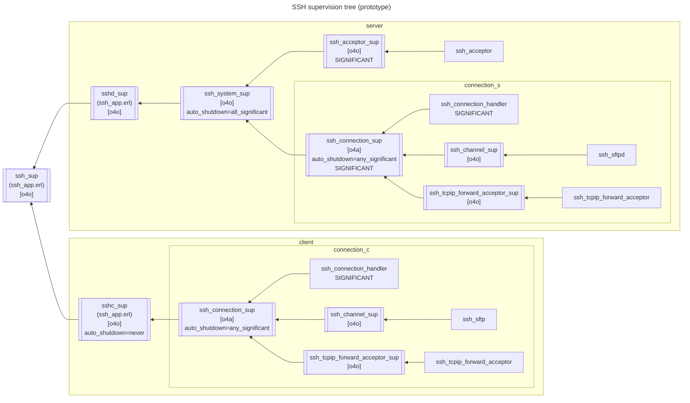
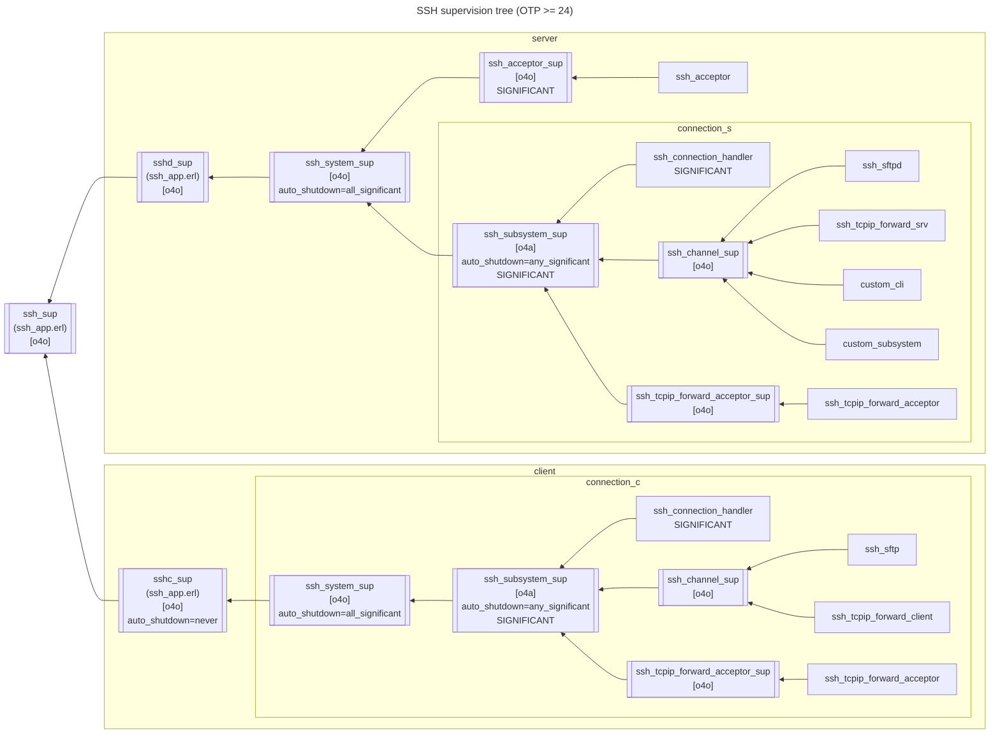
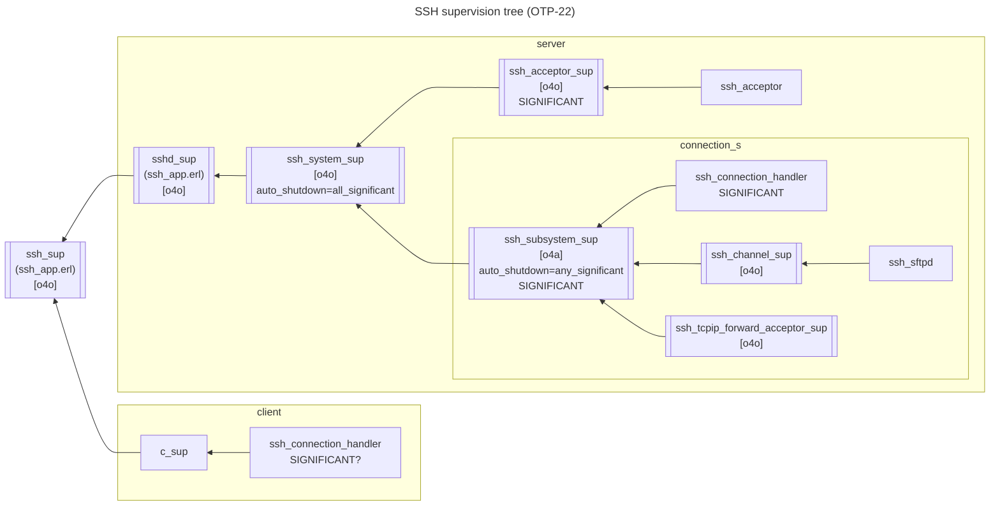

# SSH supervision tree (prototype)

```mermaid
---
title: SSH supervision tree (prototype)
---
flowchart RL
    d_sup --> sup[["ssh_sup\n(ssh_app.erl)\n[o4o]"]]
    c_sup --> sup

    subgraph client
    connection_sup --> c_sup[["sshc_sup\n(ssh_app.erl)\n[o4o]\nauto_shutdown=never"]]
    subgraph connection_c
    connection_handler["ssh_connection_handler\nSIGNIFICANT"] --> connection_sup[["ssh_connection_sup\n[o4a]\nauto_shutdown=any_significant"]]
    channel_sup[["ssh_channel_sup\n[o4o]"]] --> connection_sup
    sftp["ssh_sftp"] --> channel_sup
    tcpip_forward_acceptor_sup[["ssh_tcpip_forward_acceptor_sup\n[o4o]"]] --> connection_sup
    ssh_tcpip_forward_acceptor["ssh_tcpip_forward_acceptor"] --> tcpip_forward_acceptor_sup  
    end
    end

    subgraph server
    system_sup_s --> d_sup[["sshd_sup\n(ssh_app.erl)\n[o4o]"]]
    acceptor_sup --> system_sup_s[["ssh_system_sup\n[o4o]\nauto_shutdown=all_significant"]]
    acceptor["ssh_acceptor"] --> acceptor_sup[["ssh_acceptor_sup\n[o4o]\nSIGNIFICANT"]]

    connection_sup_s --> system_sup_s

    subgraph connection_s
    connection_handler_s["ssh_connection_handler\nSIGNIFICANT"] --> connection_sup_s[["ssh_connection_sup\n[o4a]\nauto_shutdown=any_significant\nSIGNIFICANT"]]
    channel_sup_s[["ssh_channel_sup\n[o4o]"]] --> connection_sup_s
    tcpip_forward_acceptor_sup_s[["ssh_tcpip_forward_acceptor_sup\n[o4o]"]] --> connection_sup_s
    ssh_tcpip_forward_acceptor_s["ssh_tcpip_forward_acceptor"] --> tcpip_forward_acceptor_sup_s
    sftd1["ssh_sftpd"] --> channel_sup_s
    end
    end
```

# SSH supervision tree (OTP >= 24)

```mermaid
---
title: SSH supervision tree (OTP >= 24)
---
flowchart RL
    d_sup --> sup[["ssh_sup\n(ssh_app.erl)\n[o4o]"]]
    c_sup --> sup

    subgraph client
    system_sup --> c_sup[["sshc_sup\n(ssh_app.erl)\n[o4o]\nauto_shutdown=never"]]
    subgraph connection_c
    subsystem_sup --> system_sup[["ssh_system_sup\n[o4o]\nauto_shutdown=all_significant"]]
    connection_handler["ssh_connection_handler\nSIGNIFICANT"] --> subsystem_sup[["ssh_subsystem_sup\n[o4a]\nauto_shutdown=any_significant\nSIGNIFICANT"]]
    channel_sup[["ssh_channel_sup\n[o4o]"]] --> subsystem_sup
    sftp["ssh_sftp"] --> channel_sup
    ssh_tcpip_forward_client --> channel_sup
    tcpip_forward_acceptor_sup[["ssh_tcpip_forward_acceptor_sup\n[o4o]"]] --> subsystem_sup
    ssh_tcpip_forward_acceptor["ssh_tcpip_forward_acceptor"] --> tcpip_forward_acceptor_sup
    end
    end

    subgraph server
    system_sup_s --> d_sup[["sshd_sup\n(ssh_app.erl)\n[o4o]"]]
    acceptor_sup --> system_sup_s[["ssh_system_sup\n[o4o]\nauto_shutdown=all_significant"]]
    acceptor["ssh_acceptor"] --> acceptor_sup[["ssh_acceptor_sup\n[o4o]\nSIGNIFICANT"]]

    subsystem_sup_s --> system_sup_s

    subgraph connection_s
    connection_handler_s["ssh_connection_handler\nSIGNIFICANT"] --> subsystem_sup_s[["ssh_subsystem_sup\n[o4a]\nauto_shutdown=any_significant\nSIGNIFICANT"]]
    channel_sup_s[["ssh_channel_sup\n[o4o]"]] --> subsystem_sup_s
    tcpip_forward_acceptor_sup_s[["ssh_tcpip_forward_acceptor_sup\n[o4o]"]] --> subsystem_sup_s
    ssh_tcpip_forward_acceptor_s["ssh_tcpip_forward_acceptor"] --> tcpip_forward_acceptor_sup_s
    sftd1["ssh_sftpd"] --> channel_sup_s
    ssh_tcpip_forward_srv --> channel_sup_s
    custom_cli --> channel_sup_s
    custom_subsystem --> channel_sup_s
    end
    end
```
# SSH supervision tree (OTP-23) ??
# SSH supervision tree (OTP-22)

```mermaid
---
title: SSH supervision tree (OTP-22)
---
flowchart RL
    d_sup --> sup[["ssh_sup\n(ssh_app.erl)\n[o4o]"]]
    c_sup --> sup

    subgraph client
    connection_handler["ssh_connection_handler\nSIGNIFICANT?"] --> c_sup
    end

    subgraph server
    system_sup_s --> d_sup[["sshd_sup\n(ssh_app.erl)\n[o4o]"]]
    acceptor_sup --> system_sup_s[["ssh_system_sup\n[o4o]\nauto_shutdown=all_significant"]]
    acceptor["ssh_acceptor"] --> acceptor_sup[["ssh_acceptor_sup\n[o4o]\nSIGNIFICANT"]]

    subsystem_sup_s --> system_sup_s

    subgraph connection_s
    connection_handler_s["ssh_connection_handler\nSIGNIFICANT"] --> subsystem_sup_s[["ssh_subsystem_sup\n[o4a]\nauto_shutdown=any_significant\nSIGNIFICANT"]]
    channel_sup_s[["ssh_channel_sup\n[o4o]"]] --> subsystem_sup_s
    tcpip_forward_acceptor_sup_s[["ssh_tcpip_forward_acceptor_sup\n[o4o]"]] --> subsystem_sup_s
    sftd1["ssh_sftpd"] --> channel_sup_s
    end
end
```
