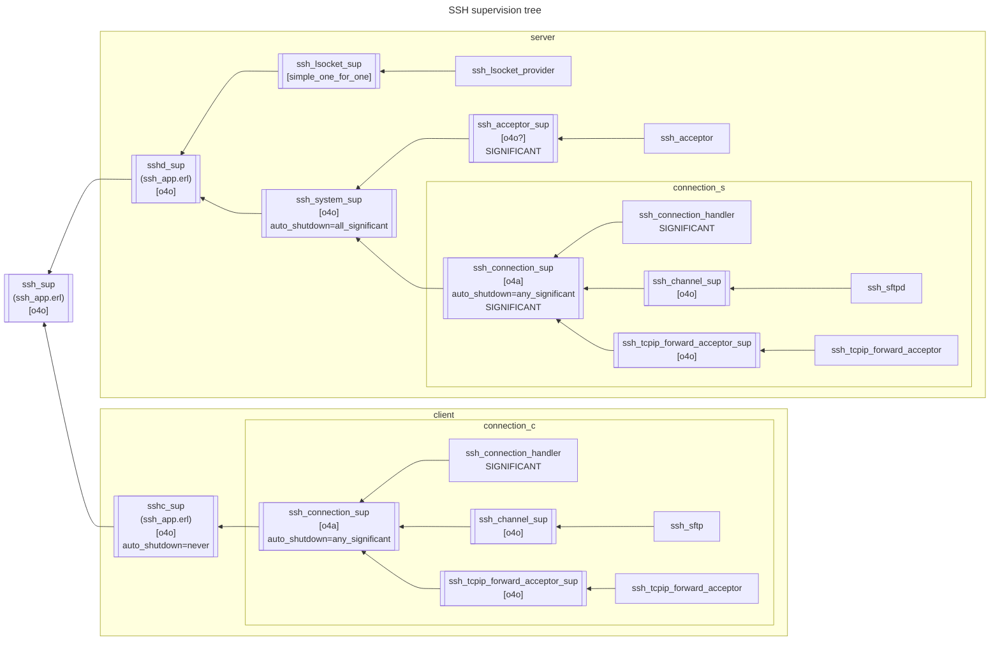
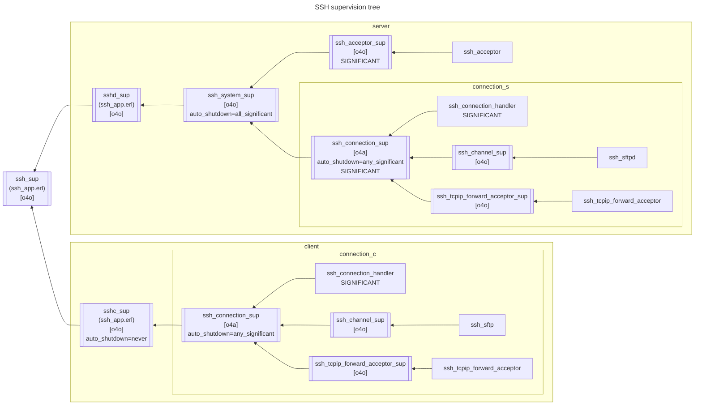
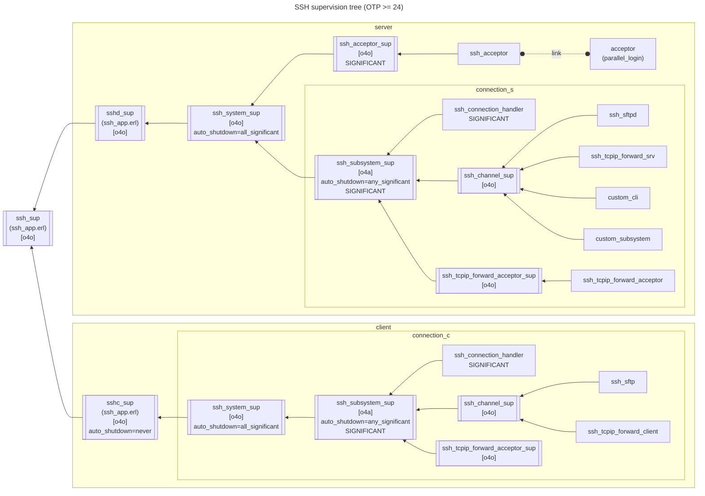
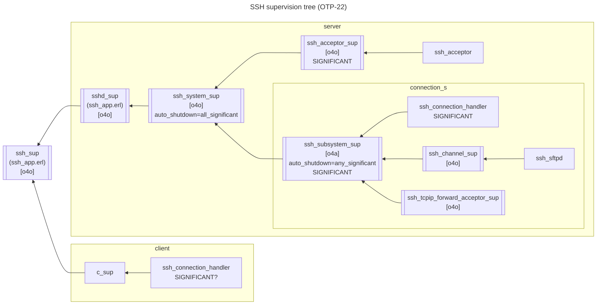

# SSH supervision tree (server side update >= OTP-28)

# SSH supervision tree (client side update since ssh-5.2.3, ssh-5.1.4.3, ssh-4.15.3.7)

# SSH supervision tree (OTP >= 24)

# SSH supervision tree (OTP-23) ??
# SSH supervision tree (OTP-22)

