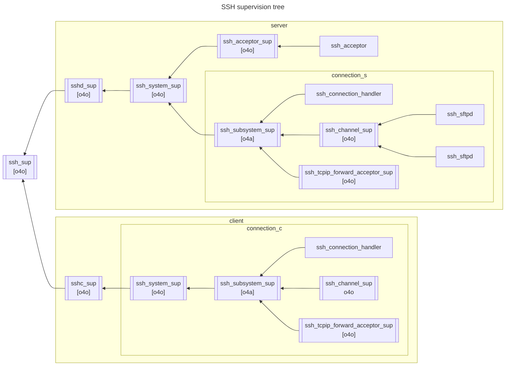

```mermaid
---
title: SSH supervision tree
---
flowchart RL
    d_sup --> sup[["ssh_sup\n[o4o]"]]
    c_sup --> sup

    subgraph client
    system_sup --> c_sup[["sshc_sup\n[o4o]"]]

    subgraph connection_c
    subsystem_sup --> system_sup[["ssh_system_sup\n[o4o]"]]
    connection_handler["ssh_connection_handler"] --> subsystem_sup[["ssh_subsystem_sup\n[o4a]"]]
    channel_sup[["ssh_channel_sup\no4o"]] --> subsystem_sup
    tcpip_forward_acceptor_sup[["ssh_tcpip_forward_acceptor_sup\n[o4o]"]] --> subsystem_sup
    end

    end

    subgraph server
    system_sup_s --> d_sup[["sshd_sup\n[o4o]"]]
    acceptor_sup --> system_sup_s[["ssh_system_sup\n[o4o]"]]
    acceptor["ssh_acceptor"] --> acceptor_sup[["ssh_acceptor_sup\n[o4o]"]]

    subsystem_sup_s --> system_sup_s

    subgraph connection_s
    connection_handler_s["ssh_connection_handler"] --> subsystem_sup_s[["ssh_subsystem_sup\n[o4a]"]]
    channel_sup_s[["ssh_channel_sup\n[o4o]"]] --> subsystem_sup_s
    tcpip_forward_acceptor_sup_s[["ssh_tcpip_forward_acceptor_sup\n[o4o]"]] --> subsystem_sup_s
    sftd1["ssh_sftpd"] --> channel_sup_s
    sftd2["ssh_sftpd"] --> channel_sup_s
    end
    end
```
