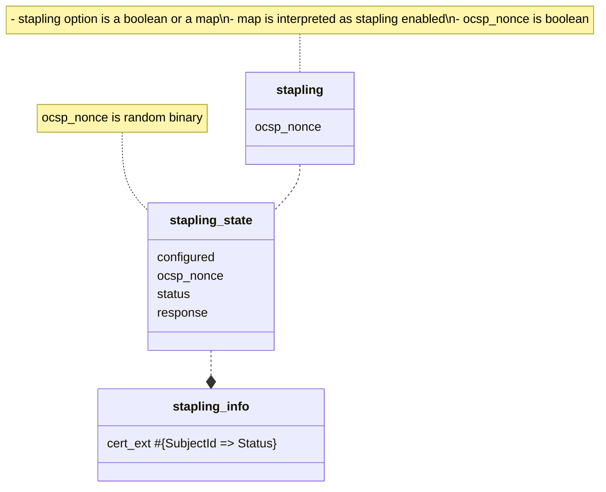
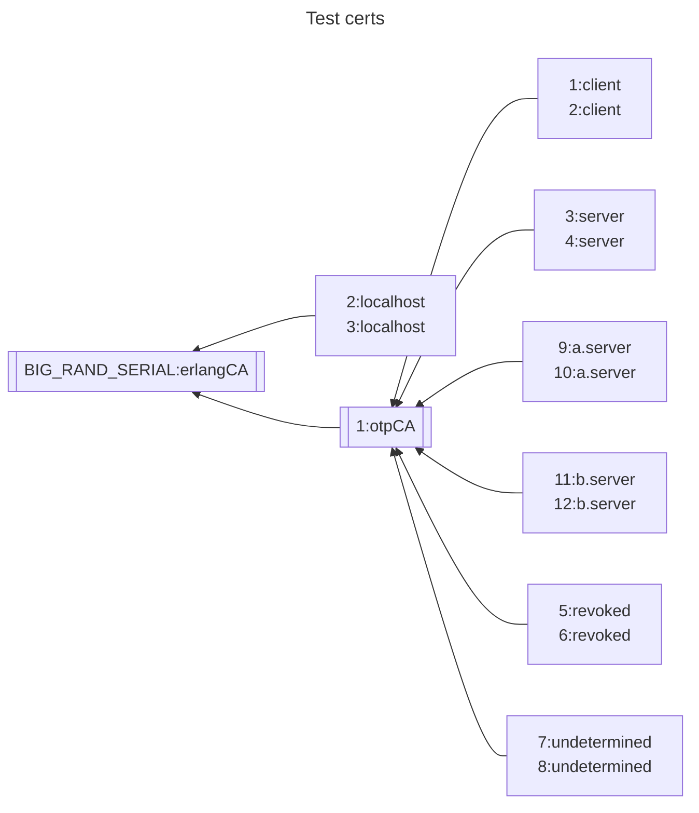

# ssl dev notes
## client-side OCSP stapling
1. stapling - is ssl option holding configuration provided by user
   - ocsp_nonce :: true|false
2. stapling_state - holds handshake process data
   - status :: not_negotiated | negotiated | not_received | received_staple
   - ocsp_nonce :: binary()
3. stapling_info - holds date required for verifying the certificate chain

## ssl test certificates
- test certificates are generated by `ssl/test/make_certs.erl/`

## Notes on the PEM and cert caches
### Data relations

     |---------------|                 |------------------------|
     | PemCache      |                 | CertDb                 |
     |---------------|               * |------------------------|
     | FilePath (PK) |           +---- | {Ref, SN, Issuer} (PK) |
     | FileContent   |           |     | Cert (Subject)         |
     |---------------|           |     |------------------------|
        |0,1                     |
        |            +-----------+
        |0,1         |1
     |-----------------|               |------------|
     | FileMapDb       |               | RefDb      |
     |-----------------|1           1  |------------|
     | CaCertFile (PK) |---------------| Ref (PK)   |
     | Ref (FK)        |               | Counter    |
     |-----------------|               |------------|

#### PemCache
1. stores a copy of file content in memory
2. includes files from cacertfile, certfile, keyfile options
3. content is added unless FileMapDb table contains entry with specified path

#### FileMapDb
1. holds relation between specific path (PEM file with CA certificates) and a ref
2. ref is generated when file from path is added for 1st time
3. ref is used as path identifier in CertDb and RefDb tables

#### RefDb
1. holds an active connections counter for a specific ref
2. when counter reaches zero - related data in CertDb, FileMapDb, RefDb is deleted

#### CertDb
1. holds decoded CA ceritificates (only those taken from cacertfile option)
2. used for building certificate chains
3. it is an ETS set table - when iterating in search of Issuer certificate,
   processing order is not guaranted
4. Table key is: {Ref, SerialNumber, Issuer}
