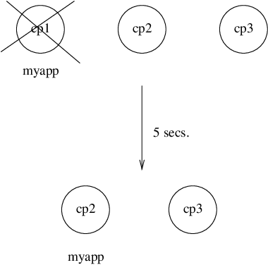
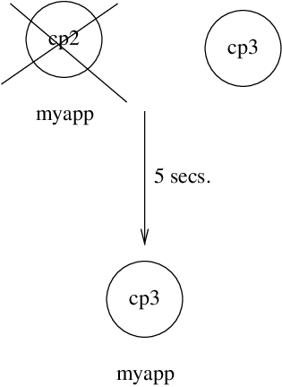
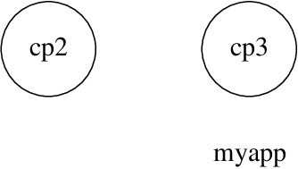
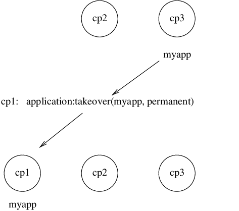

<!--
%CopyrightBegin%

Copyright Ericsson AB 2023-2024. All Rights Reserved.

Licensed under the Apache License, Version 2.0 (the "License");
you may not use this file except in compliance with the License.
You may obtain a copy of the License at

    http://www.apache.org/licenses/LICENSE-2.0

Unless required by applicable law or agreed to in writing, software
distributed under the License is distributed on an "AS IS" BASIS,
WITHOUT WARRANTIES OR CONDITIONS OF ANY KIND, either express or implied.
See the License for the specific language governing permissions and
limitations under the License.

%CopyrightEnd%
-->
# Distributed Applications

[](){: #distributed-appl }

## Introduction

In a distributed system with several Erlang nodes, it can be necessary to
control applications in a distributed manner. If the node, where a certain
application is running, goes down, the application is to be restarted at another
node.

Such an application is called a _distributed application_. Notice that it is the
control of the application that is distributed. All applications can be
distributed in the sense that they, for example, use services on other nodes.

Since a distributed application can move between nodes, some addressing
mechanism is required to ensure that it can be addressed by other applications,
regardless on which node it currently executes. This issue is not addressed
here, but the `global` or `pg` modules in Kernel can be used for this purpose.

## Specifying Distributed Applications

Distributed applications are controlled by both the application controller and a
distributed application controller process, `dist_ac`. Both these processes are
part of the Kernel application. Distributed applications are thus specified by
configuring the Kernel application, using the following configuration parameter
(see also `kernel(6)`):

`distributed = [{Application, [Timeout,] NodeDesc}]`

- Specifies where the application `Application = atom()` can execute.
- `NodeDesc = [Node | {Node,...,Node}]` is a list of node names in priority
  order. The order between nodes in a tuple is undefined.
- `Timeout = integer()` specifies how many milliseconds to wait before
  restarting the application at another node. It defaults to 0.

For distribution of application control to work properly, the nodes where a
distributed application can run must contact each other and negotiate where to
start the application. This is done using the following configuration parameters
in Kernel:

- `sync_nodes_mandatory = [Node]` \- Specifies which other nodes must be started
  (within the time-out specified by `sync_nodes_timeout`).
- `sync_nodes_optional = [Node]` \- Specifies which other nodes can be started
  (within the time-out specified by `sync_nodes_timeout`).
- `sync_nodes_timeout = integer() | infinity` \- Specifies how many milliseconds
  to wait for the other nodes to start.

When started, the node waits for all nodes specified by `sync_nodes_mandatory`
and `sync_nodes_optional` to come up. When all nodes are up, or when all
mandatory nodes are up and the time specified by `sync_nodes_timeout` has
elapsed, all applications start. If not all mandatory nodes are up, the node
terminates.

_Example:_

An application `myapp` is to run at the node `cp1@cave`. If this node goes down,
`myapp` is to be restarted at `cp2@cave` or `cp3@cave`. A system configuration
file `cp1.config` for `cp1@cave` can look as follows:

```erlang
[{kernel,
  [{distributed, [{myapp, 5000, [cp1@cave, {cp2@cave, cp3@cave}]}]},
   {sync_nodes_mandatory, [cp2@cave, cp3@cave]},
   {sync_nodes_timeout, 5000}
  ]
 }
].
```

The system configuration files for `cp2@cave` and `cp3@cave` are identical,
except for the list of mandatory nodes, which is to be `[cp1@cave, cp3@cave]`
for `cp2@cave` and `[cp1@cave, cp2@cave]` for `cp3@cave`.

> #### Note {: .info }
>
> All involved nodes must have the same value for `distributed` and
> `sync_nodes_timeout`. Otherwise the system behaviour is undefined.

## Starting and Stopping Distributed Applications

When all involved (mandatory) nodes have been started, the distributed
application can be started by calling `application:start(Application)` at _all
of these nodes._

A boot script (see [Releases](release_structure.md)) can be used that
automatically starts the application.

The application is started at the first operational node that is listed in the
list of nodes in the `distributed` configuration parameter. The application is
started as usual. That is, an application master is created and calls the
application callback function:

```erlang
Module:start(normal, StartArgs)
```

Example:

Continuing the example from the previous section, the three nodes are started,
specifying the system configuration file:

```text
> erl -sname cp1 -config cp1
> erl -sname cp2 -config cp2
> erl -sname cp3 -config cp3
```

When all nodes are operational, `myapp` can be started. This is achieved by
calling `application:start(myapp)` at all three nodes. It is then started at
`cp1`, as shown in the following figure:

[](){: #dist1 }


Similarly, the application must be stopped by calling
`application:stop(Application)` at all involved nodes.

## Failover

If the node where the application is running goes down, the application is
restarted (after the specified time-out) at the first operational node that is
listed in the list of nodes in the `distributed` configuration parameter. This
is called a _failover_.

The application is started the normal way at the new node, that is, by the
application master calling:

```erlang
Module:start(normal, StartArgs)
```

An exception is if the application has the `start_phases` key defined (see
[Included Applications](included_applications.md)). The application is then
instead started by calling:

```erlang
Module:start({failover, Node}, StartArgs)
```

Here `Node` is the terminated node.

_Example:_

If `cp1` goes down, the system checks which one of the other nodes, `cp2` or
`cp3`, has the least number of running applications, but waits for 5 seconds for
`cp1` to restart. If `cp1` does not restart and `cp2` runs fewer applications
than `cp3`, `myapp` is restarted on `cp2`.

[](){: #dist2 }



Suppose now that `cp2` goes also down and does not restart within 5 seconds.
`myapp` is now restarted on `cp3`.

[](){: #dist3 }



## Takeover

If a node is started, which has higher priority according to `distributed` than
the node where a distributed application is running, the application is
restarted at the new node and stopped at the old node. This is called a
_takeover_.

The application is started by the application master calling:

```erlang
Module:start({takeover, Node}, StartArgs)
```

Here `Node` is the old node.

_Example:_

If `myapp` is running at `cp3`, and if `cp2` now restarts, it does not restart
`myapp`, as the order between the `cp2` and `cp3` nodes is undefined.

[](){: #dist4 }



However, if `cp1` also restarts, the function `application:takeover/2` moves
`myapp` to `cp1`, as `cp1` has a higher priority than `cp3` for this
application. In this case, `Module:start({takeover, cp3@cave}, StartArgs)` is
executed at `cp1` to start the application.

[](){: #dist5 }


