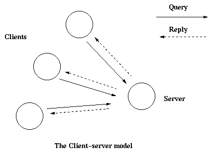

<!--
%CopyrightBegin%

Copyright Ericsson AB 2023-2024. All Rights Reserved.

Licensed under the Apache License, Version 2.0 (the "License");
you may not use this file except in compliance with the License.
You may obtain a copy of the License at

    http://www.apache.org/licenses/LICENSE-2.0

Unless required by applicable law or agreed to in writing, software
distributed under the License is distributed on an "AS IS" BASIS,
WITHOUT WARRANTIES OR CONDITIONS OF ANY KIND, either express or implied.
See the License for the specific language governing permissions and
limitations under the License.

%CopyrightEnd%
-->
# gen_server Behaviour

[](){: #gen_server }

This section is to be read with the `m:gen_server` manual page in `stdlib`,
where all interface functions and callback functions are described in detail.

## Client-Server Principles

The client-server model is characterized by a central server and an arbitrary
number of clients. The client-server model is used for resource management
operations, where several different clients want to share a common resource. The
server is responsible for managing this resource.

[](){: #clientserver }



## Example

An example of a simple server written in plain Erlang is provided in
[Overview](design_principles.md#ch1). The server can be reimplemented using
`gen_server`, resulting in this callback module:

[](){: #ex }

```erlang
-module(ch3).
-behaviour(gen_server).

-export([start_link/0]).
-export([alloc/0, free/1]).
-export([init/1, handle_call/3, handle_cast/2]).

start_link() ->
    gen_server:start_link({local, ch3}, ch3, [], []).

alloc() ->
    gen_server:call(ch3, alloc).

free(Ch) ->
    gen_server:cast(ch3, {free, Ch}).

init(_Args) ->
    {ok, channels()}.

handle_call(alloc, _From, Chs) ->
    {Ch, Chs2} = alloc(Chs),
    {reply, Ch, Chs2}.

handle_cast({free, Ch}, Chs) ->
    Chs2 = free(Ch, Chs),
    {noreply, Chs2}.
```

The code is explained in the next sections.

## Starting a Gen_Server

In the example in the previous section, `gen_server` is started by calling
`ch3:start_link()`:

```erlang
start_link() ->
    gen_server:start_link({local, ch3}, ch3, [], []) => {ok, Pid}
```

`start_link` calls function `gen_server:start_link/4`. This function spawns and
links to a new process, a `gen_server`.

- The first argument, `{local, ch3}`, specifies the name. The gen_server is then
  locally registered as `ch3`.

  If the name is omitted, the `gen_server` is not registered. Instead its pid
  must be used. The name can also be given as `{global, Name}`, in which case
  the `gen_server` is registered using `global:register_name/2`.

- The second argument, `ch3`, is the name of the callback module, that is, the
  module where the callback functions are located.

  The interface functions (`start_link`, `alloc`, and `free`) are then located
  in the same module as the callback functions (`init`, `handle_call`, and
  `handle_cast`). This is normally good programming practice, to have the code
  corresponding to one process contained in one module.

- The third argument, `[]`, is a term that is passed as is to the callback
  function `init`. Here, `init` does not need any indata and ignores the
  argument.
- The fourth argument, `[]`, is a list of options. See the `m:gen_server` manual
  page for available options.

If name registration succeeds, the new `gen_server` process calls the callback
function `ch3:init([])`. `init` is expected to return `{ok, State}`, where
`State` is the internal state of the `gen_server`. In this case, the state is
the available channels.

```erlang
init(_Args) ->
    {ok, channels()}.
```

`gen_server:start_link` is synchronous. It does not return until the
`gen_server` has been initialized and is ready to receive requests.

`gen_server:start_link` must be used if the `gen_server` is part of a
supervision tree, that is, started by a supervisor. There is another function,
`gen_server:start`, to start a standalone `gen_server`, that is, a `gen_server`
that is not part of a supervision tree.

## Synchronous Requests - Call

The synchronous request `alloc()` is implemented using `gen_server:call/2`:

```text
alloc() ->
    gen_server:call(ch3, alloc).
```

`ch3` is the name of the `gen_server` and must agree with the name used to start
it. `alloc` is the actual request.

The request is made into a message and sent to the `gen_server`. When the
request is received, the `gen_server` calls `handle_call(Request, From, State)`,
which is expected to return a tuple `{reply,Reply,State1}`. `Reply` is the reply
that is to be sent back to the client, and `State1` is a new value for the state
of the `gen_server`.

```erlang
handle_call(alloc, _From, Chs) ->
    {Ch, Chs2} = alloc(Chs),
    {reply, Ch, Chs2}.
```

In this case, the reply is the allocated channel `Ch` and the new state is the
set of remaining available channels `Chs2`.

Thus, the call `ch3:alloc()` returns the allocated channel `Ch` and the
`gen_server` then waits for new requests, now with an updated list of available
channels.

## Asynchronous Requests - Cast

The asynchronous request `free(Ch)` is implemented using `gen_server:cast/2`:

```erlang
free(Ch) ->
    gen_server:cast(ch3, {free, Ch}).
```

`ch3` is the name of the `gen_server`. `{free, Ch}` is the actual request.

The request is made into a message and sent to the `gen_server`. `cast`, and
thus `free`, then returns `ok`.

When the request is received, the `gen_server` calls
`handle_cast(Request, State)`, which is expected to return a tuple
`{noreply,State1}`. `State1` is a new value for the state of the `gen_server`.

```erlang
handle_cast({free, Ch}, Chs) ->
    Chs2 = free(Ch, Chs),
    {noreply, Chs2}.
```

In this case, the new state is the updated list of available channels `Chs2`.
The `gen_server` is now ready for new requests.

## Stopping

### In a Supervision Tree

If the `gen_server` is part of a supervision tree, no stop function is needed.
The `gen_server` is automatically terminated by its supervisor. Exactly how this
is done is defined by a [shutdown strategy](sup_princ.md#shutdown) set in the
supervisor.

If it is necessary to clean up before termination, the shutdown strategy must be
a time-out value and the `gen_server` must be set to trap exit signals in
function `init`. When ordered to shutdown, the `gen_server` then calls the
callback function `terminate(shutdown, State)`:

```erlang
init(Args) ->
    ...,
    process_flag(trap_exit, true),
    ...,
    {ok, State}.

...

terminate(shutdown, State) ->
    ..code for cleaning up here..
    ok.
```

### Standalone Gen_Servers

If the `gen_server` is not part of a supervision tree, a stop function can be
useful, for example:

```erlang
...
export([stop/0]).
...

stop() ->
    gen_server:cast(ch3, stop).
...

handle_cast(stop, State) ->
    {stop, normal, State};
handle_cast({free, Ch}, State) ->
    ....

...

terminate(normal, State) ->
    ok.
```

The callback function handling the `stop` request returns a tuple
`{stop,normal,State1}`, where `normal` specifies that it is a normal termination
and `State1` is a new value for the state of the `gen_server`. This causes the
`gen_server` to call `terminate(normal, State1)` and then it terminates
gracefully.

## Handling Other Messages

If the `gen_server` is to be able to receive other messages than requests, the
callback function `handle_info(Info, State)` must be implemented to handle them.
Examples of other messages are exit messages, if the `gen_server` is linked to
other processes (than the supervisor) and trapping exit signals.

```erlang
handle_info({'EXIT', Pid, Reason}, State) ->
    ..code to handle exits here..
    {noreply, State1}.
```

The `code_change` method must also be implemented.

```erlang
code_change(OldVsn, State, Extra) ->
    ..code to convert state (and more) during code change
    {ok, NewState}.
```
