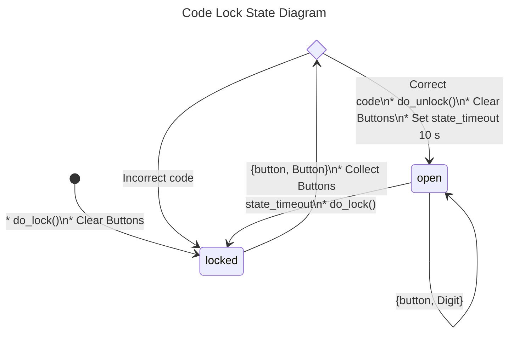
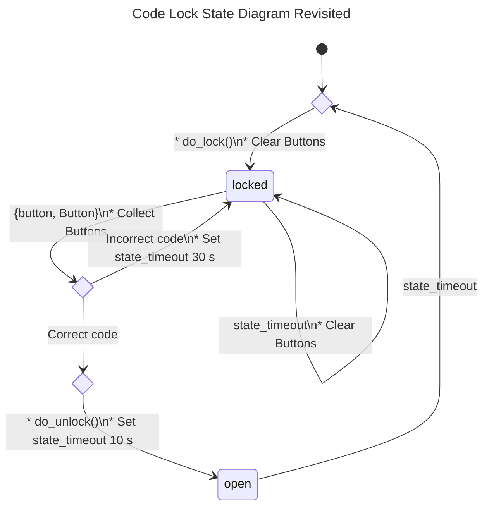

<!--
%CopyrightBegin%

Copyright Ericsson AB 2024. All Rights Reserved.

Licensed under the Apache License, Version 2.0 (the "License");
you may not use this file except in compliance with the License.
You may obtain a copy of the License at

    http://www.apache.org/licenses/LICENSE-2.0

Unless required by applicable law or agreed to in writing, software
distributed under the License is distributed on an "AS IS" BASIS,
WITHOUT WARRANTIES OR CONDITIONS OF ANY KIND, either express or implied.
See the License for the specific language governing permissions and
limitations under the License.

%CopyrightEnd%
-->
# gen_statem Behaviour

It is recommended to read this section alongside `m:gen_statem` in STDLIB.

## Event-Driven State Machines

Established Automata Theory does not deal much with how a _state transition_ is
triggered, but assumes that the output is a function of the input (and the
state) and that they are some kind of values.

For an Event-Driven State Machine, the input is an event that triggers a _state
transition_ and the output is actions executed during the _state transition_.
Analogously to the mathematical model of a Finite State Machine, it can be
described as a set of relations of the following form:

```erlang
State(S) x Event(E) -> Actions(A), State(S')
```

These relations are interpreted as follows: if we are in state `S` and event `E`
occurs, we are to perform actions `A`, and make a transition to state `S'`.
Notice that `S'` can be equal to `S`, and that `A` can be empty.

In `gen_statem` we define a _state change_ as a _state transition_ in which the
new state `S'` is different from the current state `S`, where "different" means
Erlang's strict inequality: `=/=` also known as "does not match". `gen_statem`
does more things during _state changes_ than during other _state transitions_.

As `A` and `S'` depend only on `S` and `E`, the kind of state machine described
here is a Mealy machine (see, for example, the Wikipedia article
[Mealy machine](https://en.wikipedia.org/wiki/Mealy_machine)).

Similar to most `gen_` behaviours, `gen_statem` keeps a server `Data`
item besides the state. Because of this data item, and since there is
no restriction on the number of states (assuming sufficient virtual
machine memory), or on the number of distinct input events, a state
machine implemented with this behaviour is Turing complete. But it
feels mostly like an Event-Driven Mealy machine.

## When to use gen_statem

You should consider using `m:gen_statem` over `m:gen_server` if your
process logic is convenient to describe as a state machine and you
need any of these `m:gen_statem` key features:

- Co-located callback code for each state, for all
  [_Event Types_ ](statem.md#event-types-and-event-content), such as _call_,
  _cast_, and _info_
- [Postponing Events](statem.md#postponing-events) - a substitute for selective
  receive
- [Inserted Events](statem.md#inserted-events) - events from the state
  machine to itself; for purely internal events in particular
- [_State Enter Calls_](statem.md#state-enter-calls) - callback on state entry
  co-located with the rest of each state's callback code
- Easy-to-use time-outs - [State Time-Outs](statem.md#state-time-outs),
  [Event Time-Outs](statem.md#event-time-outs), and
  [Generic Time-Outs](statem.md#generic-time-outs) (named time-outs)

For simple state machines not needing these features, `m:gen_server`
is perfectly suitable. It also has a smaller call overhead, but we are
talking about something like 2 vs 3.3 microseconds call roundtrip time
here, so if the server callback does just a little bit more than just
replying, or if calls are not extremely frequent, that difference
will be hard to notice.

## Callback Module

The _callback module_ contains functions that implement the state
machine. When an event occurs, the `gen_statem` behaviour engine calls
a function in the _callback module_ with the event, current state, and
server data. This callback function performs the actions for the
event, and returns the new state and server data as well as actions to
be performed by the behaviour engine.

The behaviour engine holds the state machine state, server data, timer
references, a queue of postponed messages, and other metadata. It receives all
process messages, handles the system messages, and calls the _callback module_
with machine specific events.

The _callback module_ can be changed for a running server using any of the
[transition actions](statem.md#transition-actions)
[`{change_callback_module, NewModule}`](`t:gen_statem:action/0`),
[`{push_callback_module, NewModule}`](`t:gen_statem:action/0`), or
[`pop_callback_module`](`t:gen_statem:action/0`).

> #### Note {: .info }
>
> Switching the callback module is a pretty esoteric thing to do...
>
> The origin for this feature is a protocol that after version
> negotiation branches off into quite different state machines depending
> on the protocol version. There _might_ be other use cases. _Beware_
> that the new callback module completely replaces the previous callback
> module, so all relevant callback functions have to handle the state
> and data from the previous callback module.

## Callback Modes

The `gen_statem` behaviour supports two _callback modes_:

- **[`state_functions`](`t:gen_statem:callback_mode/0`)** - Events are handled
  by one callback function per state.

- **[`handle_event_function`](`t:gen_statem:callback_mode/0`)** - Events are
  handled by one single callback function.

The _callback mode_ is a property of the _callback module_ and is set at server
start. It may be changed due to a code upgrade/downgrade, or when changing the
_callback module_.

See the section [_State Callback_](statem.md#state-callback) that describes the
event handling callback function(s).

The _callback mode_ is selected by implementing a mandatory callback function
[`Module:callback_mode()` ](`c:gen_statem:callback_mode/0`)that returns one of
the _callback modes_.

The [`Module:callback_mode()` ](`c:gen_statem:callback_mode/0`)function may also
return a list containing the _callback mode_ and the atom `state_enter` in which
case [_state enter calls_ ](statem.md#state-enter-calls)are activated for the
_callback mode_.

### Choosing the Callback Mode

The short version: choose `state_functions` - it is the one most like
`m:gen_fsm`. But if you do not want the restriction that the state must be an
atom, or if you do not want to write one _state callback_ function per state,
please read on...

The two [_callback modes_](statem.md#callback-modes) give different
possibilities and restrictions, with one common goal: to handle all possible
combinations of events and states.

This can be done, for example, by focusing on one state at the time and for
every state ensure that all events are handled. Alternatively, you can focus on
one event at the time and ensure that it is handled in every state. You can also
use a mix of these strategies.

With `state_functions`, you are restricted to use atom-only states, and the
`m:gen_statem` engine branches depending on state name for you. This encourages
the _callback module_ to co-locate the implementation of all event actions
particular to one state in the same place in the code, hence to focus on one
state at the time.

This mode fits well when you have a regular state diagram, like the ones in this
chapter, which describes all events and actions belonging to a state visually
around that state, and each state has its unique name.

With `handle_event_function`, you are free to mix strategies, as all events and
states are handled in the same callback function.

This mode works equally well when you want to focus on one event at the time or
on one state at the time, but function
[`Module:handle_event/4` ](`c:gen_statem:handle_event/4`)quickly grows too large
to handle without branching to helper functions.

The mode enables the use of non-atom states, for example, complex states or even
hierarchical states. See section [Complex State](statem.md#complex-state). If,
for example, a state diagram is largely alike for the client side and the server
side of a protocol, you can have a state `{StateName,server}` or
`{StateName,client}`, and make `StateName` determine where in the code to handle
most events in the state. The second element of the tuple is then used to select
whether to handle special client-side or server-side events.

## State Callback

The _state callback_ is the callback function that handles an event in the
current state, and which function that is depends on the _callback mode_:

- **`state_functions`** - The event is handled by:
  [`Module:StateName(EventType, EventContent, Data)`](`c:gen_statem:'StateName'/3`)

  This form is the one mostly used in the [Example](statem.md#example) section.

- **`handle_event_function`** - The event is handled by:
  [`Module:handle_event(EventType, EventContent, State, Data)`](`c:gen_statem:handle_event/4`)

  See section [_One State Callback_ ](statem.md#one-state-callback)for an
  example.

The state is either the name of the function itself or an argument to it. The
other arguments are the `EventType` and the event dependent `EventContent`, both
described in section
[Event Types and Event Content](statem.md#event-types-and-event-content), and
the current server `Data`.

_State enter calls_ are also handled by the event handler and have slightly
different arguments. See section
[State Enter Calls](statem.md#state-enter-calls).

The _state callback_ return values are defined in the description of
[`Module:StateName/3` ](`c:gen_statem:'StateName'/3`) in `m:gen_statem`,
but here is a more readable list:

- **`{next_state, NextState, NewData, Actions}`
  `{next_state, NextState, NewData}`**
  Set next state and update the server data. If the `Actions` field is used,
  execute _transition actions_. An empty `Actions` list is equivalent to not
  returning the field.

  See section [_Transition Actions_ ](statem.md#transition-actions)for a list of
  possible _transition actions_.

  If `NextState =/= State` this is a _state change_ so the extra things
  `gen_statem` does are: the event queue is restarted from the oldest
  [postponed event](statem.md#postponing-events), any current
  [state time-out](statem.md#state-time-outs) is canceled, and a
  [state enter call](statem.md#state-enter-calls) is performed, if enabled.

- **`{keep_state, NewData, Actions}`
  `{keep_state, NewData}`**
  Same as the `next_state` values with `NextState =:= State`, that is, no _state
  change_.

- **`{keep_state_and_data, Actions}`
  `keep_state_and_data`**
  Same as the `keep_state` values with `NextData =:= Data`, that is, no change
  in server data.

- **`{repeat_state, NewData, Actions}`
  `{repeat_state, NewData}`
  `{repeat_state_and_data, Actions}`
  `repeat_state_and_data`**
  Same as the `keep_state` or `keep_state_and_data` values, and if
  [State Enter Calls ](statem.md#state-enter-calls)are enabled, repeat the
  _state enter call_ as if this state was entered again.

  If these return values are used from a _state enter call_ the `OldState` does
  not change, but if used from an event handling _state callback_ the new _state
  enter call's_ `OldState` will be the current state.

- **`{stop, Reason, NewData}`
  `{stop, Reason}`**
  Stop the server with reason `Reason`. If the `NewData` field is used, first
  update the server data.

- **`{stop_and_reply, Reason, NewData, ReplyActions}`
  `{stop_and_reply, Reason, ReplyActions}`**
  Same as the `stop` values, but first execute the given
  [_transition actions_ ](statem.md#transition-actions)that may only be reply
  actions.

### The First State

To decide the first state the
[`Module:init(Args)` ](`c:gen_statem:init/1`)callback function is called before
any [_state callback_](statem.md#state-callback) is called. This function
behaves like a _state callback_ function, but gets its only argument `Args` from
the `gen_statem` [`start/3,4` ](`gen_statem:start/3`)or
[`start_link/3,4` ](`gen_statem:start_link/3`)function, and returns
`{ok, State, Data}` or `{ok, State, Data, Actions}`. If you use the
[`postpone`](statem.md#postponing-events) action from this function, that action
is ignored, since there is no event to postpone.

## Transition Actions

In the first section
([Event-Driven State Machines](statem.md#event-driven-state-machines)), actions
were mentioned as a part of the general state machine model. These general
actions are implemented with the code that _callback module_ `gen_statem`
executes in an event-handling callback function before returning to the
`m:gen_statem` engine.

There are more specific _transition actions_ that a callback function can
command the `gen_statem` engine to do after the callback function return. These
are commanded by returning a list of [actions](`t:gen_statem:action/0`) in the
[return value ](`t:gen_statem:state_callback_result/1`)from the
[callback function](`c:gen_statem:'StateName'/3`). These are the possible
_transition actions_:

- **[`postpone`](`t:gen_statem:postpone/0`)
  `{postpone, Boolean}`** -
  If set postpone the current event, see section
  [Postponing Events](statem.md#postponing-events).

- **[`hibernate`](`t:gen_statem:hibernate/0`)
  `{hibernate, Boolean}`** -
  If set hibernate the `gen_statem`, treated in section
  [Hibernation](statem.md#hibernation).

- **[`{state_timeout, Time, EventContent}`](`t:gen_statem:state_timeout/0`)
  `{state_timeout, Time, EventContent, Opts}`
  [`{state_timeout, update, EventContent}`](`t:gen_statem:timeout_update_action/0`)
  [`{state_timeout, cancel}`](`t:gen_statem:timeout_cancel_action/0`)** -
  Start, update or cancel a state time-out, read more in sections
  [Time-Outs](statem.md#time-outs) and
  [State Time-Outs](statem.md#state-time-outs).

- **[`{{timeout, Name}, Time, EventContent}`](`t:gen_statem:generic_timeout/0`)
  `{{timeout, Name}, Time, EventContent, Opts}`
  [`{{timeout, Name}, update, EventContent}`](`t:gen_statem:timeout_update_action/0`)
  [`{{timeout, Name}, cancel}`](`t:gen_statem:timeout_cancel_action/0`)** -
  Start, update or cancel a generic time-out, read more in sections
  [Time-Outs](statem.md#time-outs) and
  [Generic Time-Outs](statem.md#generic-time-outs).

- **[`{timeout, Time, EventContent}`](`t:gen_statem:event_timeout/0`)
  `{timeout, Time, EventContent, Opts}`
  `Time`** -
  Start an event time-out, see more in sections [Time-Outs](statem.md#time-outs)
  and [Event Time-Outs](statem.md#event-time-outs).

- **[`{reply, From, Reply}`](`t:gen_statem:reply_action/0`)** - Reply to a
  caller, mentioned at the end of section
  [All State Events](statem.md#all-state-events).

- **[`{next_event, EventType, EventContent}`](`t:gen_statem:action/0`)** -
  Generate the next event to handle, see section
  [Inserted Events](statem.md#inserted-events).

- **[`{change_callback_module, NewModule}`](`t:gen_statem:action/0`)** - Change
  the [_callback module_ ](statem.md#callback-module)for the running server.
  This can be done during any _state transition_, whether it is a _state change_
  or not, but it can _not_ be done from a
  [_state enter call_](statem.md#state-enter-calls).

- **[`{push_callback_module, NewModule}`](`t:gen_statem:action/0`)** - Push the
  current _callback module_ to the top of an internal stack of callback modules
  and set the new [_callback module_ ](statem.md#callback-module)for the running
  server. Otherwise like `{change_callback_module, NewModule}` above.

- **[`pop_callback_module`](`t:gen_statem:action/0`)** - Pop the top module from
  the internal stack of callback modules and set it to be the new
  [_callback module_ ](statem.md#callback-module)for the running server. If the
  stack is empty the server fails. Otherwise like
  `{change_callback_module, NewModule}` above.

For details, see module `m:gen_statem` for type
[`action()`](`t:gen_statem:action/0`). You can, for example, reply to many
callers, generate multiple next events, and set a time-out to use absolute
instead of relative time (using the `Opts` field).

Out of these _transition actions_, the only immediate action is
`reply` for replying to a caller. The other actions are collected and
handled later during the _state transition_. [Inserted
Events](statem.md#inserted-events) are stored and inserted all
together, and the rest set transition options where the last of a
specific type override the previous. See the description of a _state
transition_ in module `m:gen_statem` for type
[`transition_option()`](`t:gen_statem:transition_option/0`).

The different [Time-Outs](statem.md#time-outs) and
[`next_event`](statem.md#inserted-events) actions generate new events with
corresponding
[Event Types and Event Content ](statem.md#event-types-and-event-content).

## Event Types and Event Content

Events are categorized in different
[_event types_](`t:gen_statem:event_type/0`). Events of all types are for a
given state handled in the same callback function, and that function gets
`EventType` and `EventContent` as arguments. The meaning of the `EventContent`
depends on the `EventType`.

The following is a complete list of _event types_ and from where they come:

- **[`cast`](`t:gen_statem:external_event_type/0`)** - Generated by
  [`gen_statem:cast(ServerRef, Msg)` ](`gen_statem:cast/2`)where `Msg` becomes
  the `EventContent`.

- **[`{call,From}`](`t:gen_statem:external_event_type/0`)** - Generated by
  [`gen_statem:call(ServerRef, Request)` ](`gen_statem:call/2`)where `Request`
  becomes the `EventContent`. `From` is the reply address to use when replying
  either through the _transition action_ `{reply,From,Reply}` or by calling
  [`gen_statem:reply(From, Reply)` ](`gen_statem:reply/1`)from the _callback
  module_.

- **[`info`](`t:gen_statem:external_event_type/0`)** - Generated by any regular
  process message sent to the `gen_statem` process. The process message becomes
  the `EventContent`.

- **[`state_timeout`](`t:gen_statem:timeout_event_type/0`)** - Generated by
  _transition action_
  [`{state_timeout,Time,EventContent}` ](`t:gen_statem:timeout_action/0`)state
  timer timing out. Read more in sections [Time-Outs](statem.md#time-outs) and
  [State Time-Outs](statem.md#state-time-outs).

- **[`{timeout,Name}`](`t:gen_statem:timeout_event_type/0`)** - Generated by
  _transition action_
  [`{{timeout,Name},Time,EventContent}` ](`t:gen_statem:timeout_action/0`)generic
  timer timing out. Read more in sections [Time-Outs](statem.md#time-outs) and
  [Generic Time-Outs](statem.md#generic-time-outs).

- **[`timeout`](`t:gen_statem:timeout_event_type/0`)** - Generated by
  _transition action_
  [`{timeout,Time,EventContent}` ](`t:gen_statem:timeout_action/0`)(or its short
  form `Time`) event timer timing out. Read more in sections
  [Time-Outs](statem.md#time-outs) and
  [Event Time-Outs](statem.md#event-time-outs).

- **[`internal`](`t:gen_statem:event_type/0`)** - Generated by _transition
  action_ [`{next_event,internal,EventContent}`](`t:gen_statem:action/0`). All
  _event types_ above can also be generated using the `next_event` action:
  `{next_event,EventType,EventContent}`.

## State Enter Calls

The `gen_statem` behaviour can if this is enabled, regardless of _callback
mode_, automatically
[call the state callback ](`t:gen_statem:state_enter/0`)with special arguments
whenever the state changes so you can write state enter actions near the rest of
the _state transition_ rules. It typically looks like this:

```erlang
StateName(enter, OldState, Data) ->
    ... code for state enter actions here ...
    {keep_state, NewData};
StateName(EventType, EventContent, Data) ->
    ... code for actions here ...
    {next_state, NewStateName, NewData}.
```

Since the _state enter call_ is not an event there are restrictions on the
allowed return value and
[State Transition Actions](statem.md#transition-actions). You must not change the
state, [postpone](statem.md#postponing-events) this non-event,
[insert any events](statem.md#inserted-events), or change the
[_callback module_](statem.md#callback-module).

The first state that is entered will get a _state enter call_ with `OldState`
equal to the current state.

You may repeat the _state enter call_ using the `{repeat_state,...}` return
value from the [state callback](statem.md#state-callback). In this case
`OldState` will also be equal to the current state.

Depending on how your state machine is specified, this can be a very useful
feature, but it forces you to handle the _state enter calls_ in all states. See
also the [State Enter Actions ](statem.md#state-enter-actions)section.

## Time-Outs

Time-outs in `gen_statem` are started from a
[_transition action_ ](statem.md#transition-actions)during a state transition
that is when exiting from the [_state callback_](statem.md#state-callback).

There are 3 types of time-outs in `gen_statem`:

- **[`state_timeout`](`t:gen_statem:state_timeout/0`)** - There is one
  [State Time-Out](statem.md#state-time-outs) that is automatically canceled by
  a _state change_.

- **[`{timeout, Name}`](`t:gen_statem:generic_timeout/0`)** - There are any
  number of [Generic Time-Outs](statem.md#generic-time-outs) differing by their
  `Name`. They have no automatic canceling.

- **[`timeout`](`t:gen_statem:event_timeout/0`)** - There is one
  [Event Time-Out](statem.md#event-time-outs) that is automatically canceled by
  any event. Note that [postponed ](statem.md#postponing-events)and
  [inserted](statem.md#inserted-events) events cancel this time-out just as
  external events do.

When a time-out is started any running time-out of the same type
(`state_timeout`, `{timeout, Name}`, or `timeout`) is canceled, that is, the
time-out is restarted with the new time.

All time-outs has an `EventContent` that is part of the
[_transition action_ ](statem.md#transition-actions)that starts the time-out.
Different `EventContent`s does not create different time-outs. The
`EventContent` is delivered to the [_state callback_](statem.md#state-callback)
when the time-out expires.

### Canceling a Time-Out

Starting a time-out with the `infinity` time value ensures it never times
out, essentially preventing it from even starting, and any running
time-out with the same tag will be canceled. The `EventContent` will
in this case be ignored, so it makes sense to set it to `undefined`.

A more explicit way to cancel a timer is to use a
[_transition action_ ](statem.md#transition-actions)on the form
[`{TimeoutType, cancel}` ](`t:gen_statem:timeout_cancel_action/0`).

### Updating a Time-Out

While a time-out is running, its `EventContent` can be updated using a
[_transition action_ ](statem.md#transition-actions)on the form
[`{TimeoutType, update, NewEventContent}` ](`t:gen_statem:timeout_update_action/0`).

If this feature is used while no such `TimeoutType` is running, a time-out
event is immediately delivered as when starting a
[Time-Out Zero](statem.md#time-out-zero).

### Time-Out Zero

If a time-out is started with the time `0` it will actually not be started.
Instead the time-out event will immediately be inserted to be processed after
any events already enqueued, and before any not yet received external events.
Note that some time-outs are automatically canceled so if you for example
combine [postponing](statem.md#postponing-events) an event in a _state change_
with starting an [event time-out](statem.md#event-time-outs) with time `0` there
will be no time-out event inserted since the event time-out is canceled by the
postponed event that is delivered due to the state change.

## Example

A door with a code lock can be seen as a state machine.  Initially,
the door is locked.  When someone presses a button, a `{button, Button}`
event is generated.  In the state diagram below, "Collect Buttons" means
to store buttons up to as many as in the correct code; append to
a length capped list.  If correct, the door is unlocked for 10 seconds.
If incorrect, we wait for a new button to be pressed.



This code lock state machine can be implemented using `m:gen_statem` with the
following _callback module_:

```erlang
-module(code_lock).
-behaviour(gen_statem).
-define(NAME, code_lock).

-export([start_link/1]).
-export([button/1]).
-export([init/1,callback_mode/0,terminate/3]).
-export([locked/3,open/3]).

start_link(Code) ->
    gen_statem:start_link({local,?NAME}, ?MODULE, Code, []).

button(Button) ->
    gen_statem:cast(?NAME, {button,Button}).

init(Code) ->
    do_lock(),
    Data = #{code => Code, length => length(Code), buttons => []},
    {ok, locked, Data}.

callback_mode() ->
    state_functions.
```

```erlang
locked(
  cast, {button,Button},
  #{code := Code, length := Length, buttons := Buttons} = Data) ->
    NewButtons =
        if
            length(Buttons) < Length ->
                Buttons;
            true ->
                tl(Buttons)
        end ++ [Button],
    if
        NewButtons =:= Code -> % Correct
	    do_unlock(),
            {next_state, open, Data#{buttons := []},
             [{state_timeout,10_000,lock}]}; % Time in milliseconds
	true -> % Incomplete | Incorrect
            {next_state, locked, Data#{buttons := NewButtons}}
    end.
```

```erlang
open(state_timeout, lock,  Data) ->
    do_lock(),
    {next_state, locked, Data};
open(cast, {button,_}, Data) ->
    {next_state, open, Data}.
```

```erlang
do_lock() ->
    io:format("Lock~n", []).
do_unlock() ->
    io:format("Unlock~n", []).

terminate(_Reason, State, _Data) ->
    State =/= locked andalso do_lock(),
    ok.
```

The code is explained in the next sections.

## Starting gen_statem

In the example in the previous section, `gen_statem` is started by calling
`code_lock:start_link(Code)`:

```erlang
start_link(Code) ->
    gen_statem:start_link({local,?NAME}, ?MODULE, Code, []).
```

`start_link/1` calls function `gen_statem:start_link/4`, which spawns and links to
a new process, a `gen_statem`.

- The first argument, `{local,?NAME}`, specifies the name. In this case, the
  `gen_statem` is locally registered as `code_lock` through the macro `?NAME`.

  If the name is omitted, the `gen_statem` is not registered. Instead its pid
  must be used. The name can also be specified as `{global,Name}`, then the
  `gen_statem` is registered using `global:register_name/2` in Kernel.

- The second argument, `?MODULE`, is the name of the _callback module_, that is,
  the module where the callback functions are located, which is this module.

  The interface functions (`start_link/1` and `button/1`) are located in the
  same module as the callback functions (`init/1`, `locked/3`, and `open/3`). It
  is normally good programming practice to have the client-side code and the
  server-side code contained in the same module.

- The third argument, `Code`, is a list of digits, which is the correct unlock
  code that is passed to callback function `init/1`.

- The fourth argument, `[]`, is a list of options. For the available options,
  see `gen_statem:start_link/3`.

If name registration succeeds, the new `gen_statem` process calls callback
function `code_lock:init(Code)`. This function is expected to return
`{ok, State, Data}`, where `State` is the initial state of the `gen_statem`, in
this case `locked`; assuming that the door is locked to begin with. `Data` is
the internal server data of the `gen_statem`. Here the server data is a
[map](`m:maps`) with key `code` that stores the correct button sequence, key
`length` store its length, and key `buttons` that stores the collected buttons
up to the same length.

```erlang
init(Code) ->
    do_lock(),
    Data = #{code => Code, length => length(Code), buttons => []},
    {ok, locked, Data}.
```

Function [`gen_statem:start_link/3,4`](`gen_statem:start_link/3`) is synchronous. It
does not return until the `gen_statem` is initialized and is ready to receive
events.

Function [`gen_statem:start_link/3,4`](`gen_statem:start_link/3`) must be used if
the `gen_statem` is part of a supervision tree, that is, started by a
supervisor. Another function, [`gen_statem:start/3,4`](`gen_statem:start/3`) can be
used to start a standalone `gen_statem`, meaning it is not part of a supervision
tree.

Function [`Module:callback_mode/0`](`c:gen_statem:callback_mode/0`) selects the
[`CallbackMode`](statem.md#callback-modes) for the _callback module_, in this
case [`state_functions`](`t:gen_statem:callback_mode/0`). That is, each state
has its own handler function:

```erlang
callback_mode() ->
    state_functions.
```

## Handling Events

The function notifying the code lock about a button event is implemented using
`gen_statem:cast/2`:

```erlang
button(Button) ->
    gen_statem:cast(?NAME, {button,Button}).
```

The first argument is the name of the `gen_statem` and must agree with the name
used to start it. So, we use the same macro `?NAME` as when starting.
`{button,Button}` is the event content.

The event is sent to the `gen_statem`. When the event is received, the
`gen_statem` calls `StateName(cast, Event, Data)`, which is expected to return a
tuple `{next_state, NewStateName, NewData}`, or
`{next_state, NewStateName, NewData, Actions}`. `StateName` is the name of the
current state and `NewStateName` is the name of the next state to go to.
`NewData` is a new value for the server data of the `gen_statem`, and `Actions`
is a list of actions to be performed by the `gen_statem` engine.

```erlang
locked(
  cast, {button,Button},
  #{code := Code, length := Length, buttons := Buttons} = Data) ->
    NewButtons =
        if
            length(Buttons) < Length ->
                Buttons;
            true ->
                tl(Buttons)
        end ++ [Button],
    if
        NewButtons =:= Code -> % Correct
	    do_unlock(),
            {next_state, open, Data#{buttons := []},
             [{state_timeout,10_000,lock}]}; % Time in milliseconds
	true -> % Incomplete | Incorrect
            {next_state, locked, Data#{buttons := NewButtons}}
    end.
```

In state `locked`, when a button is pressed, it is collected with the
previously pressed buttons up to the length of the correct code, then
compared with the correct code. Depending on the result, the door is
either unlocked and the `gen_statem` goes to state `open`, or the door
remains in state `locked`.

When changing to state `open`, the collected buttons are reset, the lock
unlocked, and a state timer for 10 seconds is started.

```erlang
open(cast, {button,_}, Data) ->
    {next_state, open, Data}.
```

In state `open`, a button event is ignored by staying in the same state. This
can also be done by returning `{keep_state, Data}`, or in this case since `Data`
is unchanged, by returning `keep_state_and_data`.

## State Time-Outs

When a correct code has been given, the door is unlocked and the following tuple
is returned from `locked/2`:

```erlang
{next_state, open, Data#{buttons := []},
 [{state_timeout,10_000,lock}]}; % Time in milliseconds
```

10,000 is a time-out value in milliseconds. After this time (10 seconds), a
time-out occurs. Then, `StateName(state_timeout, lock, Data)` is called. The
time-out occurs when the door has been in state `open` for 10 seconds. After
that the door is locked again:

```erlang
open(state_timeout, lock,  Data) ->
    do_lock(),
    {next_state, locked, Data};
```

The timer for a state time-out is automatically canceled when the state machine
does a _state change_.

You can restart, cancel or update a state time-out. See section
[Time-Outs](statem.md#time-outs) for details.

## All State Events

Sometimes events can arrive in any state of the `gen_statem`. It is convenient
to handle these in a common state handler function that all state functions call
for events not specific to the state.

Consider a `code_length/0` function that returns the length of the correct code.
We dispatch all events that are not state-specific to the common function
`handle_common/3`:

```erlang
...
-export([button/1,code_length/0]).
...

code_length() ->
    gen_statem:call(?NAME, code_length).

...
locked(...) -> ... ;
locked(EventType, EventContent, Data) ->
    handle_common(EventType, EventContent, Data).

...
open(...) -> ... ;
open(EventType, EventContent, Data) ->
    handle_common(EventType, EventContent, Data).

handle_common({call,From}, code_length, #{code := Code} = Data) ->
    {keep_state, Data,
     [{reply,From,length(Code)}]}.
```

Another way to do it is through a convenience macro `?HANDLE_COMMON/0`:

```erlang
...
-export([button/1,code_length/0]).
...

code_length() ->
    gen_statem:call(?NAME, code_length).

-define(HANDLE_COMMON,
    ?FUNCTION_NAME(T, C, D) -> handle_common(T, C, D)).
%%
handle_common({call,From}, code_length, #{code := Code} = Data) ->
    {keep_state, Data,
     [{reply,From,length(Code)}]}.

...
locked(...) -> ... ;
?HANDLE_COMMON.

...
open(...) -> ... ;
?HANDLE_COMMON.
```

This example uses `gen_statem:call/2`, which waits for a reply from the server.
The reply is sent with a `{reply,From,Reply}` tuple in an action list in the
`{keep_state, ...}` tuple that retains the current state. This return form is
convenient when you want to stay in the current state but do not know or care
about what it is.

If the common _state callback_ needs to know the current state a function
`handle_common/4` can be used instead:

```erlang
-define(HANDLE_COMMON,
    ?FUNCTION_NAME(T, C, D) -> handle_common(T, C, ?FUNCTION_NAME, D)).
```

## One State Callback

If [_callback mode_ ](statem.md#callback-modes)`handle_event_function` is used,
all events are handled in
[`Module:handle_event/4`](`c:gen_statem:handle_event/4`) and we can (but do not
have to) use an event-centered approach where we first branch depending on event
and then depending on state:

```erlang
...
-export([handle_event/4]).

...
callback_mode() ->
    handle_event_function.

handle_event(cast, {button,Button}, State, #{code := Code} = Data) ->
    case State of
	locked ->
            #{length := Length, buttons := Buttons} = Data,
            NewButtons =
                if
                    length(Buttons) < Length ->
                        Buttons;
                    true ->
                        tl(Buttons)
                end ++ [Button],
            if
                NewButtons =:= Code -> % Correct
                    do_unlock(),
                    {next_state, open, Data#{buttons := []},
                     [{state_timeout,10_000,lock}]}; % Time in milliseconds
                true -> % Incomplete | Incorrect
                    {keep_state, Data#{buttons := NewButtons}}
            end;
	open ->
            keep_state_and_data
    end;
handle_event(state_timeout, lock, open, Data) ->
    do_lock(),
    {next_state, locked, Data};
handle_event(
  {call,From}, code_length, _State, #{code := Code} = Data) ->
    {keep_state, Data,
     [{reply,From,length(Code)}]}.

...
```

## Stopping

### In a Supervision Tree

If the `gen_statem` is part of a supervision tree, no stop function is needed.
The `gen_statem` is automatically terminated by its supervisor. Exactly how this
is done is defined by a [shutdown strategy](sup_princ.md#shutdown) set in the
supervisor.

If it is necessary to clean up before termination, the shutdown strategy must be
a time-out value and the `gen_statem` must in function `init/1` set itself to
trap exit signals by calling
[`process_flag(trap_exit, true)`](`erlang:process_flag/2`):

```erlang
init(Args) ->
    process_flag(trap_exit, true),
    do_lock(),
    ...
```

When ordered to shut down, the `gen_statem` then calls callback function
`terminate(shutdown, State, Data)`.

In this example, function `terminate/3` locks the door if it is open, so we do
not accidentally leave the door open when the supervision tree terminates:

```erlang
terminate(_Reason, State, _Data) ->
    State =/= locked andalso do_lock(),
    ok.
```

### Standalone gen_statem

If the `gen_statem` is not part of a supervision tree, it can be stopped using
[`gen_statem:stop/1`](`gen_statem:stop/1`), preferably through an API function:

```erlang
...
-export([start_link/1,stop/0]).

...
stop() ->
    gen_statem:stop(?NAME).
```

This makes the `gen_statem` call callback function `terminate/3` just like for a
supervised server and waits for the process to terminate.

## Event Time-Outs

A time-out feature inherited from `gen_statem`'s predecessor `m:gen_fsm`, is an
event time-out, that is, if an event arrives the timer is canceled. You get
either an event or a time-out, but not both.

It is ordered by the
[_transition action_ ](statem.md#transition-actions)`{timeout,Time,EventContent}`,
or just an integer `Time`, even without the enclosing actions list (the latter
is a form inherited from `gen_fsm`).

This type of time-out is useful, for example, to act on inactivity. Let us restart
the code sequence if no button is pressed for say 30 seconds:

```erlang
...

locked(timeout, _, Data) ->
    {next_state, locked, Data#{buttons := []}};
locked(
  cast, {button,Button},
  #{code := Code, length := Length, buttons := Buttons} = Data) ->
...
	true -> % Incomplete | Incorrect
            {next_state, locked, Data#{buttons := NewButtons},
             30000} % Time in milliseconds
...
```

Whenever we receive a button event we start an event time-out of 30 seconds, and
if we get an _event type_ of `timeout` we reset the remaining code sequence.

An event time-out is canceled by any other event so you either get
some other event or the time-out event. Therefore, canceling,
restarting, or updating an event time-out is neither possible nor
necessary. Whatever event you act on has already canceled the event
time-out, so there is never a running event time-out while the _state
callback_ executes.

Note that an event time-out does not work well when you have for example a
status call as in section [All State Events](statem.md#all-state-events), or
handle unknown events, since all kinds of events will cancel the event time-out.

## Generic Time-Outs

The previous example of state time-outs only work if the state machine stays in
the same state during the time-out time. And event time-outs only work if no
disturbing unrelated events occur.

You may want to start a timer in one state and respond to the time-out in
another, maybe cancel the time-out without changing states, or perhaps run
multiple time-outs in parallel. All this can be accomplished with
[generic time-outs](`t:gen_statem:generic_timeout/0`). They may look a little
bit like [event time-outs](`t:gen_statem:event_timeout/0`) but contain a name to
allow for any number of them simultaneously and they are not automatically
canceled.

Here is how to accomplish the state time-out in the previous example by instead
using a generic time-out named for example `open`:

```erlang
...
locked(
  cast, {button,Button},
  #{code := Code, length := Length, buttons := Buttons} = Data) ->
...
    if
        NewButtons =:= Code -> % Correct
	    do_unlock(),
            {next_state, open, Data#{buttons := []},
             [{{timeout,open},10_000,lock}]}; % Time in milliseconds
...

open({timeout,open}, lock, Data) ->
    do_lock(),
    {next_state,locked,Data};
open(cast, {button,_}, Data) ->
    {keep_state,Data};
...
```

Specific generic time-outs can just as
[state time-outs](statem.md#state-time-outs) be restarted or canceled by
setting it to a new time or `infinity`.

In this particular case we do not need to cancel the time-out since the time-out
event is the only possible reason to do a _state change_ from `open` to
`locked`.

Instead of bothering with when to cancel a time-out, a late time-out event can
be handled by ignoring it if it arrives in a state where it is known to be late.

You can restart, cancel, or update a generic time-out. See section
[Time-Outs](statem.md#time-outs) for details.

## Erlang Timers

The most versatile way to handle time-outs is to use Erlang Timers; see
[`erlang:start_timer/3,4`](`erlang:start_timer/4`). Most time-out tasks can be
performed with the time-out features in `m:gen_statem`, but an example of one that
cannot is if you should need the return value from
[`erlang:cancel_timer(Tref)`](`erlang:cancel_timer/2`), that is, the remaining
time of the timer.

Here is how to accomplish the state time-out in the previous example by instead
using an Erlang Timer:

```erlang
...
locked(
  cast, {button,Button},
  #{code := Code, length := Length, buttons := Buttons} = Data) ->
...
    if
        NewButtons =:= Code -> % Correct
	    do_unlock(),
	    Tref =
                 erlang:start_timer(
                     10_000, self(), lock), % Time in milliseconds
            {next_state, open, Data#{buttons := [], timer => Tref}};
...

open(info, {timeout,Tref,lock}, #{timer := Tref} = Data) ->
    do_lock(),
    {next_state,locked,maps:remove(timer, Data)};
open(cast, {button,_}, Data) ->
    {keep_state,Data};
...
```

Removing the `timer` key from the map when we do a _state change_ to `locked` is
not strictly necessary since we can only get into state `open` with an updated
`timer` map value. But it can be nice to not have outdated values in the state
`Data`.

If you need to cancel a timer because of some other event, you can use
[`erlang:cancel_timer(Tref)`](`erlang:cancel_timer/2`). Note that no time-out
message will arrive after this (because the timer has been explicitly canceled),
unless you have already postponed one earlier (see the next section), so ensure
that you do not accidentally postpone such messages. Also note that a time-out
message may arrive during a _state callback_ that is canceling the timer, so
you may have to read out such a message from the process mailbox, depending on
the return value from [`erlang:cancel_timer(Tref)`](`erlang:cancel_timer/2`).

Another way to handle a late time-out can be to not cancel it, but to ignore it
if it arrives in a state where it is known to be late.

## Postponing Events

If you want to ignore a particular event in the current state and handle it in a
future state, you can postpone the event. A postponed event is retried after a
_state change_, that is, `OldState =/= NewState`.

Postponing is ordered by the
[_transition action_ ](statem.md#transition-actions)`postpone`.

In this example, instead of ignoring button events while in the `open` state, we
can postpone them and they are queued and later handled in the `locked` state:

```erlang
...
open(cast, {button,_}, Data) ->
    {keep_state,Data,[postpone]};
...
```

Since a postponed event is only retried after a _state change_, you have to
think about where to keep a state data item. You can keep it in the server
`Data` or in the `State` itself, for example by having two more or less
identical states to keep a boolean value, or by using a complex state (see
section [Complex State](statem.md#complex-state)) with
[_callback mode_](statem.md#callback-modes)
[`handle_event_function`](`t:gen_statem:callback_mode/0`). If a change in the
value changes the set of events that is handled, the value should be kept
in the State. Otherwise no postponed events will be retried since only the
server `Data` changes.

This is not important if you do not postpone events. But if you later decide to
start postponing some events, the design flaw of not having separate states
when they should be, could become a hard-to-find bug.

### Fuzzy State Diagrams

It is not uncommon that a state diagram does not specify how to handle events
that are not illustrated in a particular state in the diagram. Hopefully this is
described in an associated text or from the context.

Possible actions: ignore as in drop the event (maybe log it) or deal with the
event in some other state as in postpone it.

### Selective Receive

Erlang's selective `receive` statement is often used to describe simple state
machine examples in straightforward Erlang code. The following is a possible
implementation of the first example:

```erlang
-module(code_lock).
-define(NAME, code_lock_1).
-export([start_link/1,button/1]).

start_link(Code) ->
    spawn(
      fun () ->
	      true = register(?NAME, self()),
	      do_lock(),
	      locked(Code, length(Code), [])
      end).

button(Button) ->
    ?NAME ! {button,Button}.
```

```erlang
locked(Code, Length, Buttons) ->
    receive
        {button,Button} ->
            NewButtons =
                if
                    length(Buttons) < Length ->
                        Buttons;
                    true ->
                        tl(Buttons)
                end ++ [Button],
            if
                NewButtons =:= Code -> % Correct
                    do_unlock(),
		    open(Code, Length);
                true -> % Incomplete | Incorrect
                    locked(Code, Length, NewButtons)
            end
    end.
```

```erlang
open(Code, Length) ->
    receive
    after 10_000 -> % Time in milliseconds
	    do_lock(),
	    locked(Code, Length, [])
    end.

do_lock() ->
    io:format("Locked~n", []).
do_unlock() ->
    io:format("Open~n", []).
```

The selective receive in this case causes `open` to implicitly postpone any
events to the `locked` state.

A catch-all receive should never be used from a `gen_statem` behaviour (or from
any `gen_*` behaviour), as the receive statement is within the `gen_*` engine
itself. `m:sys`-compatible behaviours must respond to system messages and
therefore do that in their engine receive loop, passing non-system messages to
the _callback module_. Using a catch-all receive can result in system messages
being discarded, which in turn can lead to unexpected behaviour. If a selective
receive must be used, great care should be taken to ensure that only
messages pertinent to the operation are received. Likewise, a callback must
return in due time to let the engine receive loop handle system messages, or
they might time out, also leading to unexpected behaviour.

The [_transition action_ ](statem.md#transition-actions)`postpone` is
designed to model selective receives. A selective receive implicitly
postpones any events not yet received, but the `postpone` _transition
action_ explicitly postpones a single received event.

Both mechanisms have the same theoretical time and memory complexity,
but note that the selective receive language construct has smaller
constant factors.

## State Enter Actions

Say you have a state machine specification that uses state enter actions.
Although you can code this using inserted events (described in the next
section), especially if only one or a few states have state enter actions,
this is a perfect use case for the built in
[_state enter calls_](statem.md#state-enter-calls).

You return a list containing `state_enter` from your
[`callback_mode/0` ](`c:gen_statem:callback_mode/0`)function and the
`gen_statem` engine will call your _state callback_ once with an event
`(enter, OldState, ...)` whenever it does a _state change_. Then you just need
to handle these event-like calls in all states.

```erlang
...
init(Code) ->
    process_flag(trap_exit, true),
    Data = #{code => Code, length = length(Code)},
    {ok, locked, Data}.

callback_mode() ->
    [state_functions,state_enter].

locked(enter, _OldState, Data) ->
    do_lock(),
    {keep_state,Data#{buttons => []}};
locked(
  cast, {button,Button},
  #{code := Code, length := Length, buttons := Buttons} = Data) ->
...
    if
        NewButtons =:= Code -> % Correct
            {next_state, open, Data};
...

open(enter, _OldState, _Data) ->
    do_unlock(),
    {keep_state_and_data,
     [{state_timeout,10_000,lock}]}; % Time in milliseconds
open(state_timeout, lock, Data) ->
    {next_state, locked, Data};
...
```

You can repeat the state enter code by returning one of `{repeat_state, ...}`,
`{repeat_state_and_data,_}`, or `repeat_state_and_data` that otherwise behaves
exactly like their `keep_state` siblings. See the type
[`state_callback_result()` ](`t:gen_statem:state_callback_result/1`) in the
Reference Manual.

## Inserted Events

It can sometimes be beneficial to be able to generate events to your own state
machine. This can be done with the
[_transition action_ ](statem.md#transition-actions)[`{next_event,EventType,EventContent}`](`t:gen_statem:action/0`).

You can generate events of any existing [type](`t:gen_statem:action/0`), but the
`internal` type can only be generated through action `next_event`. Hence, it
cannot come from an external source, so you can be certain that an `internal`
event is an event from your state machine to itself.

One example for this is to pre-process incoming data, for example decrypting
chunks or collecting characters up to a line break.

Purists may argue that this should be modeled with a separate state machine
that sends pre-processed events to the main state machine.

However, for efficiency's sake, the small pre-processing state machine
can be integrated into the common event handling of the main state
machine. This integration involves using a few state data items
to dispatch pre-processed events as internal events to the main state
machine.

Using internal events also can make it easier to synchronize the state
machines.

A variant of this is to use a [complex state](statem.md#complex-state) with
[_one state callback_](statem.md#one-state-callback), modeling the state
with, for example, a tuple `{MainFSMState,SubFSMState}`.

To illustrate this we make up an example where the buttons instead generate down
and up (press and release) events, and the lock responds to an up event only
after the corresponding down event.

```erlang
...
-export([down/1, up/1]).
...
down(Button) ->
    gen_statem:cast(?NAME, {down,Button}).

up(Button) ->
    gen_statem:cast(?NAME, {up,Button}).

...

locked(enter, _OldState, Data) ->
    do_lock(),
    {keep_state,Data#{buttons => []}};
locked(
  internal, {button,Button},
  #{code := Code, length := Length, buttons := Buttons} = Data) ->
...
```

```erlang
handle_common(cast, {down,Button}, Data) ->
    {keep_state, Data#{button => Button}};
handle_common(cast, {up,Button}, Data) ->
    case Data of
        #{button := Button} ->
            {keep_state,maps:remove(button, Data),
             [{next_event,internal,{button,Button}}]};
        #{} ->
            keep_state_and_data
    end;
...

open(internal, {button,_}, Data) ->
    {keep_state,Data,[postpone]};
...
```

If you start this program with `code_lock:start([17])` you can unlock with
`code_lock:down(17), code_lock:up(17).`

## Example Revisited

This section includes the example after most of the mentioned modifications and
some more using _state enter calls_, which deserves a new state diagram:



Notice that this state diagram does not specify how to handle a button event in
the state `open`. So, you need to read in some side notes, that is, here: that
unspecified events shall be postponed (handled in some later state). Also, the
state diagram does not show that the `code_length/0` call must be handled in
every state.

### Callback Mode: state_functions

Using state functions:

```erlang
-module(code_lock).
-behaviour(gen_statem).
-define(NAME, code_lock_2).

-export([start_link/1,stop/0]).
-export([down/1,up/1,code_length/0]).
-export([init/1,callback_mode/0,terminate/3]).
-export([locked/3,open/3]).

start_link(Code) ->
    gen_statem:start_link({local,?NAME}, ?MODULE, Code, []).
stop() ->
    gen_statem:stop(?NAME).

down(Button) ->
    gen_statem:cast(?NAME, {down,Button}).
up(Button) ->
    gen_statem:cast(?NAME, {up,Button}).
code_length() ->
    gen_statem:call(?NAME, code_length).
```

```erlang
init(Code) ->
    process_flag(trap_exit, true),
    Data = #{code => Code, length => length(Code), buttons => []},
    {ok, locked, Data}.

callback_mode() ->
    [state_functions,state_enter].

-define(HANDLE_COMMON,
    ?FUNCTION_NAME(T, C, D) -> handle_common(T, C, D)).
%%
handle_common(cast, {down,Button}, Data) ->
    {keep_state, Data#{button => Button}};
handle_common(cast, {up,Button}, Data) ->
    case Data of
        #{button := Button} ->
            {keep_state, maps:remove(button, Data),
             [{next_event,internal,{button,Button}}]};
        #{} ->
            keep_state_and_data
    end;
handle_common({call,From}, code_length, #{code := Code}) ->
    {keep_state_and_data,
     [{reply,From,length(Code)}]}.
```

```erlang
locked(enter, _OldState, Data) ->
    do_lock(),
    {keep_state, Data#{buttons := []}};
locked(state_timeout, button, Data) ->
    {keep_state, Data#{buttons := []}};
locked(
  internal, {button,Button},
  #{code := Code, length := Length, buttons := Buttons} = Data) ->
    NewButtons =
        if
            length(Buttons) < Length ->
                Buttons;
            true ->
                tl(Buttons)
        end ++ [Button],
    if
        NewButtons =:= Code -> % Correct
            {next_state, open, Data};
	true -> % Incomplete | Incorrect
            {keep_state, Data#{buttons := NewButtons},
             [{state_timeout,30000,button}]} % Time in milliseconds
    end;
?HANDLE_COMMON.
```

```erlang
open(enter, _OldState, _Data) ->
    do_unlock(),
    {keep_state_and_data,
     [{state_timeout,10_000,lock}]}; % Time in milliseconds
open(state_timeout, lock, Data) ->
    {next_state, locked, Data};
open(internal, {button,_}, _) ->
    {keep_state_and_data, [postpone]};
?HANDLE_COMMON.

do_lock() ->
    io:format("Locked~n", []).
do_unlock() ->
    io:format("Open~n", []).

terminate(_Reason, State, _Data) ->
    State =/= locked andalso do_lock(),
    ok.
```

### Callback Mode: handle_event_function

This section describes what to change in the example to use one `handle_event/4`
function. The previously used approach to first branch depending on event does
not work that well here because of the _state enter calls_, so this example
first branches depending on state:

```erlang
-export([handle_event/4]).
```

```erlang
callback_mode() ->
    [handle_event_function,state_enter].
```

```erlang
%%
%% State: locked
handle_event(enter, _OldState, locked, Data) ->
    do_lock(),
    {keep_state, Data#{buttons := []}};
handle_event(state_timeout, button, locked, Data) ->
    {keep_state, Data#{buttons := []}};
handle_event(
  internal, {button,Button}, locked,
  #{code := Code, length := Length, buttons := Buttons} = Data) ->
    NewButtons =
        if
            length(Buttons) < Length ->
                Buttons;
            true ->
                tl(Buttons)
        end ++ [Button],
    if
        NewButtons =:= Code -> % Correct
            {next_state, open, Data};
	true -> % Incomplete | Incorrect
            {keep_state, Data#{buttons := NewButtons},
             [{state_timeout,30000,button}]} % Time in milliseconds
    end;
```

```erlang
%%
%% State: open
handle_event(enter, _OldState, open, _Data) ->
    do_unlock(),
    {keep_state_and_data,
     [{state_timeout,10_000,lock}]}; % Time in milliseconds
handle_event(state_timeout, lock, open, Data) ->
    {next_state, locked, Data};
handle_event(internal, {button,_}, open, _) ->
    {keep_state_and_data,[postpone]};
```

```erlang
%% Common events
handle_event(cast, {down,Button}, _State, Data) ->
    {keep_state, Data#{button => Button}};
handle_event(cast, {up,Button}, _State, Data) ->
    case Data of
        #{button := Button} ->
            {keep_state, maps:remove(button, Data),
             [{next_event,internal,{button,Button}},
              {state_timeout,30000,button}]}; % Time in milliseconds
        #{} ->
            keep_state_and_data
    end;
handle_event({call,From}, code_length, _State, #{length := Length}) ->
    {keep_state_and_data,
     [{reply,From,Length}]}.
```

Notice that postponing buttons from the `open` state to the `locked` state feels
like a strange thing to do for a code lock, but it at least illustrates event
postponing.

## Filter the State

The example servers so far in this chapter print the full internal state in the
error log, for example, when killed by an exit signal or because of an internal
error. This state contains both the code lock code and which digits that remain
to unlock.

This state data can be regarded as sensitive, and maybe not what you want in the
error log because of some unpredictable event.

Another reason to filter the state can be that the state is too large to print,
as it fills the error log with uninteresting details.

To avoid this, you can format the internal state that gets in the error log and
gets returned from [`sys:get_status/1,2`](`sys:get_status/1`) by implementing
function [`Module:format_status/2`](`c:gen_statem:format_status/2`), for example
like this:

```erlang
...
-export([init/1,terminate/3,format_status/2]).
...

format_status(Opt, [_PDict,State,Data]) ->
    StateData =
	{State,
	 maps:filter(
	   fun (code, _) -> false;
	       (_, _) -> true
	   end,
	   Data)},
    case Opt of
	terminate ->
	    StateData;
	normal ->
	    [{data,[{"State",StateData}]}]
    end.
```

It is not mandatory to implement a
[`Module:format_status/2`](`c:gen_statem:format_status/2`) function. If you do
not, a default implementation is used that does the same as this example
function without filtering the `Data` term, that is, `StateData = {State,Data}`,
in this example containing sensitive information.

## Complex State

The _callback mode_ [`handle_event_function`](`t:gen_statem:callback_mode/0`)
enables using a non-atom state as described in section
[Callback Modes](statem.md#callback-modes), for example, a complex state term
like a tuple.

One reason to use this is when you have a state item that when changed should
cancel the [state time-out](statem.md#state-time-outs), or one that affects the
event handling in combination with postponing events. We will go for the latter
and complicate the previous example by introducing a configurable lock button
(this is the state item in question), which in the `open` state immediately
locks the door, and an API function `set_lock_button/1` to set the lock button.

Suppose now that we call `set_lock_button` while the door is open, and we have
already postponed a button event that was the new lock button:

```erlang
1> code_lock:start_link([a,b,c], x).
{ok,<0.666.0>}
2> code_lock:button(a).
ok
3> code_lock:button(b).
ok
4> code_lock:button(c).
ok
Open
5> code_lock:button(y).
ok
6> code_lock:set_lock_button(y).
x
% What should happen here?  Immediate lock or nothing?
```

We could say that the button was pressed too early so it is not to be recognized
as the lock button. Or we can make the lock button part of the state so when we
then change the lock button in the locked state, the change becomes a _state
change_ and all postponed events are retried, therefore the lock is immediately
locked\!

We define the state as `{StateName,LockButton}`, where `StateName` is as before
and `LockButton` is the current lock button:

```erlang
-module(code_lock).
-behaviour(gen_statem).
-define(NAME, code_lock_3).

-export([start_link/2,stop/0]).
-export([button/1,set_lock_button/1]).
-export([init/1,callback_mode/0,terminate/3]).
-export([handle_event/4]).

start_link(Code, LockButton) ->
    gen_statem:start_link(
        {local,?NAME}, ?MODULE, {Code,LockButton}, []).
stop() ->
    gen_statem:stop(?NAME).

button(Button) ->
    gen_statem:cast(?NAME, {button,Button}).
set_lock_button(LockButton) ->
    gen_statem:call(?NAME, {set_lock_button,LockButton}).
```

```erlang
init({Code,LockButton}) ->
    process_flag(trap_exit, true),
    Data = #{code => Code, length => length(Code), buttons => []},
    {ok, {locked,LockButton}, Data}.

callback_mode() ->
    [handle_event_function,state_enter].

%% State: locked
handle_event(enter, _OldState, {locked,_}, Data) ->
    do_lock(),
    {keep_state, Data#{buttons := []}};
handle_event(state_timeout, button, {locked,_}, Data) ->
    {keep_state, Data#{buttons := []}};
handle_event(
  cast, {button,Button}, {locked,LockButton},
  #{code := Code, length := Length, buttons := Buttons} = Data) ->
    NewButtons =
        if
            length(Buttons) < Length ->
                Buttons;
            true ->
                tl(Buttons)
        end ++ [Button],
    if
        NewButtons =:= Code -> % Correct
            {next_state, {open,LockButton}, Data};
	true -> % Incomplete | Incorrect
            {keep_state, Data#{buttons := NewButtons},
             [{state_timeout,30000,button}]} % Time in milliseconds
    end;
```

```erlang
%%
%% State: open
handle_event(enter, _OldState, {open,_}, _Data) ->
    do_unlock(),
    {keep_state_and_data,
     [{state_timeout,10_000,lock}]}; % Time in milliseconds
handle_event(state_timeout, lock, {open,LockButton}, Data) ->
    {next_state, {locked,LockButton}, Data};
handle_event(cast, {button,LockButton}, {open,LockButton}, Data) ->
    {next_state, {locked,LockButton}, Data};
handle_event(cast, {button,_}, {open,_}, _Data) ->
    {keep_state_and_data,[postpone]};
```

```erlang
%%
%% Common events
handle_event(
  {call,From}, {set_lock_button,NewLockButton},
  {StateName,OldLockButton}, Data) ->
    {next_state, {StateName,NewLockButton}, Data,
     [{reply,From,OldLockButton}]}.
```

```erlang
do_lock() ->
    io:format("Locked~n", []).
do_unlock() ->
    io:format("Open~n", []).

terminate(_Reason, State, _Data) ->
    State =/= locked andalso do_lock(),
    ok.
```

## Hibernation

If you have many servers in one node and they have some state(s) in their
lifetime in which the servers can be expected to idle for a while, and the
amount of heap memory all these servers need is a problem, then the memory
footprint of a server can be minimized by hibernating it through
`proc_lib:hibernate/3`.

> #### Note {: .info }
>
> It is rather costly to hibernate a process; see `erlang:hibernate/3`. It is
> not something you want to do after every event.

We can in this example hibernate in the `{open,_}` state, because what normally
occurs in that state is that the state time-out after a while triggers a
transition to `{locked,_}`:

```erlang
...
%%
%% State: open
handle_event(enter, _OldState, {open,_}, _Data) ->
    do_unlock(),
    {keep_state_and_data,
     [{state_timeout,10_000,lock}, % Time in milliseconds
      hibernate]};
...
```

The atom [`hibernate`](`t:gen_statem:hibernate/0`) in the action list on the
last line when entering the `{open,_}` state is the only change. If any event
arrives in the `{open,_},` state, we do not bother to rehibernate, so the server
stays awake after any event.

To change that we would need to insert action `hibernate` in more places. For
example, the state-independent `set_lock_button` operation would have to use
`hibernate` but only in the `{open,_}` state, which would clutter the code.

Another not uncommon scenario is to use the
[event time-out](statem.md#event-time-outs) to trigger hibernation after a
certain time of inactivity. There is also a server start option
[`{hibernate_after, Timeout}` ](`t:gen_statem:enter_loop_opt/0`)for
[`start/3,4`](`gen_statem:start/3`),
[`start_link/3,4` ](`gen_statem:start_link/3`)or
[`enter_loop/4,5,6` ](`gen_statem:enter_loop/4`)that may be used to
automatically hibernate the server.

This particular server probably does not use heap memory worth hibernating for.
To gain anything from hibernation, your server would have to produce
non-insignificant garbage during callback execution, for which this example
server can serve as a bad example.
