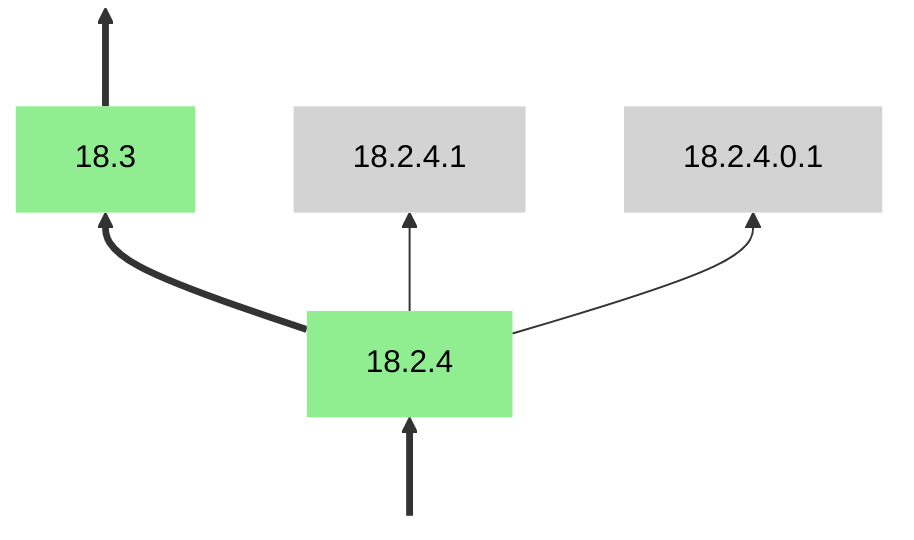
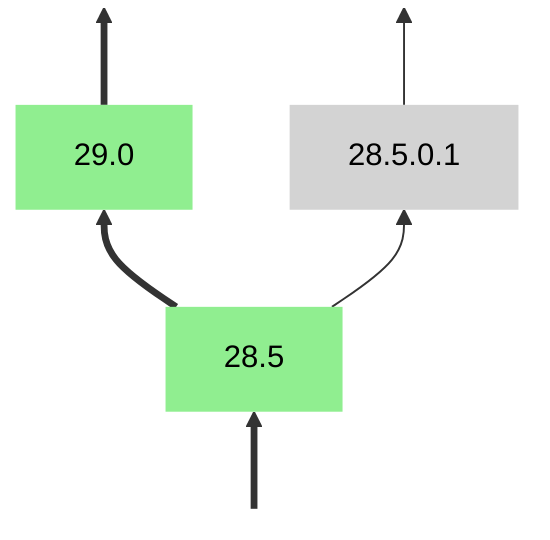
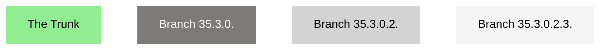
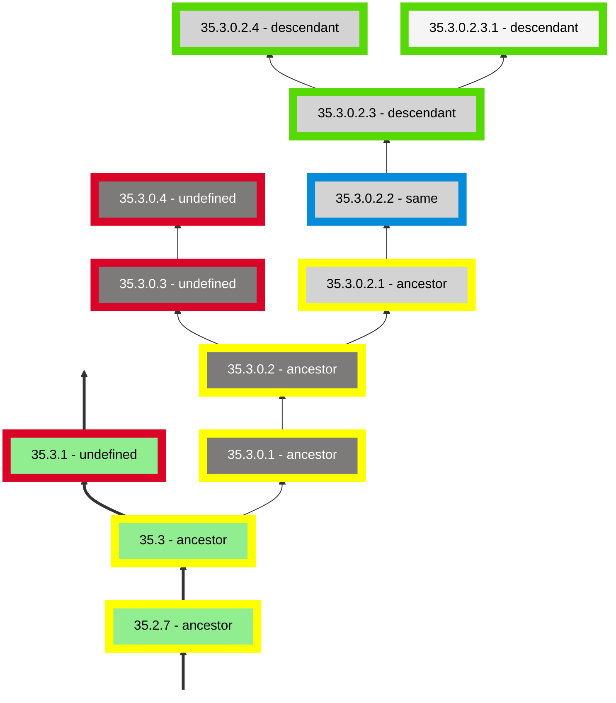

<!--
%CopyrightBegin%

SPDX-License-Identifier: Apache-2.0

Copyright Ericsson AB 2023-2025. All Rights Reserved.

Licensed under the Apache License, Version 2.0 (the "License");
you may not use this file except in compliance with the License.
You may obtain a copy of the License at

    http://www.apache.org/licenses/LICENSE-2.0

Unless required by applicable law or agreed to in writing, software
distributed under the License is distributed on an "AS IS" BASIS,
WITHOUT WARRANTIES OR CONDITIONS OF ANY KIND, either express or implied.
See the License for the specific language governing permissions and
limitations under the License.

%CopyrightEnd%
-->
# Versions

[](){: #versions-section }

## OTP Version

As of OTP release 17, the OTP release number corresponds to the major part of
the OTP version. The OTP version as a concept was introduced in OTP 17. The
version scheme used is described in detail in
[Version Scheme](versions.md#version_scheme).

[](){: #set-of-applications }

OTP of a specific version is a set of applications of specific versions. The
application versions identified by an OTP version correspond to application
versions that have been tested together by the Erlang/OTP team at Ericsson AB.
An OTP system can, however, be put together with applications from different OTP
versions. Such a combination of application versions has not been tested by the
Erlang/OTP team. It is therefore _always preferred to use OTP applications from
one single OTP version_.

### Retrieving Current OTP Version

In an OTP source code tree, the OTP version can be read from the text file
`<OTP source root>/OTP_VERSION`. The absolute path to the file can be
constructed by calling
`filename:join([`[`code:root_dir()`](`code:root_dir/0`)`, "OTP_VERSION"])`.

In an installed OTP development system, the OTP version can be read from the
text file `<OTP installation root>/releases/<OTP release number>/OTP_VERSION`.
The absolute path to the file can be constructed by calling
`filename:join([`[`code:root_dir()`](`code:root_dir/0`)`, "releases", `[`erlang:system_info(otp_release)`](`m:erlang#system_info_otp_release`)`, "OTP_VERSION"]).`

If the version read from the `OTP_VERSION` file in a development system has a
`**` suffix, the system has been patched using the
[`otp_patch_apply`](`e:system:otp-patch-apply.md`) tool. In this case, the
system consists of application versions from multiple OTP versions. The version
preceding the `**` suffix corresponds to the OTP version of the base system that
has been patched. Note that if a development system is updated by other means
than `otp_patch_apply`, the file `OTP_VERSION` can identify an incorrect OTP
version.

No `OTP_VERSION` file is placed in a [target system](create_target.md) created
by OTP tools, because one can easily create a target system where it is hard
to even determine the base OTP version. However, it is allowed to place such
a file there if one knows the OTP version.

### OTP Versions Table

The text file `<OTP source root>/otp_versions.table`, which is part of the
source code, contains information about all OTP versions from OTP 17.0 up to the
current OTP version. Each line contains information about application versions
that are part of a specific OTP version, and has the following format:

```text
<OtpVersion> : <ChangedAppVersions> # <UnchangedAppVersions> :
```

`<OtpVersion>` has the format `OTP-<VSN>`, that is, the same as the git tag used
to identify the source.

`<ChangedAppVersions>` and `<UnchangedAppVersions>` are space-separated lists of
application versions and have the format `<application>-<vsn>`.

- `<ChangedAppVersions>` corresponds to changed applications with new version
  numbers in this OTP version.
- `<UnchangedAppVersions>` corresponds to unchanged application versions in this
  OTP version.

Both of them can be empty, but not at the same time. If `<ChangedAppVersions>`
is empty, no changes have been made that change the build result of any
application. This could, for example, be a pure bug fix of the build system. The
order of lines is undefined. All white-space characters in this file are either
space (character 32) or line-break (character 10).

By using ordinary UNIX tools like `sed` and `grep` one can easily find answers
to various questions like:

- Which OTP versions are `kernel-3.0` part of?

  `$ grep ' kernel-3\.0 ' otp_versions.table`

- In which OTP version was `kernel-3.0` introduced?

  `$ sed 's/#.*//;/ kernel-3\.0 /!d' otp_versions.table`

The above commands give a bit more information than the exact answers, but
adequate information when manually searching for answers to these questions.

[](){: #version_scheme }

## Version Scheme

Versions that adhere to the OTP versions scheme explicitly form a tree. The
version numbers themselves are the only information needed in order to
identify how the versions relate to each other.

A version on the trunk of the tree, or main track, is constructed as
`<Major>.<Minor>.<Patch>`, where `<Major>` is the most significant
component. The dot-separated components consist of non-negative integers. If
there exist trailing components equaling `0` less significant than
`<Minor>`, they are omitted. The three normal parts
`<Major>.<Minor>.<Patch>` are changed as follows:

- `<Major>` - Incremented when major changes, including incompatibilities, are
    made.
- `<Minor>` - Incremented when new functionality is added.
- `<Patch>` - Incremented when pure bug fixes are made.

When creating a new version on the trunk of the version tree:
1.  one component is incremented by `1`.
2.  all components of lower significance than the incremented component are set
    to `0`.
3.  the <Patch> component is omitted if it was set to `0`.

The root of the version tree is always located on the trunk of the version
tree, but there is no fixed version that the root of the tree must have. The
version that is the root will vary from version tree to version tree.

### Branches

A version with more than 3 components exists on a branch that has branched off
from the trunk of the tree, or another branch. Such a version looks like
`<V(0)>.<V(1)>. ... .<V(N-1)>.<V(N)>` where `<V(0)>` is the most
significant component and `<V(N)>` is the least significant component.
The branch that the version exists on can be identified by
`<V(0)>.<V(1)>. ... .<V(N-1)>.` (note the dot at the end) **not** omitting
any trailing components equaling `0`. `<V(N)>` is a sequence number on that
branch. For the first version on a branch, `<V(N)>` always equals `1`. `<V(N)>`
is always incremented by `1` for each new version on the branch. There are
never any trailing `0` components on a version existing on a branch.

When a new branch is created and one or more branches already branch out from
the same base version, the new branch identifier is created by appending `0.`
to the end of the already existing branch identifier with the most components
that branch out from that same base version. Below is an example where we have
two branches branching out from the same base version `18.2.4`. When the
branch `18.2.4.0.` was created, the branch `18.2.4.` already existed. If
we were to create yet another branch based on `18.2.4`, it would get the
branch identifier `18.2.4.0.0.`.



The version on which a branch is based is obtained by omitting the least
significant components whose values are `0`, except for the `V(0)` and
`V(1)` components, from the branch identifier and removing any trailing
dots.

When branching out from a version on the trunk of the version tree where the
third component has been omitted due to being `0`, it is added in the branch
identifier. Here is an example of this scenario:



An application version or an OTP version identifies source code versions. That
is, it implies nothing about how the application or OTP has been built.

### Order of Versions

Version numbers in general are only partially ordered. However, normal version
numbers (with a maximum of three components), on the trunk of the version tree,
as of OTP 17.0 have a total linear order. This applies both to normal OTP
versions and normal application versions. Note that you can only compare
versions that come from the same version tree. It makes no sense comparing,
for example, OTP versions with ERTS versions which are two different version
trees.

All versions have an order against themselves, all of their ancestors and
all of their descendants, but against other versions the order is undefined.
The possible return values of the `versions:compare/2` function are
therefore: `same`, `ancestor`, `descendant` and `undefined`.

If a version `V1` compares to a version `V2` as:
*   `same`, then `V2` compares to `V1` as `same`.
*   `ancestor`, then `V2` compares to `V1` as `descendant`.
*   `descendant`, then `V2` compares to `V1` as `ancestor`.
*   `undefined`, then `V2` compares to `V1` as `undefined`.

In the following example we can see how a number of versions are ordered against
the version `35.3.0.2.2`.

Color coding of frames in the below example:


Color coding of canvases in the below example:



Example:


#### Algorithm for Comparing Versions

When comparing two versions, one compares the components from the most
significant to the least significant component in the same position. While
components are equal in both versions, one continues to the next components
of the versions. When that is no longer possible:

1.  If one runs out of components for both versions, the versions are the
    **same**.

2.  If one runs out of components for one version while there still are
    components left for the other version, the version with less components is
    an **ancestor** of the other version.

3.  If the component of one version is less than the component of the other
    version, and if the version with the smaller component either:

    1.  comes from a normal version (maximum 3 components in total), or
    2.  does not come from a normal version, but the smaller component is the
        last component of its version

    then, the version with the smaller component is an **ancestor** of the other
    version.

4. If none of the above is true, the order is **undefined**.

This algorithm is used by the `versions:compare/2` and `versions:list_compare/2`
functions in the `m:versions` module. The core of the algorithm is implemented
in the internal `cmp()` functions in [versions.erl](assets/versions.erl). Note
that the `cmp()` functions assume that the input versions are already properly
validated versions of the type `t:versions:vsn_list/0` before it is called and
will otherwise produce incorrect result.

#### What can the Order be Used for

When looking at two versions with a defined order, you know that the version
comparing as a *descendant* of the other version is based on the code in the
other version. For example, if a vulnerability was fixed in a version comparing
as an *ancestor* of a specific version, the fix is included in that specific
version as well (unless the vulnerability has mistakenly been reintroduced by
the changes made between the versions). When looking at two versions with an
*undefined* order, you cannot draw any such conclusions.

When making a change that you want to merge into multiple OTP branches you want
to base that change on a version that compares as a common *ancestor* to
versions on all branches that you intend to merge to. If the base version for
the change is based on a version that has an *undefined* order to versions on a
branch that you intend to merge to, you might include changes in that branch
that should not be included when merging. For example, when making a bugfix that
should be included in `maint-27`, `maint-28` and `maint-29` you typically want
to base the topic branch for that change on OTP version `27.3.4` which is the
latest version on the trunk of the OTP version tree that has a defined order
against the versions of all of those branches (see the
[OTP Versions Tree](http://www.erlang.org/download/otp_versions_tree.html)
page). Other *ancestor* versions to `27.3.4` are, of course, also ok to use as
base version.

### OTP Versions

> #### Change {: .info }
>
> The [version scheme](versions.md#version_scheme) was changed as of OTP 17.0.
> [A list of application versions used in OTP 17.0](versions.md#otp_17_0_app_versions)
> is included at the end of this section.

The root of the tree is OTP 17.0. The trunk of the tree corresponds to the
main track where new versions are released for the latest OTP release. The
latest version on the trunk of the tree corresponds to the head of the
maintenance branch of the latest release.

[](){: #release-candidates }

#### OTP Release Candidates

> #### Warning {: .warning }
>
> Release candidates are **only** intended to be used for testing an OTP release
> while it is under development and **must never** be used in production.

Release candidates have a `-rc<N>` suffix. The suffix `-rc0` is used during
development up to the first release candidate. "Versions" with `-rc<N>` suffix
are not proper versions and do not adhere to the
[version scheme](versions.md#version_scheme). They are only used in order to
identify code that we want users to test during development of a new
[OTP release](versions.md#releases_and_patches).

Application versions very often stay the same in the release candidates as in
the actual release, even though the code of these applications very often is
different in a release candidate compared to the actual OTP release. Application
versions used have also not stabilized in the release candidates. In some cases,
application versions have been stepped backwards in the actual release compared
to what was in the release candidate. That is, OTP release candidates do *not*
identify
[a set of applications of specific versions](versions.md#set-of-applications).

[](){: #application-version }

### Application Versions

As of OTP 17.0 application versions use the same
[version scheme](versions.md#version_scheme) as the
[OTP versions](versions.md#otp-versions), except that application versions
never include the `-rc<N>` suffix. Also note that a major increment in an
application version does not necessarily imply a major increment of the OTP
version, but often do. This depends on whether the major change in the
application is considered a major change for OTP as a whole or not.

[](){: #releases_and_patches }

## Releases and Patches

When a new OTP release is released it will have an OTP version on the form
`<Major>.0` where the major OTP version number equals the release number. The
major version number is increased one step since the last major version. All
other OTP versions with the same major OTP version number are patches on that
OTP release.

Patches are either released as maintenance patch packages or emergency patch
packages. The only difference is that maintenance patch packages are planned and
usually contain more changes than emergency patch packages. Emergency patch
packages are released to solve one or more specific issues when such are
discovered.

The release of a maintenance patch package usually implies an increase
of the OTP `<Minor>` version, while the release of an emergency patch
package usually implies an increase of the OTP `<Patch>`
version. However, this is not always the case, as changes in OTP
versions are determined by actual code modifications rather than
whether the patch was planned or not. For more information see
[Version Scheme](versions.md#version_scheme).

[](){: #otp_versions_tree }

## OTP Versions Tree

All released OTP versions can be found in the [OTP Versions
Tree](http://www.erlang.org/download/otp_versions_tree.html), which is
automatically updated whenever we release a new OTP version. Note that
each version number explicitly determines its position in the version
tree. All that is required to build the tree are the version numbers
themselves.

The root of the tree is OTP version 17.0 which is when we introduced the new
[version scheme](versions.md#version_scheme). The green versions are normal
versions released on the main track. Old
[OTP releases](versions.md#releases_and_patches) will be maintained for a while
on `maint` branches that have branched off from the main track. Old `maint`
branches always branch off from the main track when the next OTP release is
introduced into the main track. Versions on these old `maint` branches are
marked blue.

Apart from the green and blue versions, there are also gray
versions. These denote versions established on branches to resolve a
particular issue for a specific customer based on a specific base
version. Branches with gray versions will typically become dead ends
very quickly if not immediately.

[](){: #otp_17_0_app_versions }

## OTP 17.0 Application Versions

The following list details the application versions that were part of
OTP 17.0.

If the normal part of an application version number is smaller than
the corresponding application version in the list, the version number
does not adhere to the versioning scheme introduced in OTP
17.0. Consequently, it is not regarded as having an order against
versions used from OTP 17.0 onwards.

- `asn1-3.0`
- `common_test-1.8`
- `compiler-5.0`
- `cosEvent-2.1.15`
- `cosEventDomain-1.1.14`
- `cosFileTransfer-1.1.16`
- `cosNotification-1.1.21`
- `cosProperty-1.1.17`
- `cosTime-1.1.14`
- `cosTransactions-1.2.14`
- `crypto-3.3`
- `debugger-4.0`
- `dialyzer-2.7`
- `diameter-1.6`
- `edoc-0.7.13`
- `eldap-1.0.3`
- `erl_docgen-0.3.5`
- `erl_interface-3.7.16`
- `erts-6.0`
- `et-1.5`
- `eunit-2.2.7`
- `gs-1.5.16`
- `hipe-3.10.3`
- `ic-4.3.5`
- `inets-5.10`
- `jinterface-1.5.9`
- `kernel-3.0`
- `megaco-3.17.1`
- `mnesia-4.12`
- `observer-2.0`
- `odbc-2.10.20`
- `orber-3.6.27`
- `os_mon-2.2.15`
- `ose-1.0`
- `otp_mibs-1.0.9`
- `parsetools-2.0.11`
- `percept-0.8.9`
- `public_key-0.22`
- `reltool-0.6.5`
- `runtime_tools-1.8.14`
- `sasl-2.4`
- `snmp-4.25.1`
- `ssh-3.0.1`
- `ssl-5.3.4`
- `stdlib-2.0`
- `syntax_tools-1.6.14`
- `test_server-3.7`
- `tools-2.6.14`
- `typer-0.9.6`
- `webtool-0.8.10`
- `wx-1.2`
- `xmerl-1.3.7`
