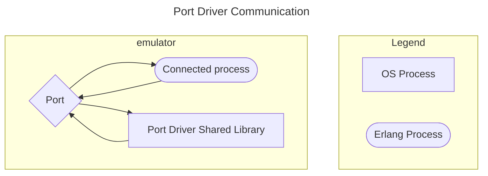

<!--
%CopyrightBegin%

Copyright Ericsson AB 2023-2024. All Rights Reserved.

Licensed under the Apache License, Version 2.0 (the "License");
you may not use this file except in compliance with the License.
You may obtain a copy of the License at

    http://www.apache.org/licenses/LICENSE-2.0

Unless required by applicable law or agreed to in writing, software
distributed under the License is distributed on an "AS IS" BASIS,
WITHOUT WARRANTIES OR CONDITIONS OF ANY KIND, either express or implied.
See the License for the specific language governing permissions and
limitations under the License.

%CopyrightEnd%
-->
# Port Drivers

This section outlines an example of how to solve the example problem in
[Problem Example](example.md) by using a linked-in port driver.

A port driver is a linked-in driver that is accessible as a port from an Erlang
program. It is a shared library (SO in UNIX, DLL in Windows), with special entry
points. The Erlang runtime system calls these entry points when the driver is
started and when data is sent to the port. The port driver can also send data to
Erlang.

As a port driver is dynamically linked into the emulator process, this is the
fastest way of calling C-code from Erlang. Calling functions in the port driver
requires no context switches. But it is also the least safe way, because a crash
in the port driver brings the emulator down too.

The scenario is illustrated in the following figure:



## Erlang Program

Like a port program, the port communicates with an Erlang process. All
communication goes through one Erlang process that is the _connected process_ of
the port driver. Terminating this process closes the port driver.

Before the port is created, the driver must be loaded. This is done with the
function `erl_ddll:load_driver/2`, with the name of the shared library as
argument.

The port is then created using the BIF [`open_port/2`](`open_port/2`), with the
tuple `{spawn, DriverName}` as the first argument. The string `SharedLib` is the
name of the port driver. The second argument is a list of options, none in this
case:

```erlang
-module(complex5).
-export([start/1, init/1]).

start(SharedLib) ->
    case erl_ddll:load_driver(".", SharedLib) of
        ok -> ok;
        {error, already_loaded} -> ok;
        _ -> exit({error, could_not_load_driver})
    end,
    spawn(?MODULE, init, [SharedLib]).

init(SharedLib) ->
  register(complex, self()),
  Port = open_port({spawn, SharedLib}, []),
  loop(Port).
```

Now `complex5:foo/1` and `complex5:bar/1` can be implemented. Both send a
message to the `complex` process and receive the following reply:

```erlang
foo(X) ->
    call_port({foo, X}).
bar(Y) ->
    call_port({bar, Y}).

call_port(Msg) ->
    complex ! {call, self(), Msg},
    receive
        {complex, Result} ->
            Result
    end.
```

The `complex` process performs the following:

- Encodes the message into a sequence of bytes.
- Sends it to the port.
- Waits for a reply.
- Decodes the reply.
- Sends it back to the caller:

```erlang
loop(Port) ->
    receive
        {call, Caller, Msg} ->
            Port ! {self(), {command, encode(Msg)}},
            receive
                {Port, {data, Data}} ->
                    Caller ! {complex, decode(Data)}
            end,
            loop(Port)
    end.
```

Assuming that both the arguments and the results from the C functions are less
than 256, a simple encoding/decoding scheme is employed. In this scheme, `foo`
is represented by byte 1, `bar` is represented by 2, and the argument/result is
represented by a single byte as well:

```erlang
encode({foo, X}) -> [1, X];
encode({bar, Y}) -> [2, Y].

decode([Int]) -> Int.
```

The resulting Erlang program, including functions for stopping the port and
detecting port failures, is as follows:

```erlang

-module(complex5).
-export([start/1, stop/0, init/1]).
-export([foo/1, bar/1]).

start(SharedLib) ->
    case erl_ddll:load_driver(".", SharedLib) of
	ok -> ok;
	{error, already_loaded} -> ok;
	_ -> exit({error, could_not_load_driver})
    end,
    spawn(?MODULE, init, [SharedLib]).

init(SharedLib) ->
    register(complex, self()),
    Port = open_port({spawn, SharedLib}, []),
    loop(Port).

stop() ->
    complex ! stop.

foo(X) ->
    call_port({foo, X}).
bar(Y) ->
    call_port({bar, Y}).

call_port(Msg) ->
    complex ! {call, self(), Msg},
    receive
	{complex, Result} ->
	    Result
    end.

loop(Port) ->
    receive
	{call, Caller, Msg} ->
	    Port ! {self(), {command, encode(Msg)}},
	    receive
		{Port, {data, Data}} ->
		    Caller ! {complex, decode(Data)}
	    end,
	    loop(Port);
	stop ->
	    Port ! {self(), close},
	    receive
		{Port, closed} ->
		    exit(normal)
	    end;
	{'EXIT', Port, Reason} ->
	    io:format("~p ~n", [Reason]),
	    exit(port_terminated)
    end.

encode({foo, X}) -> [1, X];
encode({bar, Y}) -> [2, Y].

decode([Int]) -> Int.
```

## C Driver

The C driver is a module that is compiled and linked into a shared library. It
uses a driver structure and includes the header file `erl_driver.h`.

The driver structure is filled with the driver name and function pointers. It is
returned from the special entry point, declared with the macro
`DRIVER_INIT(<driver_name>)`.

The functions for receiving and sending data are combined into a function,
pointed out by the driver structure. The data sent into the port is given as
arguments, and the replied data is sent with the C-function `driver_output`.

As the driver is a shared module, not a program, no main function is present.
All function pointers are not used in this example, and the corresponding fields
in the `driver_entry` structure are set to NULL.

All functions in the driver takes a handle (returned from `start`) that is just
passed along by the Erlang process. This must in some way refer to the port
driver instance.

The `example_drv_start`, is the only function that is called with a handle to
the port instance, so this must be saved. It is customary to use an allocated
driver-defined structure for this one, and to pass a pointer back as a
reference.

It is not a good idea to use a global variable as the port driver can be spawned
by multiple Erlang processes. This driver-structure is to be instantiated
multiple times:

```c
/* port_driver.c */

#include <stdio.h>
#include "erl_driver.h"

typedef struct {
    ErlDrvPort port;
} example_data;

static ErlDrvData example_drv_start(ErlDrvPort port, char *buff)
{
    example_data* d = (example_data*)driver_alloc(sizeof(example_data));
    d->port = port;
    return (ErlDrvData)d;
}

static void example_drv_stop(ErlDrvData handle)
{
    driver_free((char*)handle);
}

static void example_drv_output(ErlDrvData handle, char *buff,
			       ErlDrvSizeT bufflen)
{
    example_data* d = (example_data*)handle;
    char fn = buff[0], arg = buff[1], res;
    if (fn == 1) {
      res = foo(arg);
    } else if (fn == 2) {
      res = bar(arg);
    }
    driver_output(d->port, &res, 1);
}

ErlDrvEntry example_driver_entry = {
    NULL,			/* F_PTR init, called when driver is loaded */
    example_drv_start,		/* L_PTR start, called when port is opened */
    example_drv_stop,		/* F_PTR stop, called when port is closed */
    example_drv_output,		/* F_PTR output, called when erlang has sent */
    NULL,			/* F_PTR ready_input, called when input descriptor ready */
    NULL,			/* F_PTR ready_output, called when output descriptor ready */
    "example_drv",		/* char *driver_name, the argument to open_port */
    NULL,			/* F_PTR finish, called when unloaded */
    NULL,                       /* void *handle, Reserved by VM */
    NULL,			/* F_PTR control, port_command callback */
    NULL,			/* F_PTR timeout, reserved */
    NULL,			/* F_PTR outputv, reserved */
    NULL,                       /* F_PTR ready_async, only for async drivers */
    NULL,                       /* F_PTR flush, called when port is about
				   to be closed, but there is data in driver
				   queue */
    NULL,                       /* F_PTR call, much like control, sync call
				   to driver */
    NULL,                       /* unused */
    ERL_DRV_EXTENDED_MARKER,    /* int extended marker, Should always be
				   set to indicate driver versioning */
    ERL_DRV_EXTENDED_MAJOR_VERSION, /* int major_version, should always be
				       set to this value */
    ERL_DRV_EXTENDED_MINOR_VERSION, /* int minor_version, should always be
				       set to this value */
    0,                          /* int driver_flags, see documentation */
    NULL,                       /* void *handle2, reserved for VM use */
    NULL,                       /* F_PTR process_exit, called when a
				   monitored process dies */
    NULL                        /* F_PTR stop_select, called to close an
				   event object */
};

DRIVER_INIT(example_drv) /* must match name in driver_entry */
{
    return &example_driver_entry;
}
```

## Running the Example

_Step 1._ Compile the C code:

```text
unix> gcc -o example_drv.so -fpic -shared complex.c port_driver.c
windows> cl -LD -MD -Fe example_drv.dll complex.c port_driver.c
```

_Step 2._ Start Erlang and compile the Erlang code:

```erlang
> erl
Erlang/OTP 26 [erts-14.2] [source] [64-bit] [smp:8:8] [ds:8:8:10] [async-threads:1] [jit:ns]

Eshell V14.2 (press Ctrl+G to abort, type help(). for help)
1> c(complex5).
{ok,complex5}
```

_Step 3._ Run the example:

```erlang
2> complex5:start("example_drv").
<0.34.0>
3> complex5:foo(3).
4
4> complex5:bar(5).
10
5> complex5:stop().
stop
```
